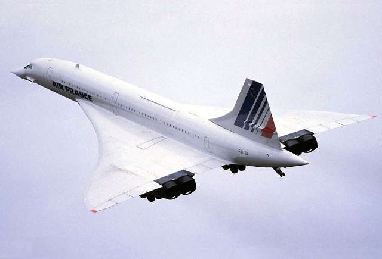

```{r layout="l-body", fig.cap="The Concorde's elegant delta-wing design enabled it to fly supersonic speeds, yet unmatched by the commercial jets of today that still rely on the traditional fuselage and wing design."}

```

The Concorde. It’s a beauty; it’s just about the most beautiful man-made thing in the world. What a shame that it guzzled gas, made so much noise, and was eventually put out of service. Still, its elegant silhouette, as well as the fact that it can travel at twice the speed of sound, inspires me to no end. I remember from a documentary that New Yorkers who were protesting on the noise of the plane stopped in hushed awe when the Concorde was wheeled in. It was just that stunning.

