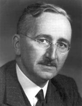

```{r fig.cap="What a majestic moustache."}

```

Here are some interesting quotes I dug up from Friedrich A. Hayek:

**On the inherent conceit of top-down approaches:**

<blockquote><span style="font-size: large;">“The curious task of economics is to demonstrate to men how little they know about what they can imagine they can design.”</span></blockquote>

It’s amazing how the simple yet powerful price mechanism coordinates and optimizes the structure of production in the economy, and how plans by the many and not plans by the few allow this mechanism to operate well.

**On redistributory mechanisms:**

<blockquote><span style="font-size: large;">“There is all the difference in the world between treating people equally and attempting to make them equal.”</span></blockquote>

Only what one deserves.
