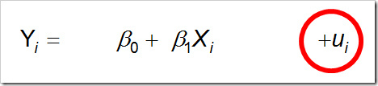

```{r fig.cap="Sometimes the noise is more important than the signal."}

```

*It’s been a while since I’ve written anything original, so I’m planning to get back on track with this blog. No, this isn’t going to be an econometrics lecture, nor do I promise complete accuracy.*

```{r fig.cap="The u<span style='font-size: xx-small;'>i </span> represents stochasticity in this linear regression."}

```

We all know that letter at the end of the sample regression function: u. It’s the stochastic disturbance term. Peculiarly, it is absent in the population regression function, the form and intensity of which is, according to my professor, only known to God. If you follow this vein of thought, you would eventually come to the conclusion that the u is simply the sum total of our ignorance. I disagree; I believe that the u represents something more than the lack of knowledge; it represents change and freedom. That u actually captures all effects, big or small, that weren’t and cannot be captured in the structured hash of the equation; the chaos in the world, as one might say.

That chaos is what excites me about stochasticity, for it makes the difference between the world being a simple clockwork operation and being a dynamic process. In a world where everything is governed by deterministic laws of physics, stochasticity provides a repreive. *It is what takes us away from a world that has already ended before it has even begun.* Stochasticity is independent from predetermination, and thus, there is something distinctly alive and human about it. Stochasticity is that which is present in man as an agent of change, and is thus the manifestation of the human free will.

Many names have been used to refer to this randomness: some call it luck, will, fate, coincidence, karma, and God. I don’t really care for nomenclature. <strong>All I know is that this; this randomness of free will, change and dynamism, is what makes life an experience worth living.</strong>
