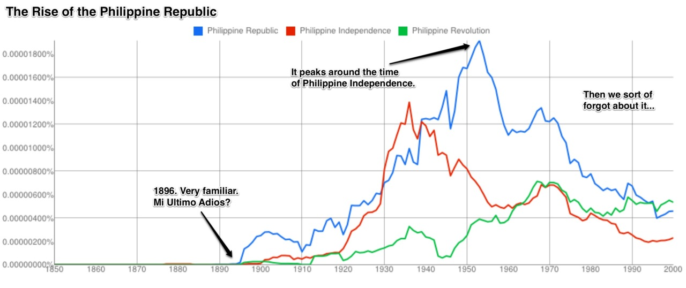
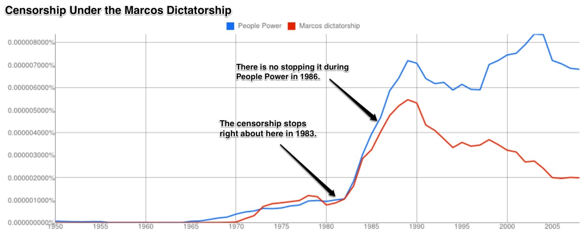
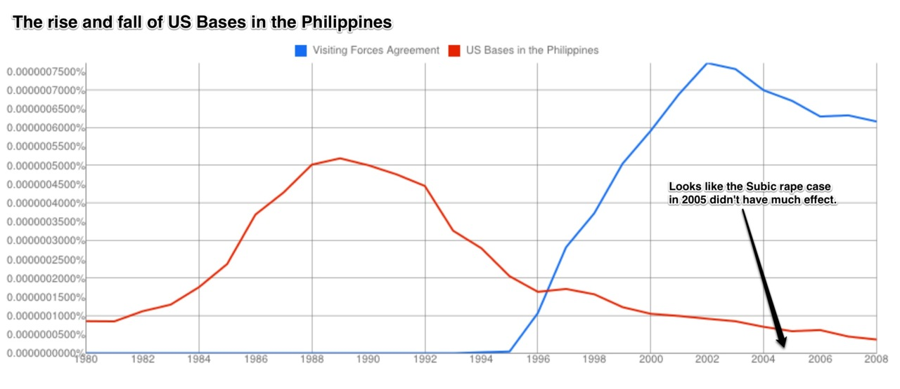
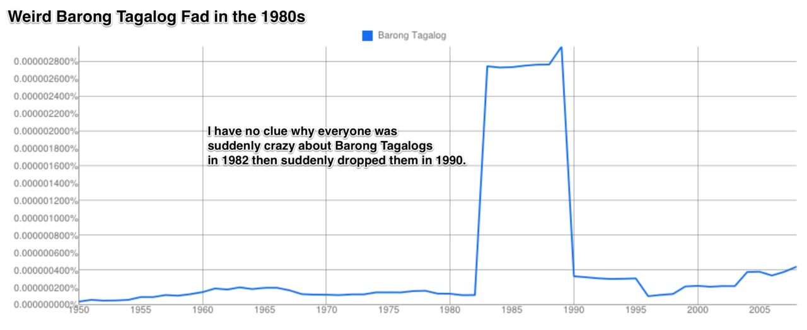

I’ve been messing around with the [Google Ngram Viewer](http://books.google.com/ngrams) which was highlighted in a previous video post. If you don’t already know, ngrams are basically charts that display how often a word or phrase appears in Google’s entire book collection. It’s a rough but quick and easy way to find out what people were writing about in various time periods.

I’ve been digging around for interesting results on Philippine history and this is what I found. These range from revealing censorship in the Marcos period, proving that Rizal really was the spark of the Philippine revolution, to a weird time in the 1980s when people were crazy about the Barong Tagalog.

```{r fig.cap="N-gram Republic"}

```

```{r fig.cap="Marcos Censorship"}

```

```{r fig.cap="US Bases in the Philippines"}

```

```{r fig.cap="Barong Taglogs"}

```

I have another set coming up soon on the Philippine economy, so watch out for that if this interests you. :D
