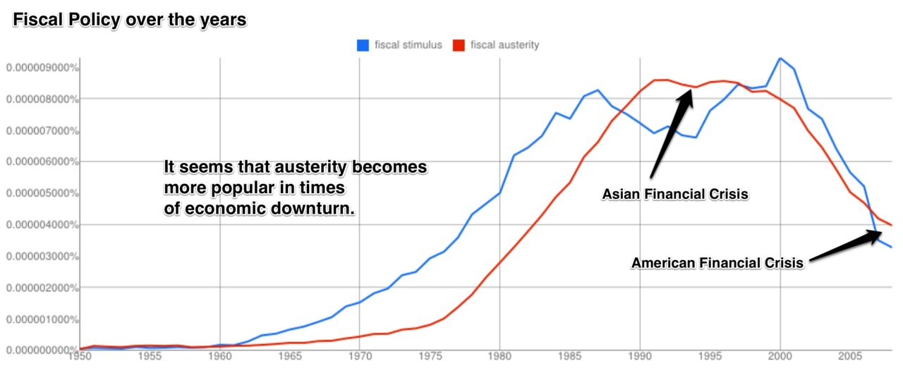
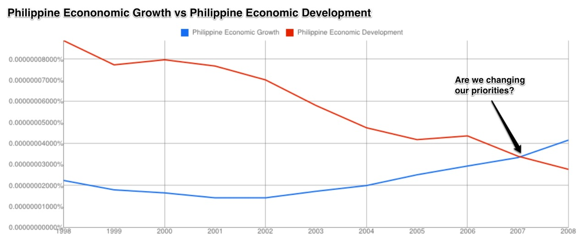
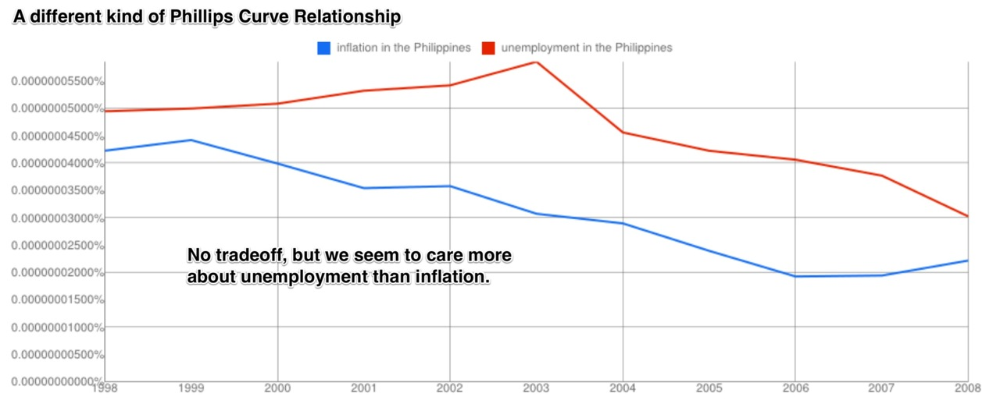
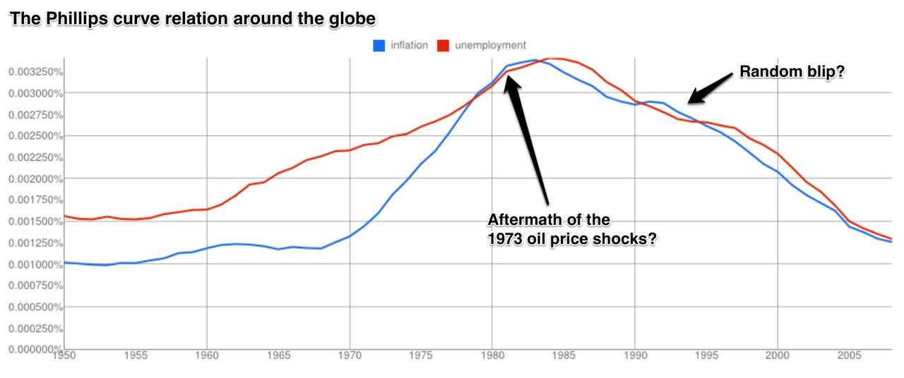
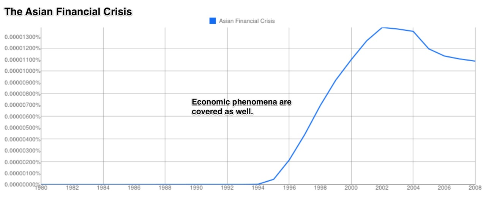

Here’s the second part of this series on ngrams, as I’ve mentioned in a previous blog post. I’ve been messing around with the [Google Ngram Viewer](http://books.google.com/ngrams) which was highlighted in a previous post. If you don’t already know, ngrams are basically charts that display how often a word or phrase appears in Google’s entire book collection. It’s a rough but quick and easy way to find out what people were writing about in various time periods.

This installment reveals that growth is now more important than development, the Phillips curve’s tradeoffs do not necessarily apply to this measure, that fiscal policy is largely affected by current economic conditions, and much more.

See the graphs below (click to enlarge):

```{r}

```

```{r}

```

```{r}

```

```{r}

```

```{r}

```
