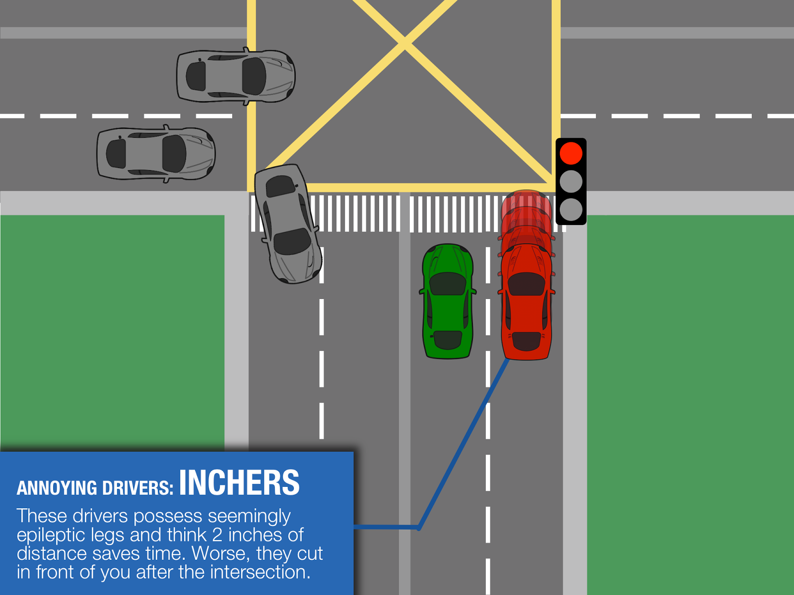
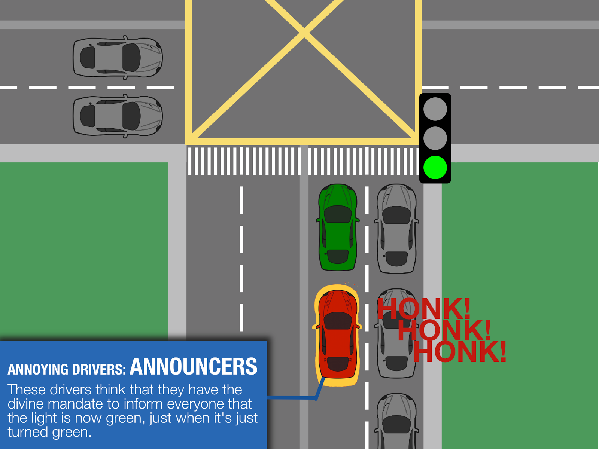
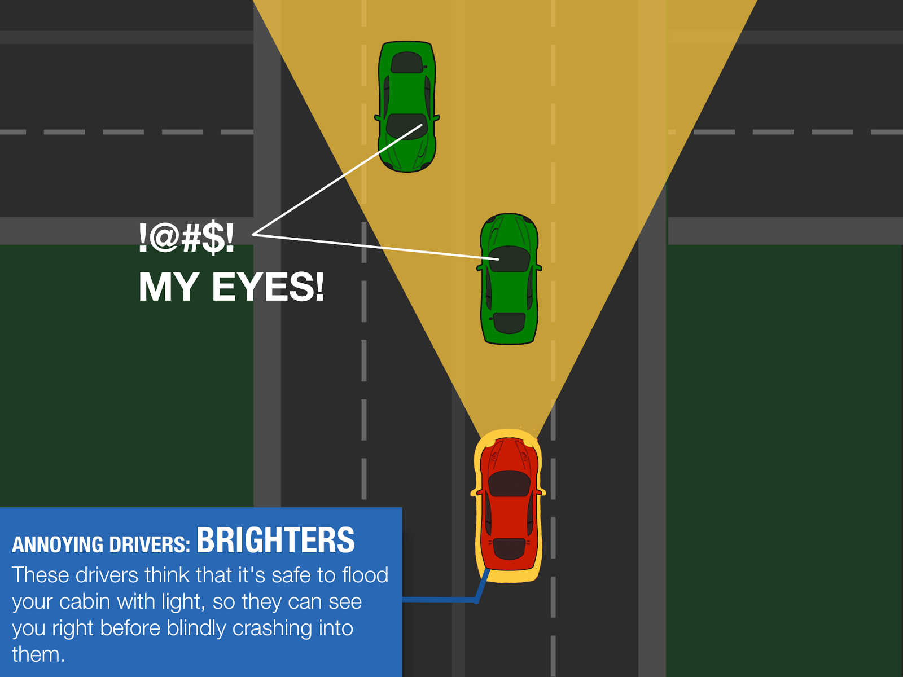
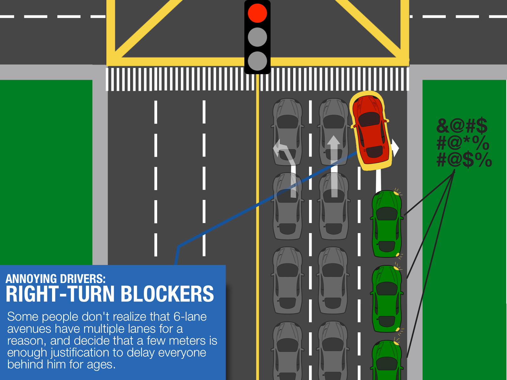
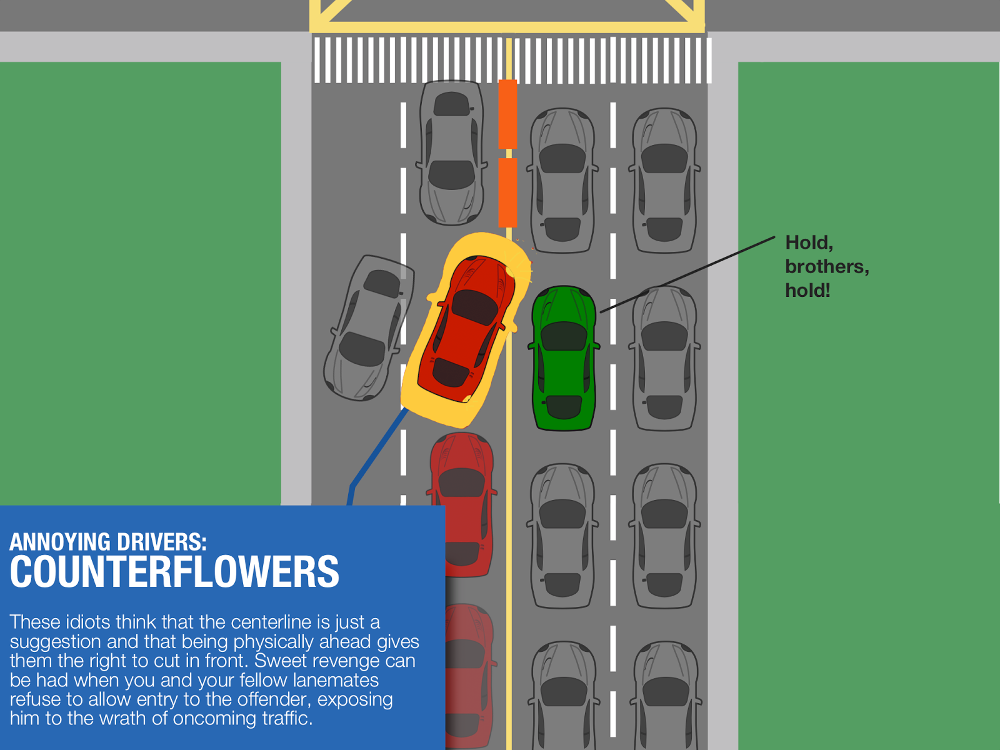

I hate slogging through Manila traffic. It's a horrible waste of time to spend an hour on an otherwise ten minute trip. What's worse - there are drivers who think that being a good driver means that you gain five seconds at the expense of multiple minutes for everyone else.

After a couple of years of this madness, I've had just about enough of it, and the only way I can release my road rage is here. I've isolated five of the most annoying types of drivers that make me want to pull my hair out.

## 5. Inchers

```{r}

```

These drivers are probably the type of people who just&nbsp;can't stand in one place. They think they can save time by stupidly inching forwards at a red light intersection. They waste gas, block the pedestrian lane, and obstruct my view of the oncoming traffic. If they are behind you on an uphill slope, you basically have to power forward just to avoid hitting them.

Where they are: Everywhere, especially in BGC.

Annoying factor: 2/5

## 4. Announcers

```{r}

```

Announcers don't understand the law of inertia: it takes a while for a green light to cascade across a long line of cars. Instead, they honk incessantly behind you while you wait helplessly for the car ahead to move forward, making you want to stop just to spite them.

Where they are: At every traffic light intersection in Manila

Annoying factor: 3.5/5

## 3. High-beamers / Brighters

```{r}

```

There's a reason why the brightest headlight setting is not on the same dial: because it's supposed to be used <i>sparingly, </i>as in on the dark countryside or when no one else is around. Behind you, they flood your cabin with light through the mirrors, and much worse if in front. They'd like to think that they stay safe by seeing potential obstacles, but that's not going to help when blinded drivers crash into them.

Where they are: Zobel-Roxas Ave., Metropolitan Ave. (Manila South Cemetery), Jupiter St., Julia Vargas Ave.

Annoying factor: 4/5

## 2. Right-turn Blockers

```{r}

```

There's a reason why we group lanes moving in the same direction instead of dividing them into many tiny little roads: it makes traffic flow smoother by organizing traffic around one intersection. But that won't work if people such as right-turn blockers try to gain ten seconds by blocking the right turn lane which is supposed to flow regardless of the red light. Anyone who does this in front of me immediately gets the unceasing horn.

Where they are: Virtually anywhere; Taft Ave. Ayala/Paseo/Makati Ave., San Miguel Ave.

Annoying factor: 4.5/5

## 1. Counterflowers

```{r}

```

Counterflow is inexcusable; you can't chalk it up to a mistake. You just can't when you intentionally try to cut through right before a midline barrier. It's about the most <i>gulang</i>, irresponsible, and disrespectful thing you can do on the road. Fortunately, sweet revenge can be had if you and your brothers in line are unrelenting to the annoying driver, exposing him to the wrath of oncoming traffic.

Where they are: Jupiter St. and Makati Ave., and most other undivided roads.

Annoying Factor: 5/5

So there you go - the most annoying types of drivers in Manila. Road rage away, folks.
