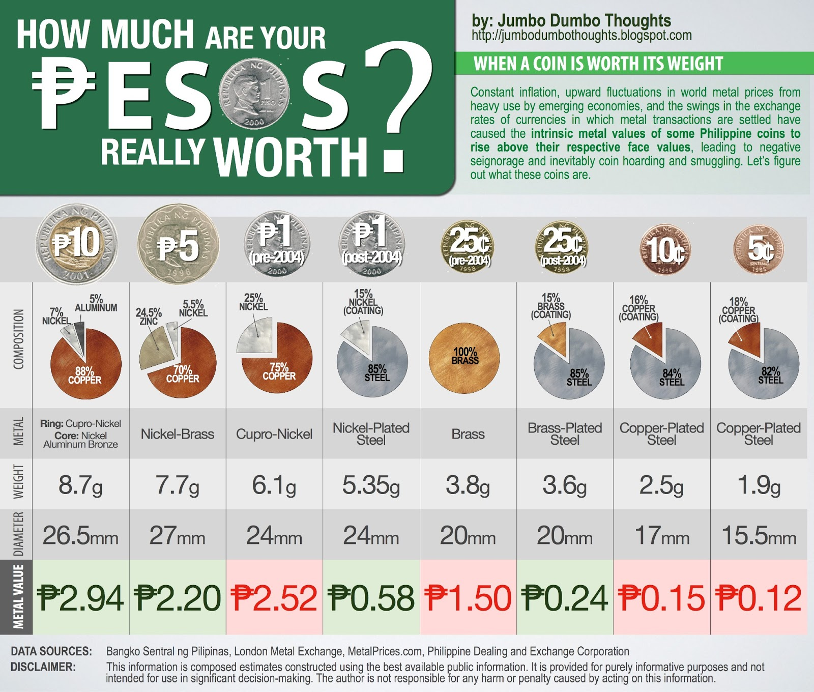
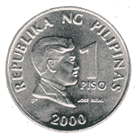

### We're running out of coins!

Did you know that the Philippines suffers from [a chronic coin shortage](http://www.sunstar.com.ph/manila/bunye-case-missing-coins-concluded-last-week), despite coins in circulation being the highest among our ASEAN neighbors? Some of this can be attributed to coin hoarding or keeping coins in <i>alkansya</i>s and tucked under those frogs in commercial establishments, but some can also be attributed to coin smuggling, or the melting down of coins for their metal content.

Why is this so? Constant inflation, as well as rapid changes in exchange rates and metal prices, have caused some coins to be <b>worth more as metal than as currency</b>. What this means is that people can make money by taking coins, melting them down, and selling them for a guaranteed profit. **It's a risk-less transaction since the coin will always be worth at least its face value.**

### Which coins are worth more when melted down?

I performed my own coin metal value analysis using data from the [Bangko Sentral ng Pilipinas](http://www.bsp.gov.ph/bspnotes/banknotes_coin.asp), the [London Metal Exchange](http://www.lme.com/), and [PDEX](http://www.pdex.com.ph/), and here's what I've come up with (click to enlarge):

```{r layout="l-body-outset"}

```

As you can see, these are the coins that are currently worth more as metal than as currency:

* pre-2004 cupro-nickel 1-peso coin - worth ₱2.52 in metal,
* pre-2004 brass 25-cent coin - worth ₱1.50 in metal,
* any 10-cent and 5-cent coin, worth ₱0.15 and ₱0.12 in metal, respectively.

```{r fig.cap="This one-peso coin was minted in 2000. (Photo: Wikimedia, fair use)", out.width="200px"}

```

The pre-2004 1-peso and 25-centavo coins are actually quite valuable (you can see the minting year of the coin on the lower part of the front or "heads" side (not the back, as the year there is a different date) of the coin). As more and more people started melting down these coins for profit, the BSP changed their composition to simply coatings of the previous metal on a low-value steel substrate. In fact, the pre-2004 coins are a little heftier than their current counterparts. You can feel this for yourself.

### What happens now?

What happens when currency is worth more in metal, though?

* **Coin Smuggling** - All this might mean that you have stumbled upon the perfect business opportunity. It's a risk-less investment and you can basically keep making money out of nothing! But this practice is considered defacement of currency and is *illegal* in the Philippines. It's really unethical, too, as it costs taxpayers money to replace those taken out of circulation. A bill has even been proposed (by none other than Senator Lapid) to address the coin shortage by [outlawing coin hoarding](http://ph.news.yahoo.com/coin-collecting-soon-a-crime-.html), but it's a good thing that stayed a bill.
* **Negative Seignorage** - Seignorage is [defined](http://www.investopedia.com/terms/s/seigniorage.asp) as the difference between the value of the money and the cost to produce it. If it is positive, governments can raise revenue by making a profit on this difference. However, if it is negative, then we come into a serious problem - we have to evaluate whether some of these denominations are even worth producing.

### Death to the centavo!

I really think there is no need for any denomination below 1-peso. There is simply <u>nothing</u> that you could buy using centavos anymore, and they just cost more to make and a hassle to manage and count than they are worth. Throughout my research, I read an (uncited and unconfirmed) statement that Congress has required all denominations below 1-peso to be demonetized. Hopefully this is true.

There are [some concerns](http://www.abs-cbnnews.com/business/02/20/10/keep-your-coins-out-piggy-bank-bsp-pleads) about prices when these coins are taken out of circulation. They say a product worth P1.95 will be rounded up to P2.00. Quite frankly, I don't mind, and some prices will be rounded down, too! In the long run it will be good for everyone as we don't have to fiddle around with these ugly non-rounded prices.

Countries such as Canada have already done this and there is a move in the U.S. to abolish their penny. To end this post, here's a video by CGPGrey illustrating the effect of negative seignorage and why the U.S. should get rid of their pennies:

<iframe width="560" height="315" src="https://www.youtube-nocookie.com/embed/y5UT04p5f7U" frameborder="0" allow="accelerometer; autoplay; encrypted-media; gyroscope; picture-in-picture" allowfullscreen></iframe>
