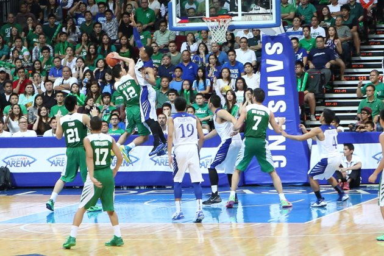
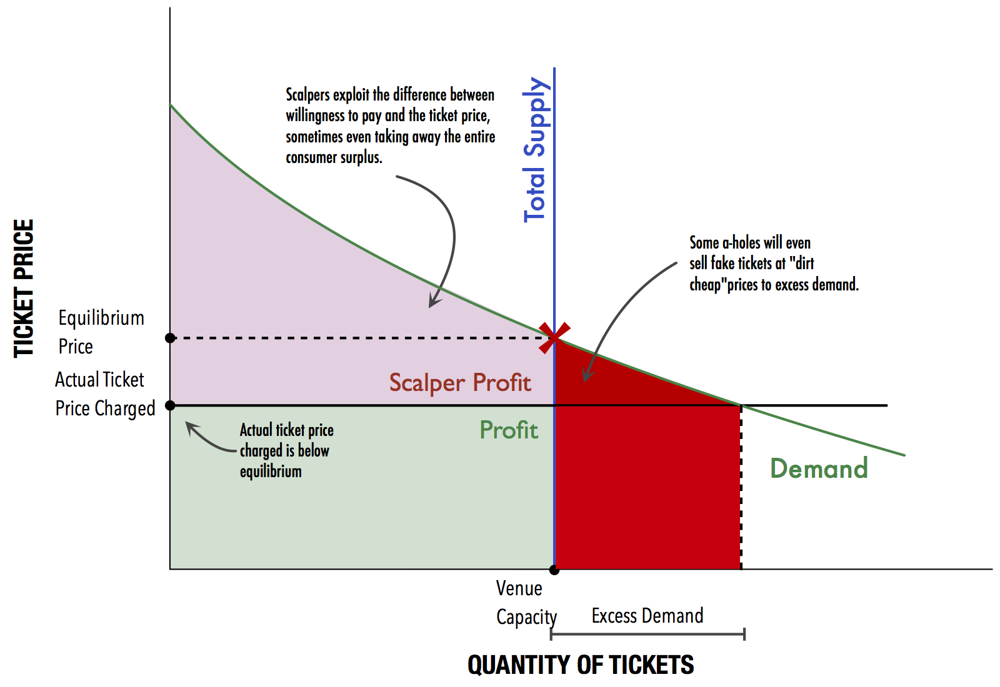
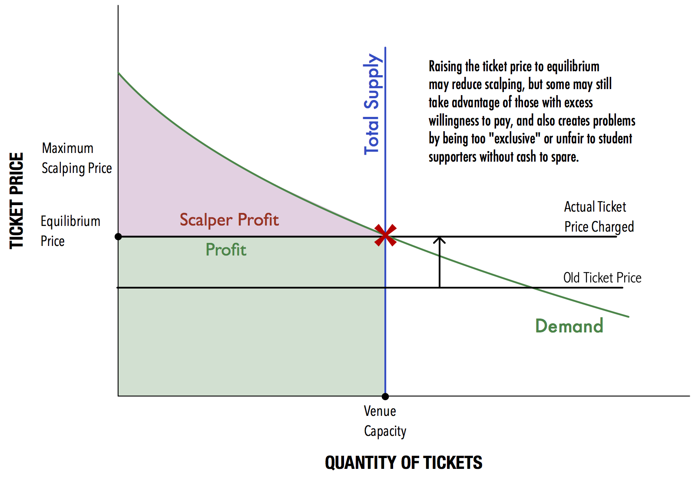
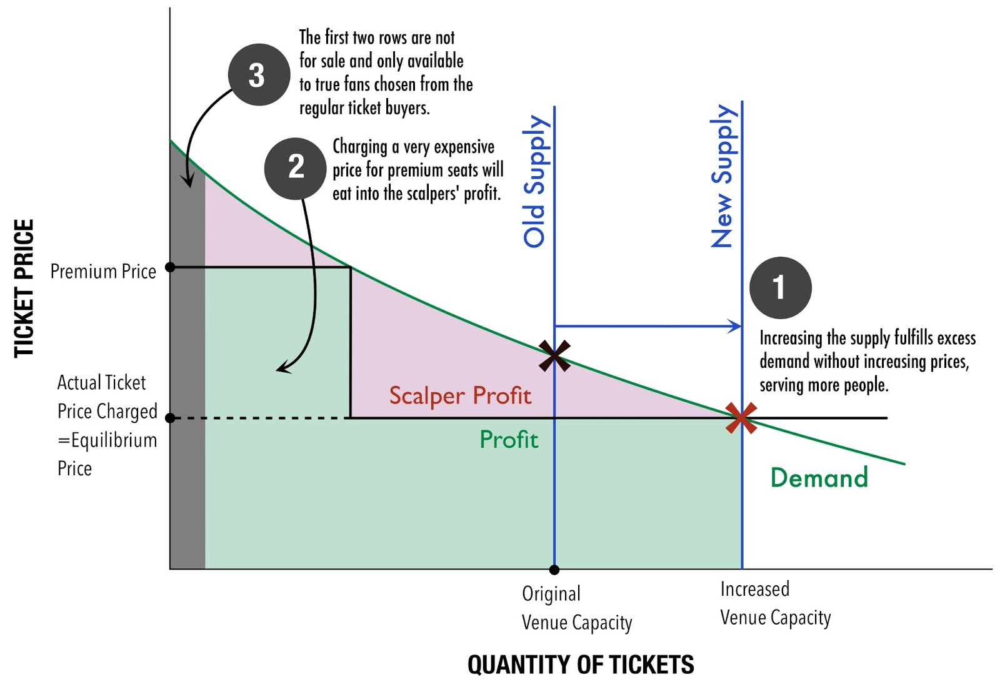

### Profiting off the Animo

```{r fig.cap="DLSU has just won a game against Ateneo after two years of losses to the rival. (Photo: <a href='http://ph.sports.yahoo.com/photos/uaap-season-76-july-7-dlsu-vs-admu-slideshow/uaap-season-76-july-7-dlsu-vs-admu-photo-1373219641305.html' target='_blank'>Winston Baltasar</a>)", out.width="100%"}

```

<b>Animo La Salle! </b>My dear alma mater [has just won against rival Ateneo](http://www.gmanetwork.com/news/story/316405/sports/campussports/uaap-dlsu-wins-rivalry-match-keeps-ateneo-winless) in UAAP men's basketball, 83-72, breaking a six-game losing streak to the Eagles since 2010. Hopefully it'll continue throughout the season.

With the Green Archers' losing streak broken, it's only to be expected the the second rivalry game would be in very high demand. A combination of limited seats in the arena, intense demand, and intentionally low ticket prices, would give rise to the problem of <b>ticket scalpers</b>, or <b>ticket price arbitrageurs</b>. Despite measures taken to prevent scalping, [the game last July 7 was still plagued with ticket scalping](http://www.spin.ph/sports/basketball/news/raft-of-measures-unable-to-keep-ateneo-la-salle-tickets-away-from-scalpers-hands). They profit off school spirit, something which I find personally objectionable but economically inevitable.

It's an interesting economic problem and it's great fun to think up solutions for this issue, but first, we need to know...

### How Scalping Happens

In order to find out how to curb scalping, we'll use an economic perspective to analyze the behavior. It's a very simple analysis and only makes use of basic supply and demand concepts. (Disclaimer: I am just a student and thus do not claim absolute accuracy over the various concepts used.)

The framework is set up using the following observations:

* <b>Supply is vertical and limited to the total venue capacity</b>, as the number of seats in the venue is fixed and cannot be adjusted upward or downward.
* <b>Demand is downward sloping</b> as more people will demand the ticket if prices are low.
* <b>Given these, the graphical representation of how scalping occurs is as follows:</b>

```{r fig.cap="Using supply and demand to explain ticket scalping behavior"}

```

Usually, ticket prices are set below equilibrium, or at a very low price, to ensure that students are able to afford the tickets and support the game. This is apparent when the willingness to pay of students is almost always above the ticket price of P75 to P550. This creates <b>excess demand</b> for tickets and thus a <b>disequilibrium</b>, or a shortage of seats.

Scalpers then come in and take advantage of the fact that <b>a student is willing to pay much more than what the ticket was originally sold for</b> by buying it up first then reselling it at the maximum willingness to pay. Technically, this is called <b>perfect price discrimination.</b> Thus, he can sell it to students for a hefty margin - sometimes up to 8 times the original price. The area in red is the maximum profit that scalpers realize if they are able to exactly match the prices they charge with the students' willingness to pay.

Sometimes, scalpers may even sell fake tickets to those desperate and reckless enough to purchase without inspecting the ticket. <b>In other words, scalping happens because there are just too little tickets to serve an abundance of willing supporters that result due to prices being set at below equilibrium.</b>

### Why not just raise ticket prices?

Most economists propose an obvious and simple solution: simply raise the prices to equilibrium so that supply matches demand, increasing the producer profit and cutting away a substantial portion of the scalpers' profit. Such an action is illustrated below:

```{r fig.cap="Why simply raising ticket prices isn't going to work."}

```

<b>However, as you can see, there are still a few issues with this situation:</b>

* <b>Scalper profit is still substantial and not totally eliminated</b> because scalpers can still buy up tickets to artificially reduce the supply, and then take advantage of those with consumer surplus (or those who are nevertheless willing to pay a price above equilibrium.)
* Ticket prices are set very low because the main purpose of allowing supporters to watch games is to garner support and raise school spirit, not to increase profits. If prices to our basketball games were raised to around P2,000 (a common scalper price), there will be widespread disdain and accusations of profiteering.<b> Pricing at equilibrium may be discriminatory to those who do not have as much disposable income.</b>

<b>Given that simply raising the ticket price is not an issue, how can we curb the scalping in basketball games? </b>Well, this type of thing happens all the time, particularly when there is huge demand for a certain event with limited seats, e.g. a concert, other sports event, product launch, or attraction. Kid Rock is a musician who is [leading the charge in battling ticket scalpers](http://www.npr.org/blogs/money/2013/06/27/196277836/kid-rock-takes-on-the-scalpers), and he's been quite successful. Let's figure out how he's done this.

### Beating the Ticket Scalpers

Kid Rock used a combination of price, supply, and reservation to combat scalpers in his concerts. <b>He used four strategies:</b>

* <b>Increase the Supply.</b> Kid Rock used a combination of using large venues and having more shows that usual in a certain area. The former is doable provided we have the infrastructure (such as using Araneta Coliseum instead of the MOA Arena), but we really can't have more games. This will reduce the equilibrium price to that of the actual ticket price and welcomes those who are not able to purchase tickets (excess demand). It also reduces the incidence of fake tickets.
* <b>Platinum Seating.</b> Ticket prices are usually already gradated based on the attractiveness of the seats, but the most valuable seats (Patron seats), are priced even higher than usual - so expensive that scalpers cannot scrape much of a profit anymore. This is also known as a <b>two-block tariff.</b>
* <b>First 2 Rows for Diehard Fans only.</b> No matter how expensive the platinum seating, the first two rows in the event are reserved and not sold. They are to be given only to true fans or those chosen by lottery from the regular seats. This shields the prime seats from scalpers and, as Kid Rock says, makes sure the best fans are up front and not the "old rich guy with the girlfriend."
* <b>Go Paperless.</b> Tickets are assigned to a name and not to the bearer of the ticket. Thus, one will need to present photo ID and proof of purchase to enter. The tickets are thus non-transferable and thus the value drops to zero once resold by scalpers.

<b>The effects of strategies 1 to 3 are shown in the graph below:</b>

```{r fig.cap="How Kid Rock battled the scalpers at his concerts. (<a href='http://www.npr.org/blogs/money/2013/06/27/196277836/kid-rock-takes-on-the-scalpers' target='_blank'>Article</a>)"}

```

Guess what? It worked for Kid Rock. <b>All his shows were just about sold out, but not totally sold out.</b> This means that the pricing is actually quite close to market-based pricing, and that's a good deal not only for the show/game's producers and performers/players, but also for the many fans eager to watch or support their team.

<b>There are other ways that one could also combat scalping:</b>

1. <b>Totally Nontransferable Tickets. </b>If airlines can do it, why not the events industry? Tickets, especially in this age of online booking, can <b>be reserved and booked to a specified name</b>, and entrants should be required to present identification to enter the concert. I realize that this does stifle the freedom of people to resell their tickets if they change their mind, so an alternative could be to allow transfer, but also <b>charge a transfer premium</b> to  the new assignee of a ticket.
2. <b>Cash Rebate Upon Entry. </b>This could be applied if non-transferability cannot be enforced. The organizers can charge a high ticket price, equivalent to the market rate or "scalping" rate, and <b>return cash to the people upon entry</b>. This way, prices can still be kept low for actual concert/game attendees. This could also increase purchases of auxiliary items such as snacks, t-shirts, or other materials in the venue itself.

So, there you go, just some of the ways that we can combat scalping. <b>The market and its resultant behaviors are tricky, but then it just takes well-conceived and smart plays to get it right.</b>

<b><i>Caveat: </i></b>It's important to note that while scalping is, on its face, morally objectionable, the scalpers are simply responding to the market opportunity that arises when event organizers charge too low a ticket. <b>If this is done to keep the game accessible and to increase consumer surplus (i.e. UAAP games), then I am all for eliminating scalping, but if it's done just to give the impression that shows are "sold out" (i.e. concerts)</b>, <b>then scalping actually serves to foil this deceit and is therefore beneficial.</b>


