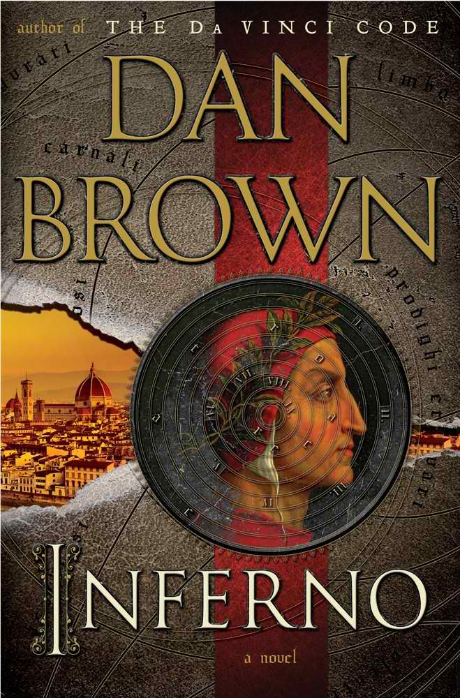
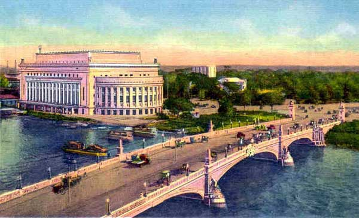
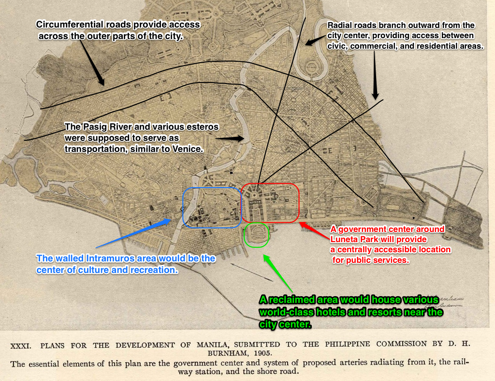
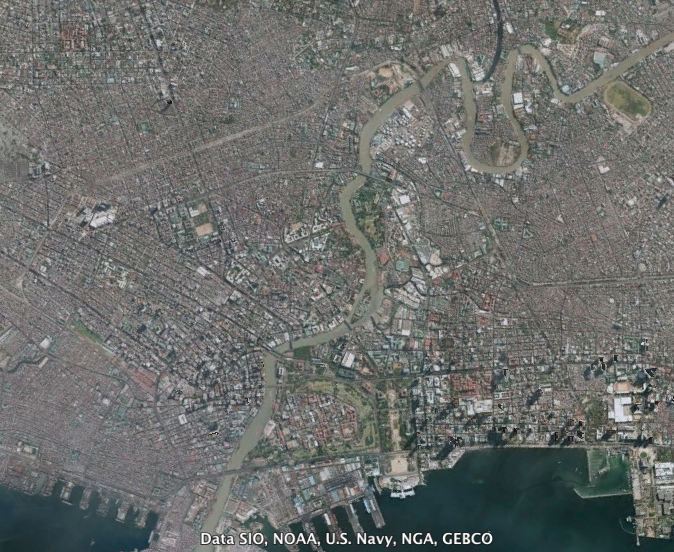

## Dan Brown's Inferno: "Gates of Hell"

```{r fig.cap="Dan Brown's <i>Inferno</i> dubbed Manila as the \"Pearl of the Orient\"", out.width="200px"}

```

After Dan Brown, in his new novel titled <em>Inferno</em>, <b>summarily compared the Philippine capital to the "gates of hell,</b>" and caused quite a stir - MMDA Chairman Tolentino [expressed disdain in an open letter](http://www.gmanetwork.com/news/story/309709/news/metromanila/mmda-to-dan-brown-manila-is-portal-to-heaven-not-gates-of-hell) and Philippine Bishops ['scolded' the author](http://www.ibtimes.co.uk/articles/471399/20130526/philippine-bishops-scold-inferno-author-dan-brown.htm) - I can only help but think about the state of this expansive metropolis.

<b>The particular passage from the book reads:</b>

<blockquote>“And so when the group settled in among the throngs in the city of Manila—the most densely populated city on earth—Sienna could only gape in horror. She had never seen poverty on this scale. How can one person possibly make a difference? For every one person Sienna fed, there were hundreds more who gazed at her with desolate eyes. Manila had <b>six-hour traffic jams, suffocating pollution, and a horrifying sex trade</b>, whose workers consisted primarily of young children, many of whom had been sold to pimps by parents who took solace in knowing that at least their children would be fed.</blockquote>

I really can't bring myself to denial; Manila really is a place where the wealthy rub shoulders with the poor, where there is rampant crime, and where traffic jams are a fact of life. There are many things that one would love about Manila - the people, culture, and character - that Dan Brown failed to mention. Nevertheless, a lot of what is immediately visible to visitors is accurately described by Brown.

How Manila came to be like this can be attributed to many factors - its destruction during World War II and subsequent disrepair, the influx of informal settlers who pollute and mess up zoning, the lack of proper urban planning and non-enforcement of zoning laws coming from its multiple uncoordinated city halls.

Manila wasn't always like this, however. It had a proper urban plan set out for it during the American colonial period, one that would, in my opinion truly make it the "Pearl of the Orient." <b>If it were followed, the Burnham Plan for Manila would have made the city a wonder to behold.</b>

## The Manila Burnham Plan of 1905

```{r fig.cap="Jones Bridge / Binondo Bridge under the Burnham Plan (Photo: Public Domain)"}

```

Back when we were newly acquired by the Americans, they commissioned one of the greatest architects and urban planners of all time, <b>Daniel H. Burnham</b>, to design the grand plan of Manila and Baguio City. This man was responsible for planning out Chicago and Washington, D.C. in the United States, with the latter being dubbed as the "best planned modern city in the world."

<b>Here's Burnham's plan for Manila with some key parts highlighted:</b>

```{r fig.cap="The Burnham Plan for Manila 1905 (Photo: public domain)"}

```

Burnham's Plan for Manila was submitted in 1905, and had the following features:

* <b>waterways</b> were used for transport, similar to the Bay of Naples and the City of Venice;
* the center of culture, government, commerce, and tourism was at the <b>geographic center</b> of the city, with an organized and refreshing network of circumferential and radial roads that allow access to the outer parts of the city containing commercial, residential, and civic spaces; and
* the <b>natural landscape</b> of rivers, esteros, and hilly terrain would be used to the advantage of the city, providing sunlight and character to the urban setting. 

## Present-day Manila

<b>Now, let's take a look at present-day Manila, courtesy of Google Earth:</b>

```{r fig.cap="Present-day Manila (Photo: Google Earth)"}

```

<b>You can see what was followed, and what was not followed.</b> The coastal road and one of the circumferential roads (Quirino Ave.) was followed, but the separation between residential and commercial zones have basically gone down the drain. Other roads are just topsy-turvy and laid down in a haphazard manner. <b>One of the most glaring differences are the absolute lack of the planned parks and civic spaces; these were consumed either by residential or industrial areas.</b>

I constantly find myself lamenting the sad state of traffic, planning and zoning in Manila. Foreigners who I've entertained around the city have always noted that the city didn't have a center - <b>nothing to call "downtown"</b>. Instead, we have multiple downtown areas developed by different property developers, dotted in the midst of abject poverty, to be hidden behind high walls and flyovers.

Urban renewal will be difficult without proper government funding, coordination between or the unification of our various city governments, and the relocation of informal settlers. <b>I hope, when time comes that old Manila starts to rot, we'll have the foresight to plan our capital city to become a true bastion of the Filipino spirit.</b>

## Further Reading

* [Manila Bulletin - On reviving the dying city of Manila](http://ph.news.yahoo.com/reviving-dying-city-manila-165234193.html) - The author lays out practical and immediately implementable plans for the new Manila mayor to execute in order to revive Manila.
* [Felino A. Palafox, Jr. - 1905 Burnham Plan for Manila](http://news.google.com/newspapers?nid=2479&amp;dat=20050822&amp;id=HK41AAAAIBAJ&amp;sjid=fiUMAAAAIBAJ&amp;pg=1830,17091981) - The author describes the original urban plan for Manila in detail.
