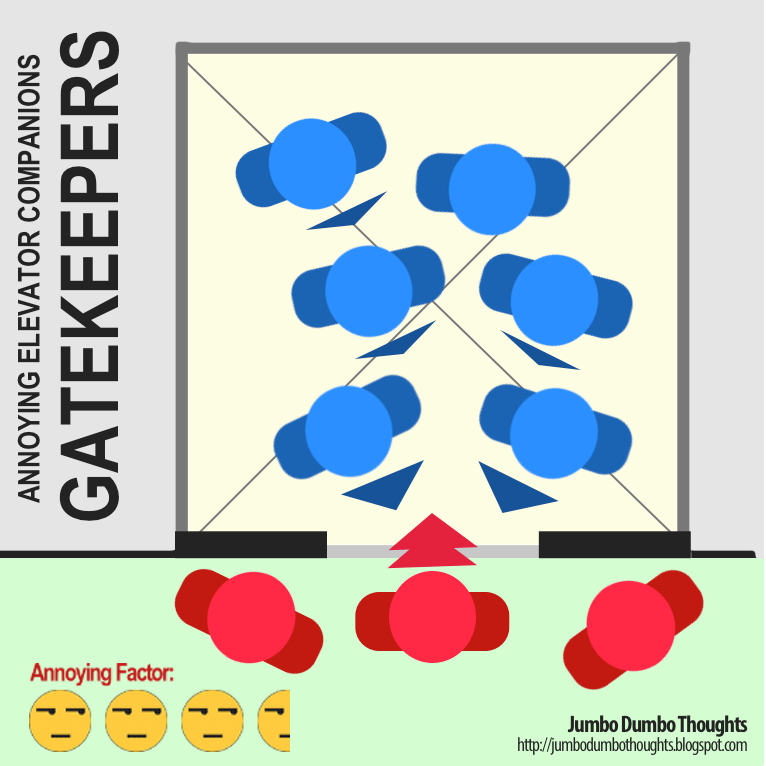
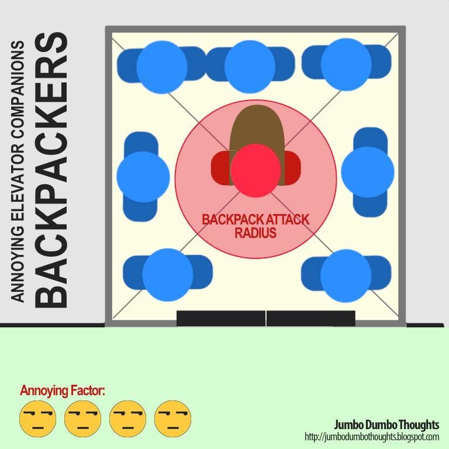
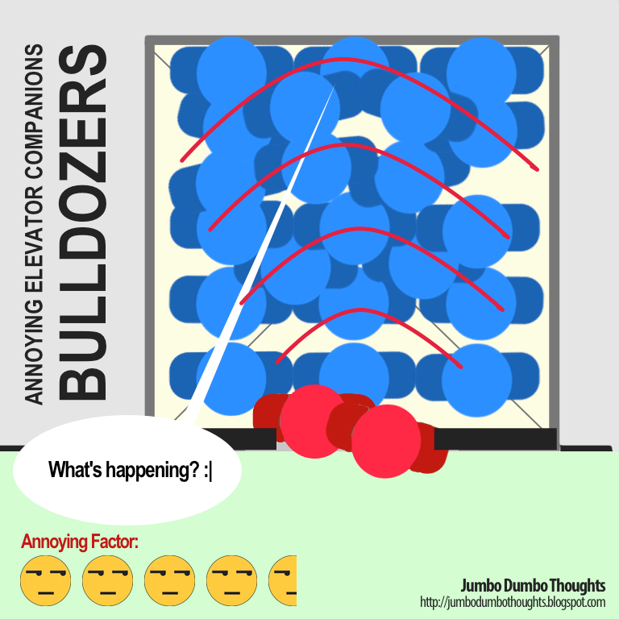
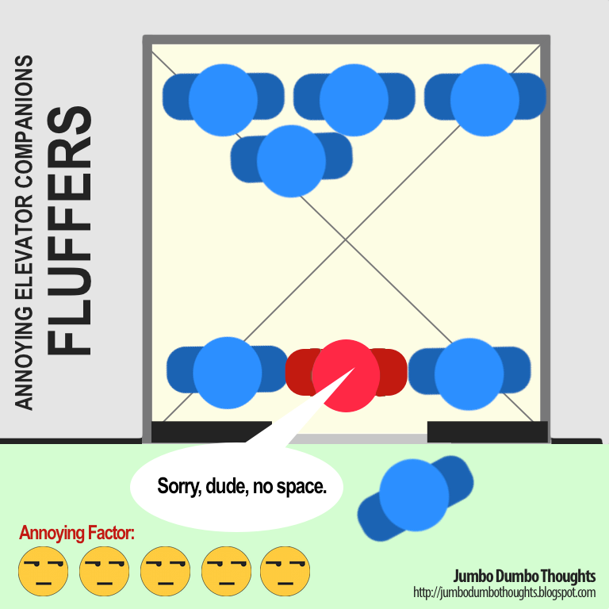

Elevator rides, despite being tediously mind-numbing moments spent avoiding awkward eye contact, are a necessary evil of city life, but sometimes, there are just some elevator companions that are bent on making your elevator rides even more of an annoyance than they already are. I've gone through my fair share of elevator rides, and would like to share four types of elevator companions that make me wish the doors cleave them in half (pardon the morbidity, it's just hyperbole). If you've read my post [On Annoying Drivers](/2013/06/on-annoying-drivers.html), you'll see that there are many things that annoy me.     
 
Let's see if you agree with me: 
 
## 4 - Gatekeepers 
 
```{r out.width="100%"}

```

Gatekeepers are always in a hurry, because, you know, unlike the rest of us, they're busy and important people.  We would love to help expedite their elevator embarkation process, if only they would *get out of the way* and stand to the side first, so that we can actually get out of the elevator. They'll just hang around the doors for a while before they either realize they're gatekeeping or just head on through, requiring both of you to engage in some sort of weird elevator door dance.

Worst of all, awkward intimate face-to-face moments can occur when both of you try to exit and enter at the same time, and a person who is in that much of a hurry must not have taken a bath properly.  

Annoying Factor: 3.5/5   

## 3 - Backpackers

```{r out.width="100%"}

```

Backpacks, especially in schools and universities, can be so large to the point that they are two to three times the thickness of the person carrying them. Moreover, they're at a person's *back,*so they won't know if they are  backing someone up against the wall of the elevator or flinging people around when they turn. 

Backpackers either don't know or don't care. They can't be bothered to spend the little effort needed to put the backpack at their feet and to avoid accidental backpack manslaughter within their backpack attack radius.

Annoying Factor: 4/5 

## 2 - Bulldozers 

```{r out.width="100%"}

```

It's not that Bulldozers really need to get on the elevator (they really might have a legitimate reason to hurry), but it's the manner in which they do so. I get that we all need to wedge ourselves into the lift to maximize people flow, but instead of politely asking or even just gently nudging to get to the space,  these people just charge in like raging bulls. 

The result - the entire crowd of people shift around violently, transferring energy around like a liquid because of their already crammed state. The worst thing is - if you're the poor guy at the back, you will never see the face of the attacker.

Annoying Factor: 4.5/5

## 1 - Fluffers 

```{r out.width="100%"}

```

You know the feeling when you buy an apparently full jar of peanut brittle, and find out that only the outer wall was really peaut brittle? It's the same feeling when you come across fluffers, only a million times more infuriating.

Fluffers, probably because of their intense desire to save five seconds by getting out of the lift first, hang around the entrance of the elevator, and  when someone tries to enter, they don't move and find space ; instead, they just stare at you as if you're supposed to pass through them like a ghost. 

You might ask why this is the one I consider the most annoying. Well, stuff like bulldozing, backpacking, or gatekeeping may be chalked up to absent-mindedness, but this offense, especially when done in bad faith, is just the worst.

I'd love to see a fluffer meet a bulldozer, just to see what happens.

Annoying Factor: 5/5 

Elevator rides are already dull and repetitive, people, let's not make them worse for anyone else. If you liked this post, I'd appreciate it if you liked, shared, tweeted, or +1'd it on your preferred social network. Thanks for reading!
