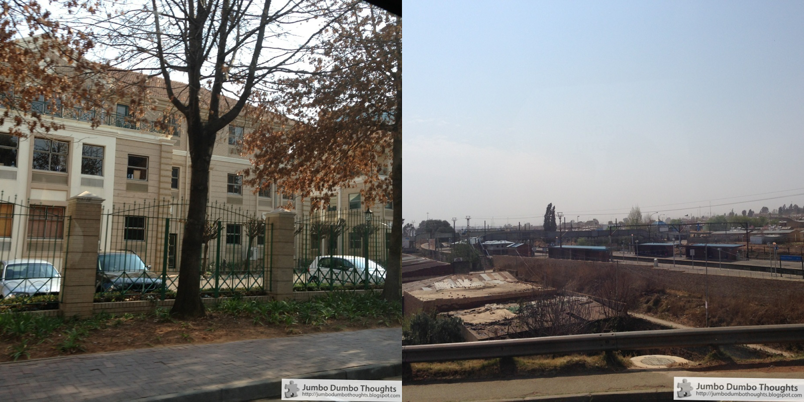
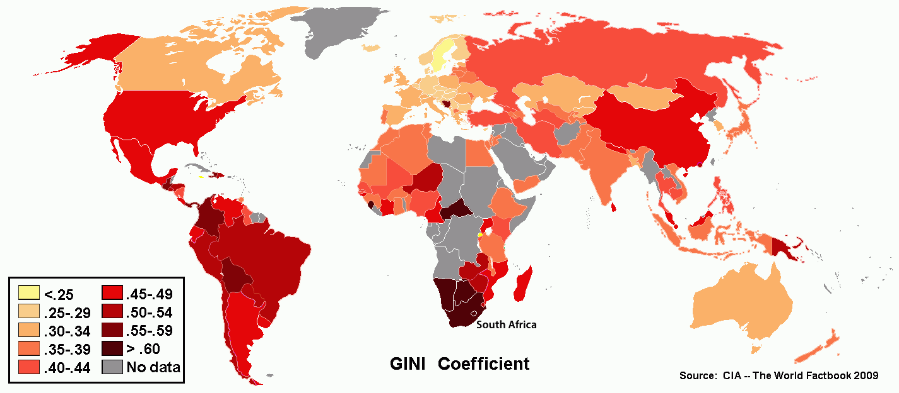
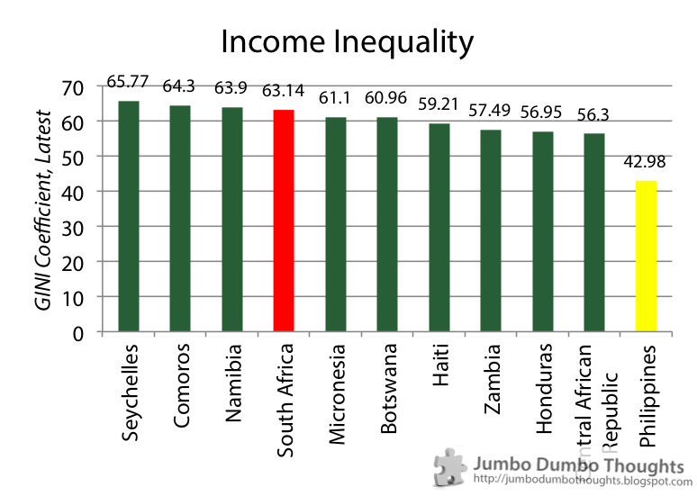
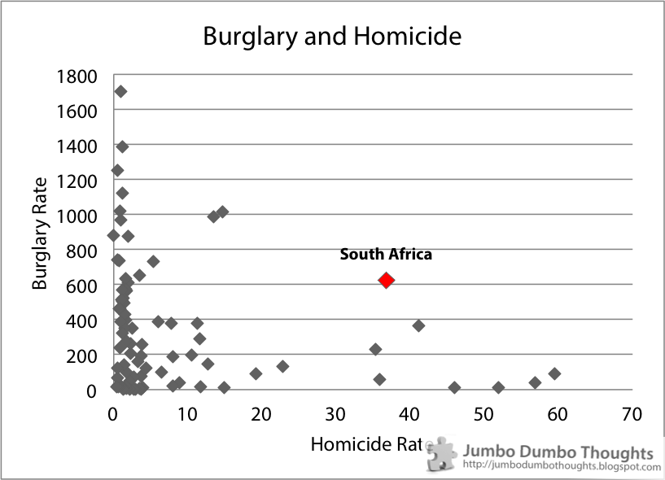
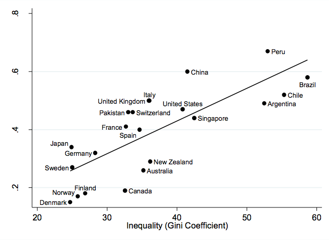

## An electrified city

Having recently gone to Johannesburg, South Africa to participate in a [business case competition](http://www.cimaglobal.com/Events-and-cpd-courses/globalbusinesschallenge/), I've of course taken the opportunity to explore the city as well. On our way to Sandton City, a shopping area, I began to notice that almost all of the beautiful buildings were nested in **ominous, tall, and electrified fences**:

```{r fig.cap="Electrified fences tarnish the beauty of many of the buildings in Johannesburg's Sandton business district", out.width="100%"}

```

All this obsession with protecting private property made me wonder how much South Africa has managed to heal from the scars of [Apartheid](http://en.wikipedia.org/wiki/Apartheid_in_South_Africa) which, after all, only ended 19 years ago in 1994. Apartheid was a former policy of racial segregation in South Africa that caused huge disparities in the living conditions between blacks and whites in the country. It permeated everything from residential areas down to the public toilets.
  
One could still see traces of this policy today - not of the segregation itself, but in terms of high income inequality. There were extremely wealthy subdivisions (again, protected by electric fences and even armed guards) in one part of town, but very impoverished townships on the other.

```{r fig.cap="Rich gated communities protected by fences, guards, and promises of an armed response within minutes (left) highly contrast with the impoverished townships (right) in Gauteng, South Africa.", out.width="100%"}

```

This brings to mind the gated communities in Manila where the richest people live - as highlighted in an [earlier blog post](http://jumbodumbothoughts.blogspot.com/2013/08/best-places-to-live-and-work-metro-manila.html#.UioEAGQY0TI0) - although to a much lesser extent.
  
## Crimes of envy
  
I looked into the data, and guess what - *South Africa still has one of the highest levels of income inequality in the world.* The GINI coefficient, a measure of overall income inequality (where higher GINI means more inequality), places South Africa in the highest bracket. In comparison, the Philippines isn't doing too bad in terms of income inequality, after all.

```{r fig.cap="South Africa retains a high GINI coefficient; one of the highest in the world. (Map source: CIA, public domain)"}

```

```{r fig.cap="Income inequality of top 10 most unequal countries, plus Philippines (Data Source: WB World Databank)", out.width="100%"}

```

I can *presume* that this is one of the causes of crime in South Africa, which, despite recent improvements, is still at alarmingly high levels.

```{r fig.cap="Data Source: UNODC", out.width="100%"}

```

With high levels of burglary and homicide, coupled with a large gap between the rich and the poor, it's not so surprising anymore that a *fence culture* - electric fences and armed guards - has formed in the country.
  
## The Great Gatsby curve: social mobility vs wealth redistribution
  
Everyone agrees that this problem is highly deplorable, but **not everyone agrees on how this can be ameliorated**. Some people argue that **wealth redistribution** - progressive taxation, social security, and preferential treatment of the poor - will solve the problem by getting rid of income inequality and therefore its negative implications. On the other hand, others argue that people have different aspirations and goals that naturally cause this inequality, and that what government must do is to simply provide **social mobility**, which means providing opportunities such that the poor can always rise up the social spectrum with a little grit and hard work.
  
This debate has raged for ages, but recent economic evidence presented in 2012 by Alan Krueger, chairman of the US Council of Economic Advisers, has possibly shown that income inequality actually causes social immobility, possibly defeating the assertion that one can provide social mobility without disrupting the income distribution. This is called the **Great Gatsby Curve**, taking from the rags-to-riches story of the main character in that famous movie (and novel), and is shown below:

```{r fig.cap="Source:<a href='http://milescorak.files.wordpress.com/2012/01/inequality-from-generation-to-generation-the-united-states-in-comparison-v3.pdf' target='_blank'> Corak, M. (2012). \"Inequality from generation to generation: the United States in comparison\"</a>", out.width="100%"}

```

As you can see, this demonstrates a (somewhat) clear positive correlation between income inequality as measured by the GINI coefficient and social mobility as measured by intergenerational earnings elasticity (this is how much the income of your parent/s affect your future income, the more it does the less socially mobile you are). Spurious correlation cannot be ruled out here, but you can posit that higher income inequality means more entrenched interests at the top preventing social mobility (lobbying, crony capitalism), and thus, it is not enough to provide these opportunities to solve inequality (because they will not be given).
  
A good way of thinking about this is that it is much more difficult to move up and down the social ladder if the rungs are further apart. To illustrate, the White House provided this neat little animation:

```{r fig.cap="(Source: United States White House, public domain)"}

```

This assertion is still very new and thus very debatable: [Greg Mankiw](http://gregmankiw.blogspot.co.uk/2013/07/some-observations-on-great-gatsby-curve.html) argues that this is simple a side effect of diversity (different aspirational desires and different income variances across countries) that the graph does not take into consideration. [The National Review](http://nationalreview.com/agenda/356421/great-gatsby-curve-not-so-great-after-all-j-d-vance) has shown that the relationship does not hold between different US cities, and thus showing that there might be heterogeneity between the countries. On the other hand, [Paul Krugman](http://krugman.blogs.nytimes.com/2012/01/15/the-great-gatsby-curve/) and [Timothy Noah](http://www.newrepublic.com/blog/timothy-noah/99651/white-house-heres-why-you-have-care-about-inequality) see potential in this theory. The Economist blog [Democracy in America](http://www.economist.com/blogs/democracyinamerica/2013/07/great-gatsby-curve#comments) has even argued that Mankiw's critique is invalid because internal characteristics and natural abilities are not the only factor that influences a person's income; that they require nurturing or protection from society's stochastic ills.
  
However, going back to South Africa, whether or not the Great Gatsby Curve is a reflection of economic reality or a spurious correlation, one thing is for sure: Social mobility may improve, and opportunities for the poor may be provided, despite high income inequality, but these:


are most certainly not helping.
  
If you enjoyed reading this post or found it interesting, I'd appreciate it if you shared it with your friends on your preferred social network, or commented below. Thanks for reading!
