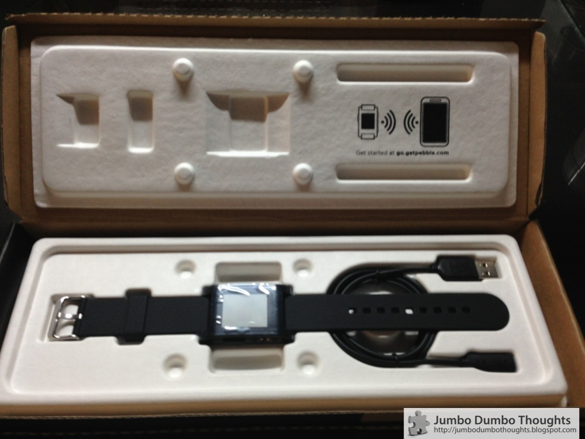
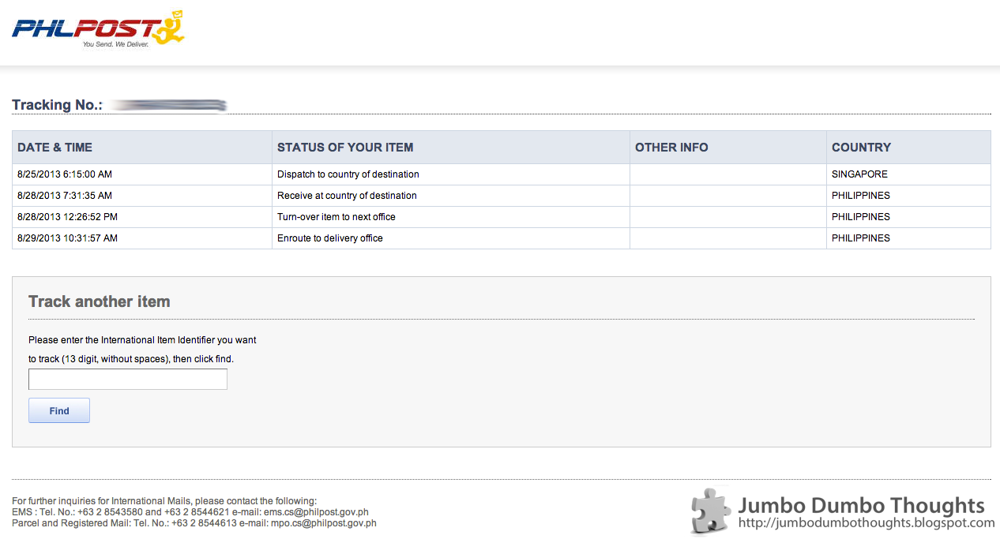
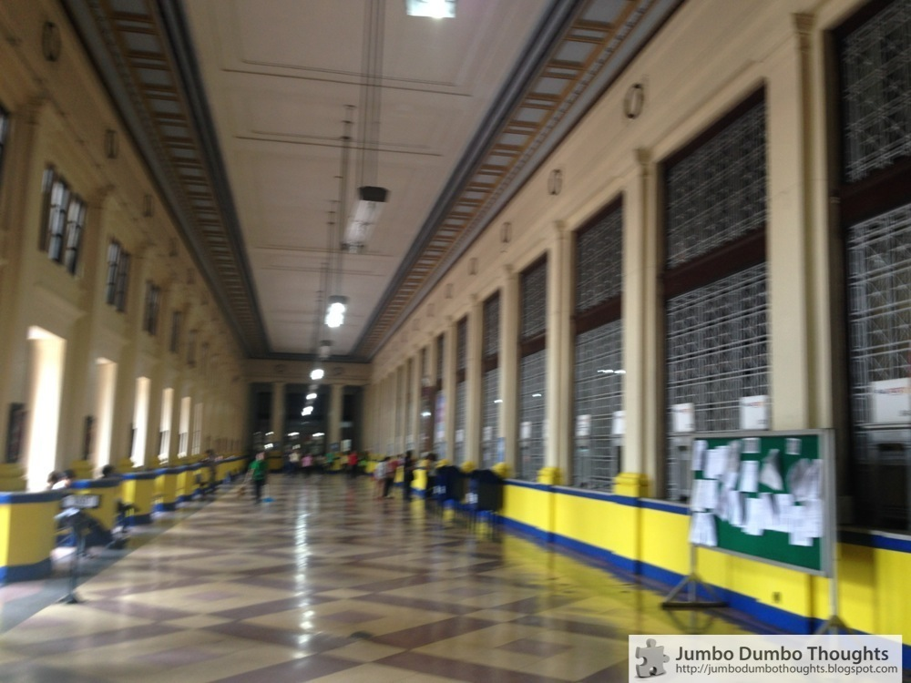
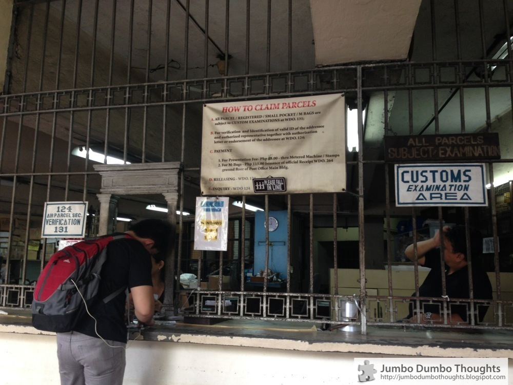
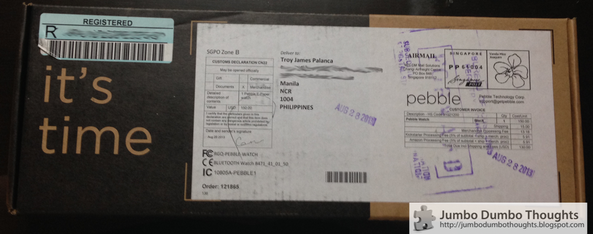
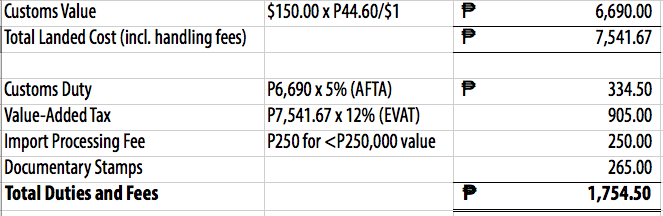
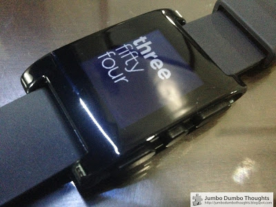

```{r fig.cap="It took a lot of manoeuvring around trackers and phone numbers to finally get my hands on this Pebble watch.", out.width="500px"}

```

I recently ordered a [Pebble watch](http://getpebble.com/) - which I have *itching* to get my hands on since it came out on [Kickstarter](http://www.kickstarter.com/projects/597507018/pebble-e-paper-watch-for-iphone-and-android/posts/536005). To my dismay, I wasn't given any shipping choices after ordering online. Instead, it was sent through the **Express Mail Service (EMS)**, managed in the Philippines the Philippine Postal Service or **Philpost.**

My order was shipped from Singapore on August 22, and I have only received it today, September 10, after almost two weeks, when it should have taken only 4 days to a week considering all factors. This even involved extra effort on my part.

A lot of people seem to having similar problems with the postal service regarding their online purchases, so I'd like to share how I managed to do it. A few facts: I had this shipped from Singapore to Malate, Manila and it's a small package valued at $150.

Here's how I eventually managed to wrench my Pebble from the web:

  * I tracked it through Singapore Post as it made its way into the lethargic embarrassment of a postal service that we call the Philippine Postal Corporation.
  * Philpost did provide a tracking tool, despite the rest of their website being shut down, and this is what I saw when it arrived in Manila on August 29:
      
  * Philpost's tracking service informed me that my package was en-route to delivery office since August 29, but 12 days later I found that it was actually already at my local post office.
  * After 12 days, I got fed up with it *still* being "en-route to delivery office" and decided to make some calls. Unfortunately, all the numbers listed at the bottom of the tracking page and some numbers from the internet *did not work*.
  * Eventually, by making good use of the phone's plunger and redial button for around 45 minutes, I managed to get a hold of the EMS Center in Pasay City through which all international airmail enters the country. As of September 10, 2013 this number worked, but only if you try multiple times: +63 2 854-4613.

They told me that they've already shipped it to the local post office: Manila Lawton (or the famous Post Office Building in the center of the city), so I decided to call them over there. This is where it gets really hairy and annoying. EMS Pasay gave me the phone number to the Office of the Postmaster, and they instructed me to call the Parcels division. *You have to know that they are in the same building.* They kept telling me to call the Parcels direct line despite the fact that the Parcels line was disconnected. I pleaded the Postmaster to just go over there and tell them their phone wasn't working, or even to just give me another number, but their excuse was "Hindi pwede eh, nasa baba 'yun." ("We can't do that; it's downstairs."). Talk about government inefficiency at its worst.

Finally, I had enough of the crazy roundabout phone dance. I decided to go there, whether or not I could confirm the existence of the package, to get my hands on my Pebble once and for all.

My car was off the road due to number coding, so I decided to take the LRT to the post office. It was a relatively easy trip from the DLSU area, anyway. The post office was a beautiful example of old Manila that I wish was preserved. It was a beautiful building and I could almost imagine what it was like in its heyday. Unfortunately, now it's just another run-down building maintained with patchwork engineering.

```{r fig.cap="The Post Office was a beautiful building, but not anymore.", out.width="400px"}

```

To get to the Parcels division, you needed to turn right from the entrance, go down a flight of stairs, and make your way through a dark corridor until you see Window 124 and 131 (which are somehow combined):

```{r fig.cap="Parcels claiming area at the Manila Post Office.", out.width="400px"}

```

I asked them why their telephone wasn't working. They nonchalantly told me that their phone broke from the recent flood, as if it was perfectly okay for no-one to be able to contact them. The lady then scanned a gigantic record book of *handwritten* tracking numbers for my parcel (why is this not computerized?). After some time, she gave up and let me check the records, and to my relief it was there. It's particularly annoying how she kept chanting "Mag-aalas dose na. Mag-aalas dose na." (It's almost noon. It's almost noon.) while I was searching, hinting at the nearing lunch break. Such a mentality is so prevalent in many government offices.

I then filled out a notice card (although I wasn't really notified, *I* notified *them*.) and signed a receiving form for the parcel. She went to the back, took the parcel from storage, and <b>behold, my package, rescued from the eternal depths of the postal system!</b>

```{r fig.cap="This is the parcel I've been tracking for nearly three weeks."}

```

There was one final hurdle, however: **Customs**. I had already prepared for the taxman. I did my homework and brought my own duty computation based on the [Bureau of Customs' tax computation formula](http://customs.gov.ph/references/tax-computation/) and the rates prescribed in the [ASEAN Harmonized Tariff Nomenclature Book](http://www.tariffcommission.gov.ph/AHTN_(TARIFF)_BOOK.htm) from the Philippine Tariff Commission, since the parcel came from Singapore (part of the [ASEAN Free Trade Area](http://en.wikipedia.org/wiki/ASEAN_Free_Trade_Area)). 

Surprisingly, the computation turned out to be almost exactly the same as mine, as follows:

```{r}

```

I've read up on horror stories with customs where up to double the item's value was imposed, so I prepared myself to fight for a lower levy, but their computation was actually spot on. I quickly ponied up the cash, got the receipt, and was on my merry way.

I am finally with my lovely Pebble watch, and it has been amazing so far. I'm so excited to review it in a later blog post, probably after a week or two of use under real world conditions.

```{r fig.cap="My Pebble watch is finally here!", out.width="400px"}

```

Thanks for reading! If you have any post office experiences that you would like to share or have any questions, please feel free to comment below. I'd appreciate it if you shared, tweeted, or +1'd it on your preferred social network.

Important Numbers and Websites:
  
  * [Philpost Track & Trace](http://webtrk1.philpost.org/index.asp) - tracks your package through the Philippine system after it has arrived in the country; have your EMS tracking number ready.
  * [Bureau of Customs Tax Computation](http://customs.gov.ph/references/tax-computation/) - formula on how to compute the taxes on imports.
  * [ASEAN Harmonized Tariff Nomenclature Book](http://www.tariffcommission.gov.ph/AHTN_(TARIFF)_BOOK.htm) - tariff rates on different products coming from ASEAN member countries.
  * EMS/CMEC Center, Domestic Road, Pasay City - entry point of all airmail shipments to the Philippines through NAIA; useful as first place of inquiry. 
    * Working number as of Sep. 10, 2013 - +63 2 854 4613
    * Other numbers - +63 2 851 6688, +63 2 854 0084 to 86
  * Manila Post Office (Lawton Plaza) - for Manila parcel pick-ups, sometimes.
    * Postmaster's Office - +63 2 527 0070
    * Parcels Division - +63 2 527 0079 (not working as of Sep. 10, 2013)
