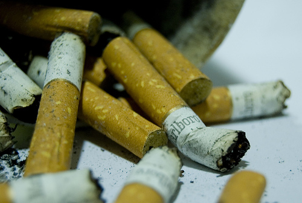
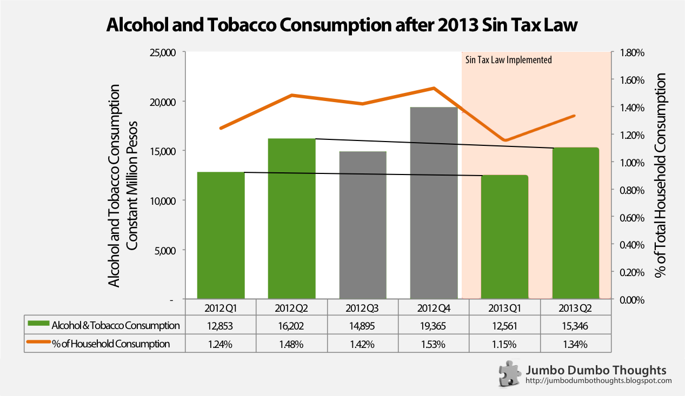
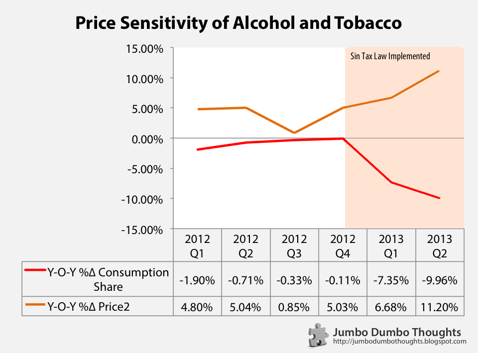

> HOW EFFECTIVE ARE HIGHER SIN TAXES? Last year, President Aquino signed the Sin Tax Bill, raising the effective tax burden on sin products from 26% to 63% within 5 years. It had two goals: (1) raise revenue for the government, and (2) reduce cigarette consumption and negative externality. It's now been half a year since the new taxes were implemented, and it's a good time to assess how it's been achieving its goals so far.

**UPDATE (Sept 16 2014):** This post has been updated with 2014 Q2 data. Please [click here](/2014/09/sin-taxes-2014q2-update.html) to view the updated article.

**UPDATE (Dec 11 2013):** This post only uses data for the first two quarters of 2012. I've updated it with the latest 3rd quarter national accounts data in a [quick new post](/2013/12/effectiveness-sin-taxes-philippines-2013q3-update.html), so you might want to check that out afterwards.

## The price of sin is taxes

```{r fig.cap="Around 1% of household expenditures go toward purchasing cigarettes. (Photo: <a href='http://www.flickr.com/photos/bachmont/1414623570/sizes/m/' rel='nofollow'>Flickr/Bachmont</a>, <a href='http://creativecommons.org/licenses/by/2.0/' target='_blank'>CC BY 2.0</a>)", out.width="400px"}

```

Late last year, the [President signed the Sin Tax Bill into law](http://www.philstar.com/headlines/2012/12/21/888415/sin-tax-bill-signed-law) after it spent 15 years in Congress, mainly due to a very strong industry lobby against it. The law raises the effective tax burden on alcohol and tobacco products (also known as "sin products" or those that [produce negative externalities](http://en.wikipedia.org/wiki/Externality)).

While you may or may not agree with imposing higher excise taxes on sin products, it's useful to evaluate how this bill has done so far in terms of its stated goals: (a) higher revenue collection, and (b) reduced sin products consumption.
  
It's quite obvious that the bill has increased tax revenues, which [increased by 46%](http://www.philstar.com/business/2013/08/10/1071531/sin-tax-collection-46-h1) or by approx. P12 billion. It's not up to the targets, but that can be chalked up to adjustments and probable front-loading of inventory by manufacturers.
  
However, analyzing the impact on consumption is a little more complicated. Some say [cigarette consumption hasn't been dampened](http://www.philstar.com/business/2013/07/11/963983/sin-tax-reform-working) due to downshifting; consumers are shifting to lower-priced brands. On the other hand, [others](http://www.philstar.com/headlines/2013/08/19/1107331/phl-cigarette-consumption-down-japan-study) (suspiciously the tobacco companies) say that consumption has gone down significantly.
  
## A look at consumption data
  
Let's take a look at the national accounts data on Alcohol and Tobacco household consumption for 2012 and the first two quarters of 2013, those that faced higher tax rates: 

```{r fig.cap="Data Source: National Statistical Coordination Board"}

```

It's important that comparisons be made for each corresponding quarter (or year-on-year) to factor out seasonality. We compare 2012Q1 to 2013Q1, because Q4 might naturally have higher consumption due to the Christmas season.

The percent of household consumption is more relevant because it factors out the income effect (changes in income may cause alcohol and tobacco expenditure to change regardless of tax increases) **Both as an absolute level and as a percentage of total household consumption, alcohol and tobacco consumption has fallen from their 2012 levels.**
  
Alcohol and tobacco consumption dropped from P12.9B to P12.6B in the first quarter, and from P16.2B to P15.3B in the second quarter. Also, alcohol and tobacco fell as a share of total household expenditure from 1.24% and 1.48%, to 1.15% and 1.34% in the first and second quarters, respectively. It's not as significant as the 50% drop predicted by the government, though.
  
## New year's resolution
  
Instead of just looking at time trends, we can get a better picture of whether higher sin taxes actually discourage consumption by observing the change in prices and resultant change in consumption (once again, on a year-on-year basis to avoid seasonality):

```{r fig.cap="Data Source: National Statistical Coordination Board"}

```

Since the sin tax law was implemented, the price of alcohol and tobacco has grown, coupled with almost a proportional reduction in the sin products consumption share. **Consumers seem to be reacting to the tax increases, and it should pick up as the taxes ramp up in the next few years.**

## Bottom Line: Consumers are feeling it, but not that much
  
In summary, I think the data paints a clear picture: Consumption has indeed gone down, but not as much as the government had hoped nor as much as tobacco companies would like to say they did. Now to hope that the funds actually go to the purported healthcare projects.

Thanks for reading! If you found this article interesting or otherwise enjoyed it, I'd appreciate it if you commented, shared, tweeted, or +1'd it on your preferred social network.
  
### Further reading
  
  * [Official Gazette Statement on Sin Tax](http://www.gov.ph/sin-tax/) - the Malacañang rationale for supporting this legislation
  * [Revenue Regulations No. 17-2012](http://www.dof.gov.ph/wp-content/uploads/2013/02/RR-17-2012.pdf) - implementing guidelines for revised sin taxes
  * [DOF FAQ Primer on Sin Tax Reform](http://www.dof.gov.ph/wp-content/uploads/2012/03/Sin-Taxes-Q-and-A.pdf) - a lot of useful information on the new sin taxes
    
### Notes and caveats
  
Some notes and reservations about the data, though:

  * The data is only for two quarters - there might be more developments as time progresses and as the implementation becomes full and ramps up in succeeding years.
  * All data used is at constant prices to take away the price inflation effect - only changes in expenditure because of volume increase, not price increases, will be incorporated.
  * Growth rates are computed on a year-on-year basis to remove any seasonality.
  * This is just an initial look at aggregate data - a more meaningful approach would be a direct survey of the consumption habits of smokers.
  * Data and computation requests can be made through a comment or the contact form at the bottom of the page.
