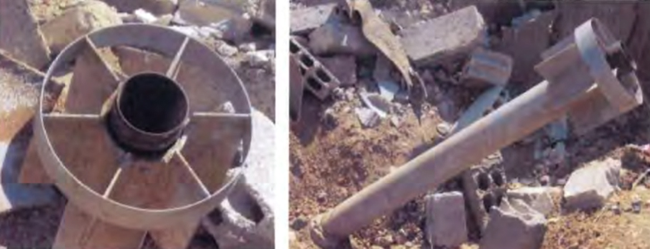
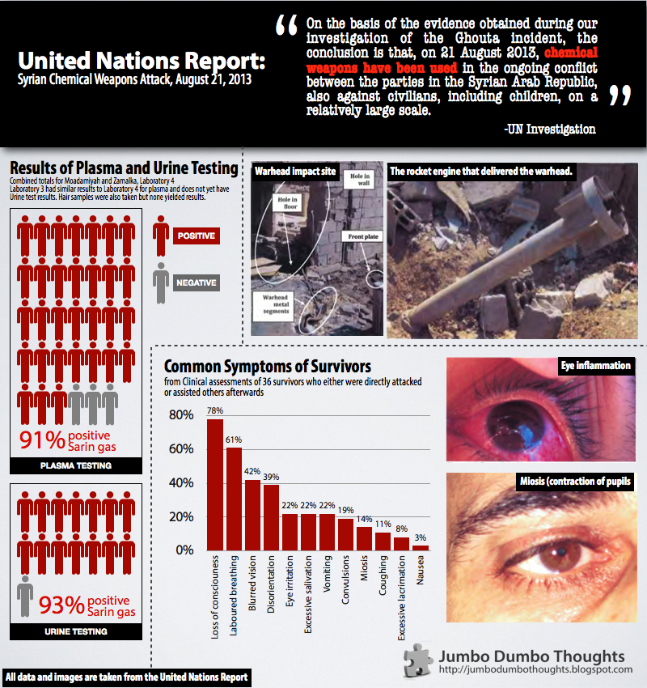

> The United Nations has recently concluded an investigation into the Syrian chemical attack last August 21, 2012 and concluded that chemicals, particularly the nerve agent Sarin, were indeed used against civilians, including children. Let's take a look at the facts and figures that allowed them to arrive at their conclusion, and illustrate how chemical warfare can be such an inhumane practice.

```{r fig.cap="This was the rocket engine used to deliver the deadly sarin gas payload. (Source: UN Report)", out.width="100%"}

```

The United Nations has recently released the report on its investigation into the Syrian chemical weapons attack. The conclusion isn't surprising: **Surface-to-surface missiles carrying the nerve agent Sarin were used (by someone, we don't know who) in the ongoing conflict in the region - injuring, incapacitating, and killing civilians, including children.**

They used various methods of establishing proof: interviews of survivors and witnesses and documentation of munitions, as well as environmental samples, symptoms of survivors, and hair blood and urine samples from the survivors. **I'd like to put a spotlight on the data gathered using the last three methods, so you can see for yourself how horrible chemical warfare and the situation in Syria are (click the image to enlarge).**

```{r out.width="100%"}

```

Data Sources:

  * [United Nations Report](http://www.un.org/disarmament/content/slideshow/Secretary_General_Report_of_CW_Investigation.pdf)
  * [The Guardian Data Blog - Chemical weapons in Syria: full data from UN report](http://www.theguardian.com/news/datablog/2013/sep/17/chemical-weapons-in-syria-data-from-un-report)
