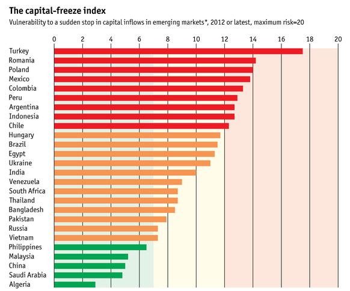

> This week in news: The Philippines posts large gaming revenue gains from recent resort and casino developments along Manila Bay, and the risk of capital flight remains relatively low amid prudent government finance and capital controls. Read more about them in this post.

```{r fig.cap="New developments along the Manila bay, like Solaire in Pasay City, have boosted Philippine gaming revenues to significant levels, and more are likely to come as a large PAGCOR gaming complex is being built. (Photo: <a href='http://www.flickr.com/photos/maehabasolo/9160146018/sizes/m/in/photolist-eXs9h3-eXrMJf-eXfTxz-eXfuBZ-eXs8b5-eXrXgA-eXfNyt-eXrY89-eXspjC/'>Flickr/Renzelle Mae Abasolo</a>, <a href='http://creativecommons.org/licenses/by/2.0/deed.en'>CC-BY-2.0</a>)", out.width="400px"}

```

I've decided to restart my previous series highlighting notable pieces of news that don't really make it into the headlines, but (at least for myself) merit attention and interest. It'll mostly be about the Philippines, business, and economics, and a little humor in between.

Amidst the pork-barrel scam, its ensuing antics, the Zamboanga crisis, and a new revelation regarding the Corona impeachment, there are at least some things that Filipinos can be happy about:<b>&nbsp;Our investments near the Manila bay have actually brought a significant amount of gambling revenue to our shores, and the</b><b>&nbsp;economy is unlikely to be affected by the emerging markets crunch.

## Gambling revenues up; now at par with neighbors - Morgan Stanley

[The Economist has reported](http://www.economist.com/blogs/graphicdetail/2013/09/daily-chart-5) that gambling revenues are up for most of the region in Asia, especially for the Philippines - &nbsp;a late entrant into the casino game, according to a report by Morgan Stanley:

<iframe width="560" height="315" src="https://www.youtube-nocookie.com/embed/TUkChnGO5X4" frameborder="0" allow="accelerometer; autoplay; encrypted-media; gyroscope; picture-in-picture" allowfullscreen></iframe>

Although Macau tops everyone by a long shot, with revenues and profits mainly coming from Chinese high-rollers, the Philippines is starting to make itself known by generating around $2B in gaming revenue, almost a quarter of Las Vegas. </b>Not only that, high-rollers (yes, mainly from China) also tend to frequent the country - revenue per visitor is second only to Macau and Singapore at $404 per visitor.

This can be attributed to the new developments along the Manila bay, the most recent being Solaire Resorts & Casino, which [generated P578.3M or $13.8M in its first 15 days of operation](http://business.inquirer.net/122241/15-days-after-opening-bloomberry-resort-corp-earns-p578-3m-revenue). Although [saddled by pre-operating expenses](http://www.gmanetwork.com/news/story/308722/economy/companies/bloomberry-posts-over-p1-b-net-loss-in-q1-on-solaire-expenses), revenue projections considering more casinos on the way including the new [PAGCOR Entertainment City](http://www.philstar.com/business/2013/06/24/957399/entertainment-city-billed-next-major-central-business-district) are at around $5B ([Bank of America](http://www.interaksyon.com/business/56661/philippine-gaming-revenue-to-double-once-pagcor-complex-opens-bank-of-america-says)) to $10B ([PAGCOR](http://www.philstar.com/business/2013/06/18/955117/gaming-revenues-seen-hit-2.5-b)). This will bring the Philippine gaming industry at par with Las Vegas.

One may or may not agree with the benefits of having a huge entertainment complex, but you can't deny the pecuniary benefit: tourism, jobs, and spillovers to retail, food, industry, and other tourism support businesses. It's definitely an improvement in my opinion.

However, what if our [tensions with China and Taiwan stem the flow of high-rollers into the country](http://www.rappler.com/business/industries/410-gaming/32039-tensions-with-taiwan-affect-solaire-revenues)? Well, it might not be such a risk due to the next article.

## Capital flight not a risk for the Philippines - The Economist

The Economist has just published a capital-freeze index that measures the risk of capital flight (a sudden stop to or reversal of investments) for 26 emerging economies:   

```{r fig.cap="<a href='http://www.economist.com/news/finance-and-economics/21586569-error-apology-and-revision-spreadsheet-different' target='_blank'>Source: The Economist</a>", out.width="100%"}

```

According to the index, government thrift, comparatively low debt, stable credit and relatively closed economy, put the Philippines at low risk of sudden capital flight. This is good news for the country in an environment where funds are pulling out of emerging markets, crippling growth in such countries.

So there you go, two articles that restore my faith in the country.<br /><b><i><br /></i></b><b><i> </i></b> <b><i> Thanks for reading! If you found this article interesting or otherwise enjoyable, I'd appreciate it if you liked, shared, tweeted or +1'd it in you preferred social network.</b></i>

### Sources:

  * <a href="http://www.economist.com/blogs/graphicdetail/2013/09/daily-chart-5">The Economist - Graphic detail - Hitting the jackpot</a>
  * <a href="http://www.economist.com/news/finance-and-economics/21586569-error-apology-and-revision-spreadsheet-different" target="_blank">The Economist - The capital-freeze index</a>
