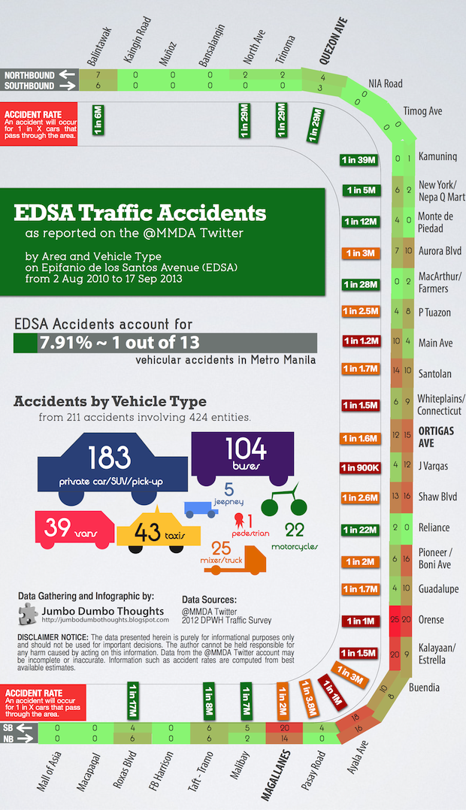
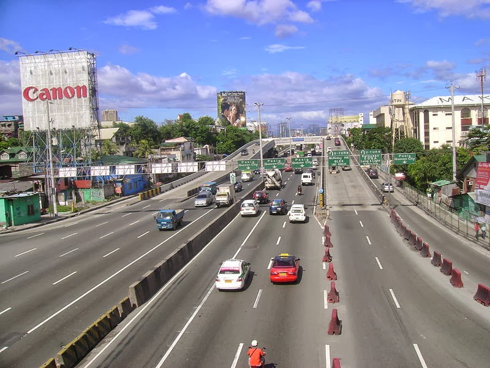
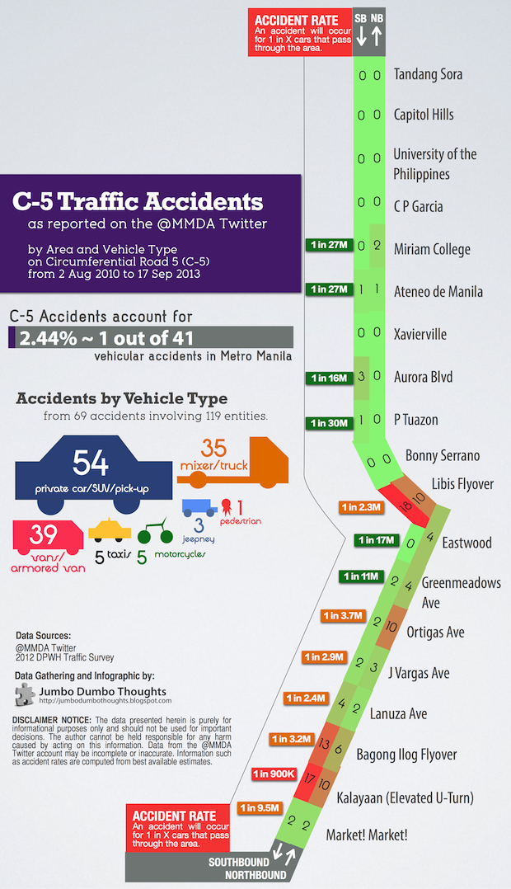

> Ever wonder where and what types of vehicles are involved in road accidents along Manila's major thoroughfares? The MMDA twitter account can shed some light on that. Vehicular accidents reported by the MMDA along EDSA and C-5 are parsed to reveal the most dangerous intersections and flyovers, as well as expose buses and trucks as major accident culprits.
  
## MMDA: 3 Years of Accident Tweets

Sometimes, it can be surprising how data can be extracted from unexpected places. Specific observations of traffic accidents in Manila are hard to come by, as they are commonly just lumped together in an aggregate. Using data from the MMDA's twitter account, however, we can generate some pretty useful information on: (a) total number of vehicles involved in an accident in an area, (b) how likely that a car will encounter an accident in the area, and (c) which vehicle types are most commonly involved in accidents along the route. *How this data was generated is in the last part of this post.*
  
All of this data is presented in the infographics below. We take a look at vehicular accidents occurring along the two major thoroughfares in Metro Manila - Epifanio de los Santos Avenue (EDSA/C-4) and Circumferential Road 5 (C-5).
  
## EDSA: Business or pleasure?
  
Ah, the venerable old EDSA; the historic avenue; the [highway from hell](http://www.philstar.com/modern-living/2013/06/22/956606/10-reasons-why-edsa-avenue-hell). Whether you're plying EDSA to go to work or to hang out with friends, it's not going to be easy. The most accidents occur along the Makati/BGC area, and the runners-up run along malls such as Shangri-La, SM Megamall, and Forum Robinsons.

```{r out.width="100%"}

```
  
As you can see, the red areas are concentrated to the south of the city along the main business districts: Makati, BGC, and Ortigas. The odds are highest at the Ayala tunnel, a site of [many a gruesome incident](http://newsinfo.inquirer.net/30451/seven-vehicle-collision-in-edsa-ayala-tunnel-police), and also along the steep incline/decline along Kalayaan/Estrella and Orense. The accident rates are also high near the EDSA malls: Robinsons Galleria, SM Megamall, EDSA Shang, and Forum Robinsons (Ortigas Avenue, J Vargas, Shaw Blvd, and Pioneer/Boni Ave).
  
Accidents are practically nonexistent in the northern part of the city, probably because of the road infrastructure and the fact that people in residential areas tend not to be in such a hurry.
  
A lot of accidents involve buses, which compose nearly a fourth of accidents, even when they are only around 10% of the traffic. This can be attributable to [improper bus stops](http://www.rappler.com/move-ph/34374-edsa-bus-segregation-system) and [reckless driving resulting from the boundary system](http://cheftonio.blogspot.com/2011/02/bus-drivers-should-be-given-fixed.html), so to give my two cents on the matter: yes, buses are a huge traffic problem along EDSA.
  
But enough about EDSA, let's move to the other well-loved avenue further out in the city.
  
## C-5: Acrophobia may save you

```{r fig.cap="The Kalayaan elevated u-turn interchange along C-5 is the most accident-prone area along the beltway. (Photo: <a href='http://en.wikipedia.org/wiki/File:Taguig-c5-kalayaan-2012-01.JPG' target='_blank'>Patrick Roque/Wikimedia Commons</a>, <a href='http://creativecommons.org/licenses/by-sa/3.0/deed.en' target='_blank'>CC-BY-SA-3.0</a>)", out.width="400px"}

```
  
It seems that along the outer areas of the city, you'll be wise to avoid curved, elevated areas which might be the main cause of accidents. A fear of heights may just be a blessing in disguise.

```{r out.width="100%"}

```

Libis flyover, the Bagong Ilog flyover, and the Kalayaan elevated U-turn rack up the most number of vehicles in accidents. C-5 Kalayaan, with its particularly strange elevated u-turns, is quite precarious with an accident per 900,000 vehicles passing through. There are virtually no accidents on sections without such flyovers and u-turns, especially to the north.
  
Trucks and vans are most commonly involved in accidents along C-5, and this isn't really that surprising given that most industrial areas can be found on the outskirts of the city.

## We're not THAT bad, after all!

If you think our road safety situation is deplorable, we're actually on the [low end of the spectrum](http://en.wikipedia.org/wiki/List_of_countries_by_traffic-related_death_rate) - Filipinos really are good drivers; we just have terrible roads and systems. However, if you're looking for an example of truly crazy accidents, this Russian driving camera compilation should be more than enough:
  
<iframe width="560" height="315" src="https://www.youtube-nocookie.com/embed/itMdLTd1l4E" frameborder="0" allow="accelerometer; autoplay; encrypted-media; gyroscope; picture-in-picture" allowfullscreen></iframe>

Thanks for reading! If you found this post useful, interesting or otherwise enjoyable, I'd appreciate it if you shared, liked, tweeted, or +1'd it on your preferred social network.
  
## Data Processing
  
I started with the MMDA twitter account history, which spans a little more than 3 years, from August 2, 2010 to September 17, 2013. All tweets for "vehicular accident," the standard term that they use to report road accidents, are then parsed into useable data.
  
Using this information, we are able to get the number of vehicles involved in an accident at each section, and the figures are normalized using traffic data from the 2012 DPWH Traffic Survey to remove the effect of simply more traffic creating more accidents. We can express the accident rate in oods in odds (1 out of every X vehicles in this area are involved in an accident.) We also analyze which types of cars are most commonly involved in traffic accidents along the route.
  
## Notes and Caveats
  
Data is gathered from the @MMDA twitter account. While it's a quick and dirty way to get information, it may be subject to a few issues:
  
  * The search was done for the keyword 'vehicular accident'. If the tweet did not use either of these words, it wouldn't be reflected. Some tweets do not mention the vehicles involved, and were excluded from the vehicle type dataset.
  * Not all accidents are reported by the twitter account; only those that cause major traffic delays are likely to be included. This isn't quite a large problem as the most serious accidents are unlikely to be omitted, but a bias nonetheless exists.
  * Data from the 2012 DPWH traffic survey is rather unclear and best estimates were made for intersections for which data was not available.
  
Data and computation requests can be made through the contact form at the bottom of the page or by commenting on this post.
