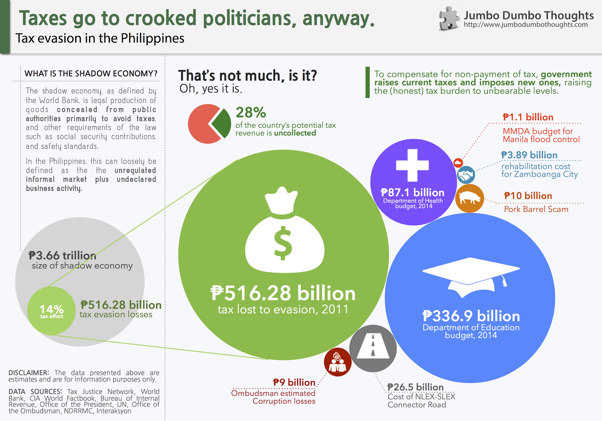
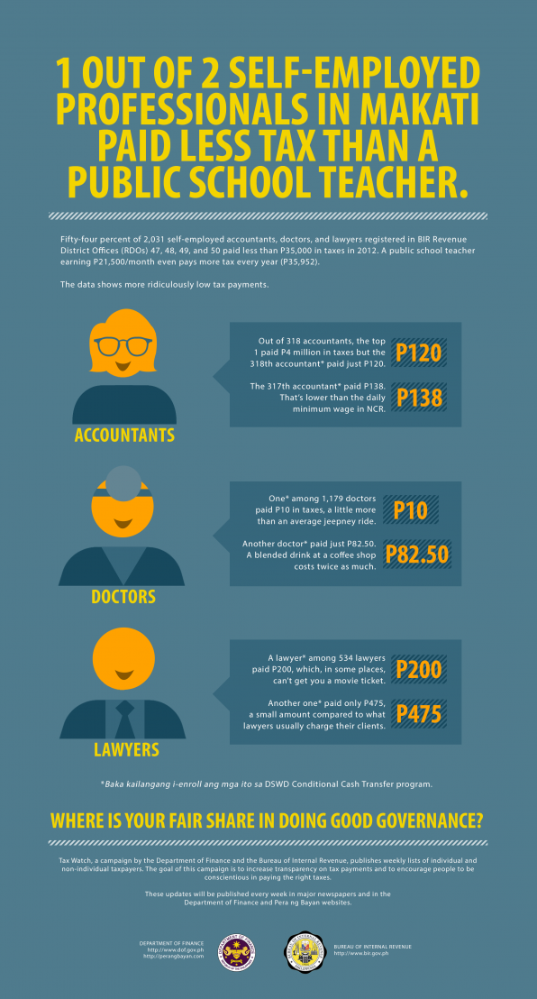

> TAX EVASION LOSSES - The Tax Justice Institute estimated the amount of taxes lost due to tax avoidance for several countries, including the Philippines, using World Bank data on shadow economies (the unregulated, but not illegal part of the market). Find out how much the government loses from tax evasion and how it compares to some commonly quoted government numbers.

### <strike>Public</strike> trust issues

Filipinos have an inexplicable love-hate relationship with government. We rely on them for so many critical services, but have enormous distrust for the people running it, and an even greater dislike for becoming one of those people.

This distrust is especially apparent in the tax system, where tax evasion is commonly justified because "it'll go to crooked politicians, anyway." Couple this with the "just a little bit" mentality, and you have unregistered businesses, undeclared income, and bribery as but common tricks of the trade for both large multinational corporations and small businesses.

But how much exactly does the government lose from all this? Data from the Tax Justice Institute reveal the impact of the **shadow economy** - the part of the market that is legal but concealed from the government primarily to avoid paying taxes - on our country's tax bill. Turns out, it isn't "just a little bit" (click the image to enlarge):

```{r out.width="100%"}

```

Taxes lost from tax evasion go up to P516 billion, half of the BIR's collections for 2012 and nearly a quarter of the 2014 national budget. To put this number in perspective, the amount lost from tax evasion is larger than the 2014 national budgets for education and health combined.

Other commonly-quoted amounts, such as the pork barrel scam, the rehabilitation for Zamboanga, the MMDA budget for flood control, the cost of the much-needed NLEX-SLEX connector road, as well as the Ombudsman's estimate for corruption losses look rather minuscule in comparison.

## A vicious cycle

What does all this tax evasion do? Well, since the government can't rack up debt and tax administration can be improved only so much, authorities have to resort to things like [raising sin taxes](/2013/09/effectiveness-sin-taxes.html) and expanding the value-added tax.

For those who pay taxes correctly, this raises their tax burden to near-unbearable levels, pressuring them to join their tax-evading countrymen. The cycle continues.

## Tax Watch

All this reminds me of the new information campaign that the BIR and DOF are undertaking - Tax Watch, which I find really interesting. Right now, they're detailing the top restaurant taxpayers in each city (turns out, that Jollibee along Vito Cruz makes a ton of money).

I'll present their first infographic, which exposes some ridiculously low tax payments by professionals in the country's financial district:

```{r fig.cap="Source: <a href='http://www.gov.ph/2013/07/31/tax-watch-a-campaign-for-transparency-and-conscientiousness/' target='_blank'>Official Gazette of the Philippines</a>", out.width="400px"}

```

You can see more tax watch infographics [here](http://www.gov.ph/featured/tax-watch/). I highly recommend checking them out.<

Thanks for reading! If you found this post interesting or otherwise enjoyable, I'd appreciate it if you shared, liked, tweeted, or +1'ed it on you preferred social network.

### Notes:

* Data Sources:
  * Main Article - [The cost of tax abuse: a briefing on the cost of tax evasion worldwide](http://www.tackletaxhavens.com/Cost_of_Tax_Abuse_TJN%20Research_23rd_Nov_2011.pdf)
  * [Graft and Corruption: the Philippine experience](http://unpan1.un.org/intradoc/groups/public/documents/apcity/unpan019122.pdf)
  * [2014 National Budget: A quick glance](http://www.gov.ph/2013/07/24/2014-national-budget-a-quick-glance/)
  * [ANC: Aquino says P3.89B needed for relief, rehabilitation efforts for Zamboanga City](https://www.facebook.com/permalink.php?id=262155953790&amp;story_fbid=10151712521813791)
  * [Interaksyon - PNoy approves Citra's NLEX-SLEX Connector Road project](http://www.interaksyon.com/business/71642/pnoy-approves-citras-nlex-slex-connector-road-project)
* I reviewed, although not that extensively, the methodology that the article used. For my purposes, it's a reasonable way to estimate tax evasion losses. Nonetheless, they are still estimates.
