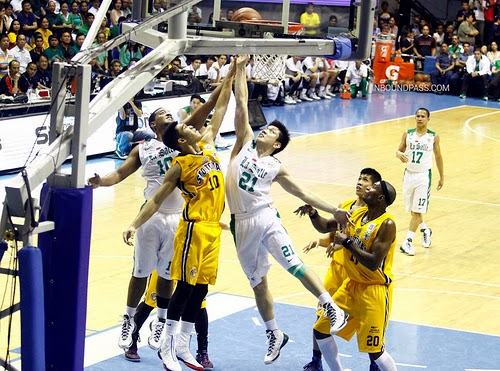
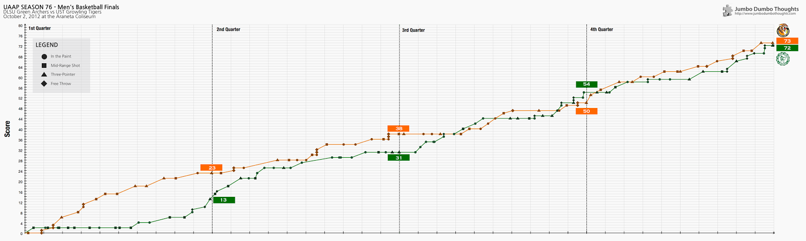
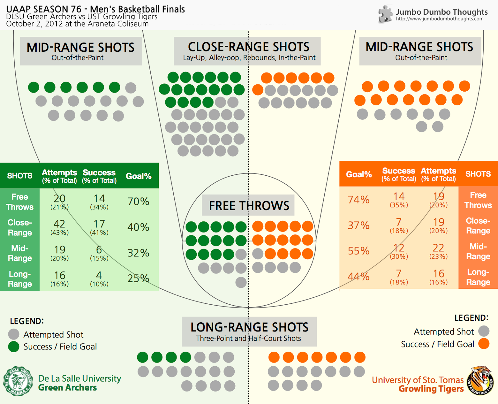

> What a heartbreaking loss! After recovering from a 17-point deficit, the DLSU Green Archers struggled to make the winning basket in their finals matchup against the UST Growling Tigers. To come to terms with it, I've tried to analyze the outcome of the game the way I know best: through data. Let's take a look at the numbers on the hard court.

```{r fig.cap="The UST Growling Tigers stole the first round of the UAAP 76 Men's Basketball Finals, at 73-72. (Photo: <a href='http://www.flickr.com/photos/inboundpass/10061956714/sizes/m/'>inboundpass/Flickr</a>, <a href='http://creativecommons.org/licenses/by-nc-nd/2.0/deed.en' target='_blank'>CC-BY-NC-ND 2.0</a>)", out.width="350px"}

```

## Score Breakdown

Video footage allows us to tease out the score movements throughout the game and record the number and type of successful and unsuccessful shots made by both teams. The time series chart is presented below (click to enlarge):

```{r layout="l-screen"}

```

You can see the heartbreaking 17-point lead that UST grabbed in the first quarter, that was the result of a series of failed mid-range and close-range shots by DLSU. On the other hand, the Tigers were powering ahead with a series of mid-range and three-point shots.

DLSU eventually caught up in the second quarter with some three-point shots of its own, as well as some successful offensive rebounds, but penalties awarded to UST kept the the teams from tying just when the scores got close.

In the third quarter, failed plays and dropped possessions by UST enabled the archers to finally claw back the lead, if only for a brief moment, since more failed close and mid-range approaches failed for the archers followed soon after. Thanks to some strong plays, helped by free throws awarded to the team, the team was able to secure a lead toward the end of the third quarter.

The last quarter was really difficult to watch for another time. The scores were consistently close to each other, and penalties awarded to UST increased as the game became physical. The spread grew wider, aided by three-point shots by the Tigers. During the last turnover, when UST carelessly lost possession, the archers were unable to make UST regret the mistake by failing to land the game-winning shot. UST stole the win at 73-72.

## Shot Breakdown

One of the most frustrating aspects of the game was that the DLSU team was excellent at forcing a turnover and keeping the ball in their hands, but could not use such opportunities to score. Compiling data on the shots attempted by each team and whether they scored, I came up with this analysis (click to enlarge):

```{r layout="l-body-outset"}

```

The Archers overall attempted more shots, and concentrated on fighting close to the basket where they are more efficient. On the other hand, the tigers attempted fewer shots but made each one count, particularly mid-range shots and three-pointers. The Archers prove to be stronger in the paint, but weaker as the shots move further away from the basket. Kevin Ferrer from UST brought the Tigers' three-point success rate up, which ultimately secured them the win.

Thanks for reading! If you found this post interesting, enjoyable, or useful, I'd appreciate it if you shared, liked, tweeted, or&nbsp;+1'ed it on your preferred social network. If you have your own analysis, I'd like to hear it in the comments section!

<div class="ui-widget"><div class="ui-state-error ui-corner-all" style="padding: 10px;">
Data was collected by watching video footage. As such, the score and shot breakdown may have discrepancies with official records in terms of the number of attempted shots, the types of shots, and timing.
</div></div>
