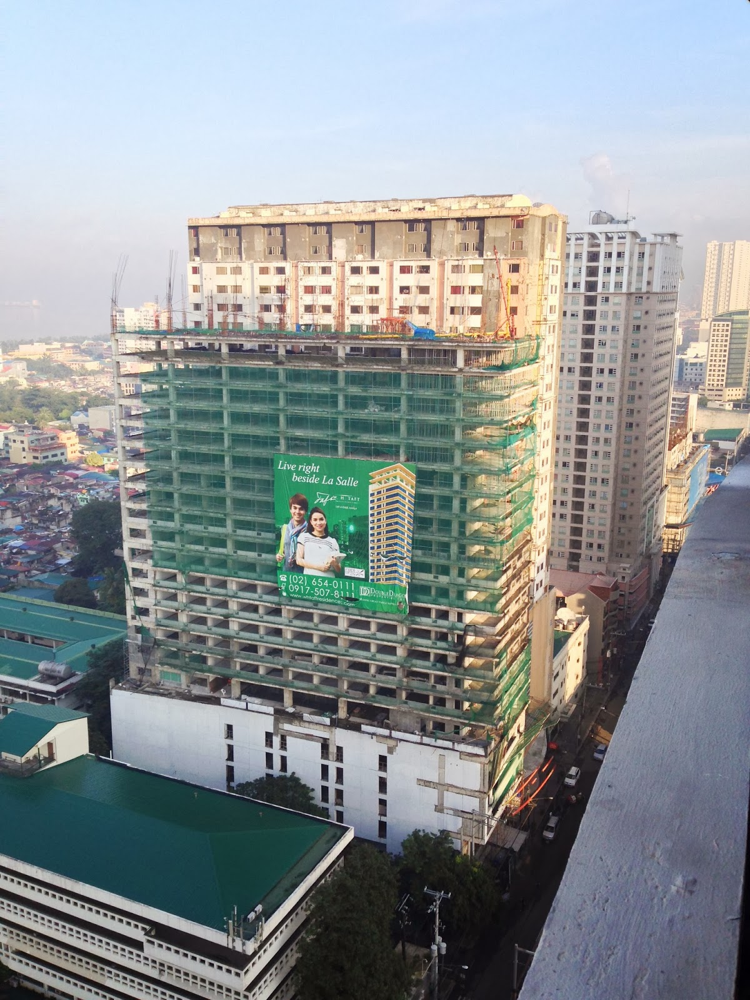
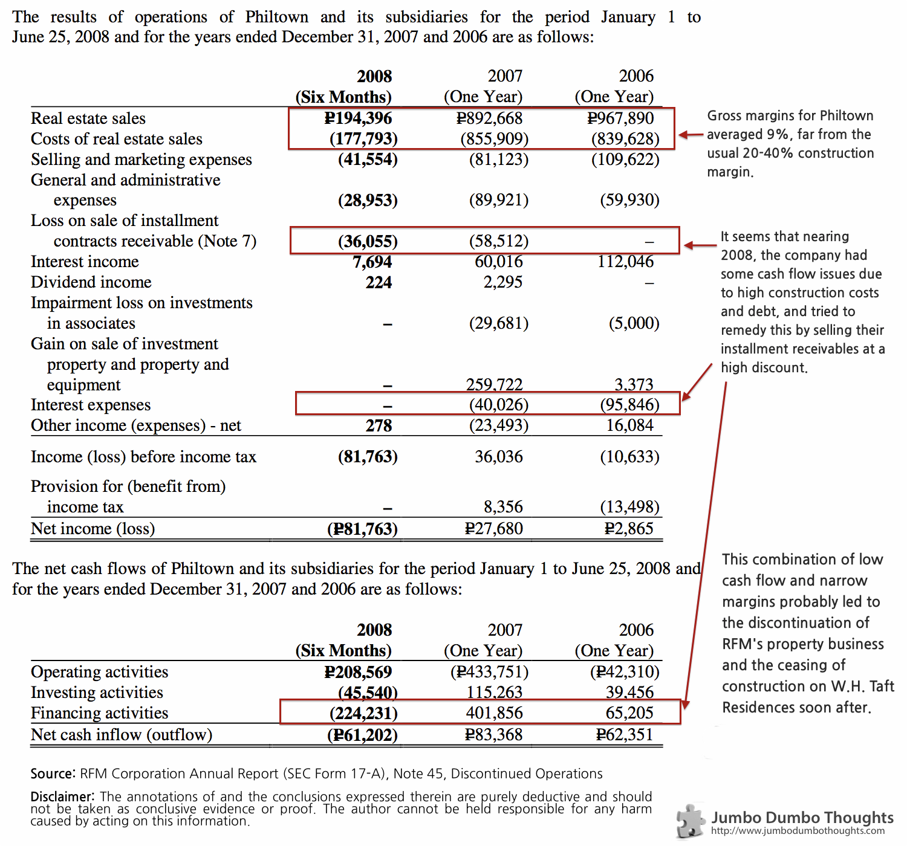

> A building along Taft Avenue, W.H. Taft Residences, is still under construction after nearly 7 years, serving as a prime example of why diversified conglomerates should be wary of putting their foot in the real estate and construction industry, where stretched operating cycles require special attention.

## Always the bridesmaid, but never the bride

You know that condo along Taft, between Velasco and EGI, the one that seems to be permanently under construction?

```{r fig.cap="That's the one!", out.width="300px"}

```

That building's been there since I entered La Salle nearly five years ago, and it still isn't finished. I mean: other buildings that have started later than it are already close to completion, but this one's still just a skeleton. Henry Sy Hall was still an open field of green when W.H. Taft Residences broke ground. Its story has always been at the back of my mind.

Luckily, by digging around accounting records, I was able to uncover some explanation as to why the poor building never grew up.

## Drowning in a sea of condos

DLSU's student population has been skyrocketing in the past few years, with a large portion of the increase attributable to scholars from the provinces. Traffic is also becoming more and more of a hindrance, prompting more affluent Manila residents to live nearby. It is of course unexpected that DLSU is now surrounding by cheap, high-rise condominium units.<br /><br />W.H. Taft Residences, found along Taft Avenue between DLSU's Velasco Hall and EGI Taft Tower, is one of those condominiums. Philippine Townships, Inc., a subsidiary of RFM Corporation, [started construction on the building in 2006](http://www.philstar.com/real-estate/363985/wh-taft-residences-history-making). However, the flour-milling company soon found that property development and food are hard to mix.

Just two years later, RFM spun off its property business by issuing the shares as a property dividend, and promptly classified Philtown Properties and its subsidiaries as a discontinued operation (the accounting term for "this never happened").

## Goodness of fit

Looking into the annual SEC filing of RFM Corporation for 2008 (that covers 2007 and 2006 comparative information as well), we can see that RFM's received less than a warm welcome in the new industry:

```{r}

```

As you can see, Philtown's performance has not really been spectacular, posting operating (pretax) losses for 2006 and 2008; even its 2007 performance was only improved by selling off assets (Gain on sale of investment property and equipment). Throughout the 3-year period, some problems plagued the company's real estate operations:

  * **Low gross margins** - At 9% on average, Philtown was a far cry from the usual 20-40% margin in the construction industry - thick enough to protect against the risks associated with long-term contracts.
  * **Poor cash management** - The company had significant issues with its cash flow - either because it was stretching itself too thin with multiple projects (for a small company, it had major projects in Makati, Fort Bonifacio, and Ortigas), or because of high interest payments on its leveraged projects. They tried to raise liquidity and reduce interest payments by selling their installment receivables at a steep discount and paying off debt, but this proved to be unsustainable.
  
During the first half of 2008, the fact that Philtown still generated a net loss and bled cash was the final nail in the coffin for the company. Its shares were disowned by the parent company through a property dividend. Philtown's assets are currently under liquidation.
  
## A new groom

Luckily, the project still had value, and a new joint venture between Jollibee's Caktiong, and Mang Inasal's Injap, DoubleDragon Properties, has [taken up the construction and promises to deliver the completed condominiums by the fourth quarter of 2014](http://business.inquirer.net/111565/tan-sia-property-firm-ventures-into-metro-manila-market).

It seems that food-centered corporations are trying really hard to ride the construction wave. Here's hoping that this time, the dear old building won't be left at the altar, again.

Thanks for reading! If you found this article interesting or enjoyable, I'd appreciate it if you liked, shared, tweeted, or&nbsp;+1'ed it on your preferred social network.

### Sources

* [RFM Corporation SEC Form 17-A (Annual Report)](http://www.rfmfoods.com/images/stories/financials/annual_reports/2008/SEC%2017-A%20Annual%20Report%202008_r.pdf)
