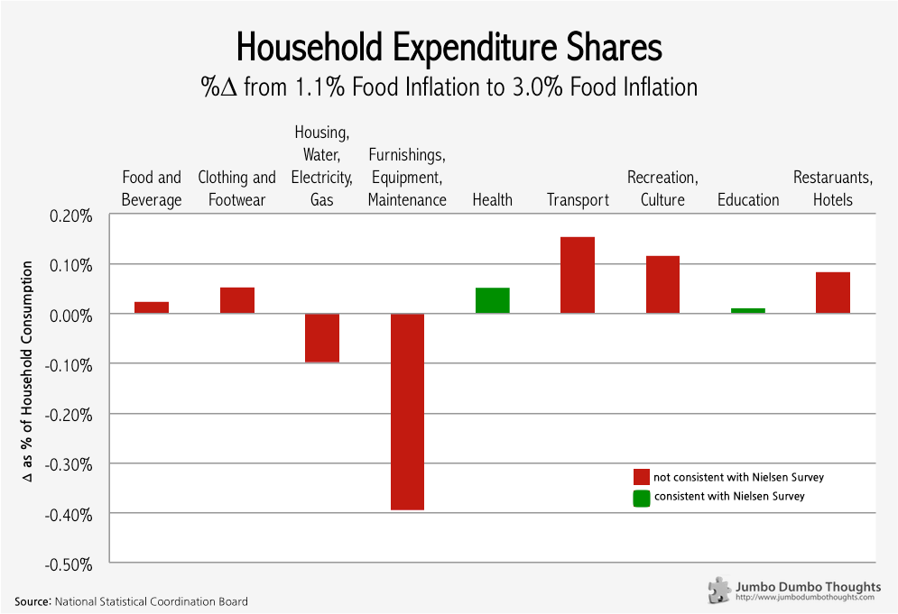
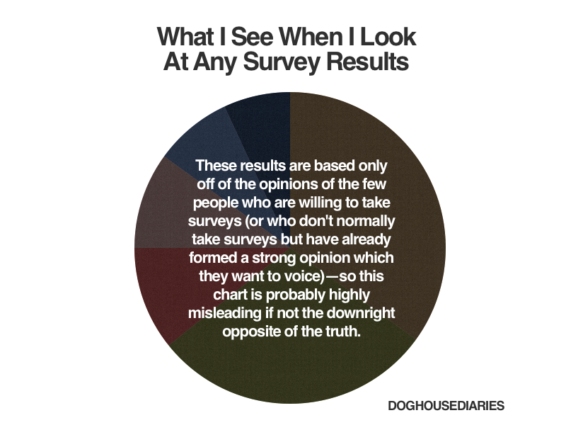

> Opinion polls can be useful for surveying public sentiment, but their usefulness ends at that. A recent Nielsen survey attempting to determine changes in spending habits when food prices rise, achieved only one thing - it measured where Filipinos said they would spend, not where they actually did.

A [Nielsen survey](http://www.rappler.com/business/170-features/40859-filipinos-on-food-inflation) attempted to determine the changes in spending habits when food prices rise; that is: what spending items do people prioritize or sacrifice, when food becomes more expensive?

The survey was based on results from 29,000 online respondents (albeit from different countries) across February and March 2013. Filipinos, according to the survey, would be more flexible with luxuries such as clothing, accessories, eating out, and recreation, and would prioritize household expenses, meals, education, and health.

If this survey was intended to determine whether Filipinos knew what wise spending meant, then it was probably successful. However, if the conclusion is extended to whether Filipinos would actually do so, the survey falls short of saying anything meaningful.

## White lies

There are a few glaring issues with opinion polls when applied to objectively determinable facts such as spending in this survey, and they're pretty much common sense:

  * First, what people say they will do isn't really what people will actually do, especially when it's about the future. It isn't that inconceivable to imagine how this will happen. In Darrel Huff's book [*How to Lie With Statistics*](http://www.amazon.com/How-Lie-Statistics-Darrell-Huff/dp/0393310728), he illustrates how a study surveying the frequency of bathing in Britain revealed that males bathe more than females, when it was hardly the case. It was later found that males tended to inflate their responses to what they thought was normal, whereas females told the truth, leading to the bias.
  * Online surveys are rife with sampling bias. Statistics textbooks will reiterate: It's okay to take only a sample of the entire population, as long as it is [representative](http://en.wikipedia.org/wiki/Sampling_(statistics)). The only way to achieve that is through random sampling. Voluntary online surveys are problematic because respondents tend to [self-select](http://en.wikipedia.org/wiki/Self-selection_bias). From the onset of the study, the scope is immediately confined only to the internet-browsing, survey-loving public. I can hardly call that a representative sample; especially when those most affected by food inflation wouldn't likely have internet access.
  
## Belt tightening?

A more objective way to understand consumption behavior during food inflation is to simply measure expenditure on different items at periods with different food inflation.

Other factors notwithstanding, this is the change as a percent of household expenditure of various items from Q2 2012 to Q2 2013, during which time food inflation climbed from 1.1% to 3.0%.

```{r out.width="100%"}

```

As you can see, only two areas, health and education, were consistent with the findings of the survey. While Filipinos said that they would keep household expenses at a priority, they tended to reduce spending heavily on household utilities and maintenance.

On the other hand, while the respondents stated that travel, recreation, clothing, and eating out would take the backseat, expenditure on these items actually increased during that period, meaning that Filipinos held on to these items even with shrinking purchasing power.

## More crappy opinion polls

You know what's worse than asking people to state something about themselves, it's asking them to state something about issues where they can't possibly know any better. This [PulseAsia survey](http://www.rappler.com/nation/41309-pulse-asia-survey-pdaf-abolition) says that 67% of Filipinos believe that pork barrel corruption continues under the Aquino administration. The question is: so what? It's as if the survey is making you confuse public perception with reality - sketchy at best, misleading at worst.

Does pork barrel corruption continue under the new administration? I don't know, but it sure won't be known through an opinion poll, that I'm sure.

## A grain of salt (make it two)

The next time you come across an opinion poll, I implore you to discern the difference between people's opinions and objective facts. They are easily blurred together but in reality can be worlds apart.

I could go on explaining, but I think my entire argument is best summed up by this Doghouse Diaries comic:

```{r fig.cap="Photo: <a href='http://thedoghousediaries.com/5314'>Doghouse Diaries</a>, <a href='http://creativecommons.org/licenses/by-nc/3.0/' target='_blank'>CC BY-NC 3.0</a>", out.width="100%"}

```

Thanks for reading! If you found this post interesting, I'd appreciate it if you liked, shared, tweeted, or +1'ed it on your preferred social network.
