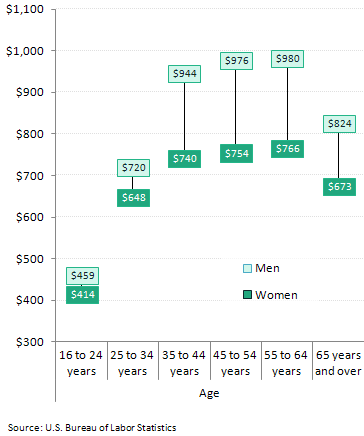
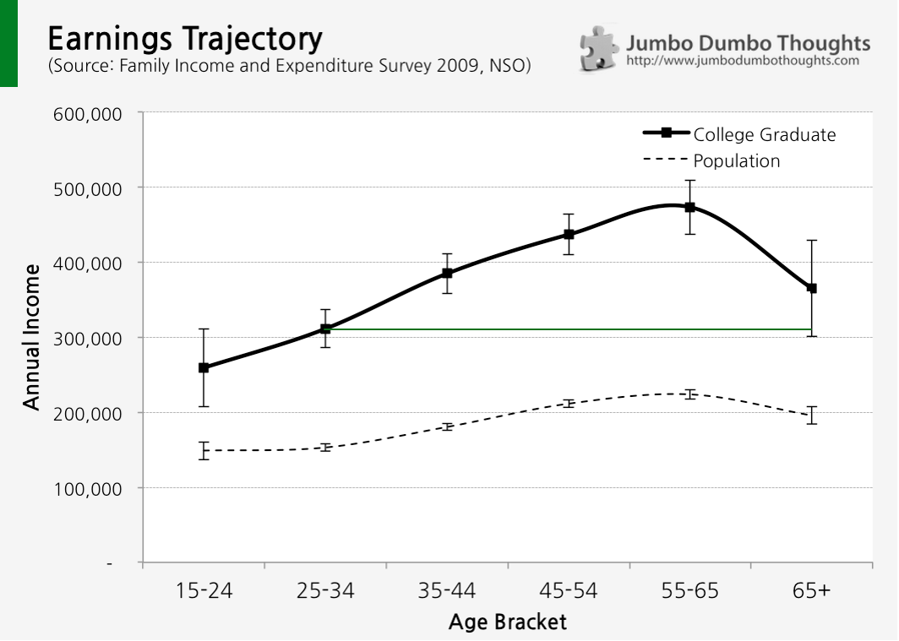
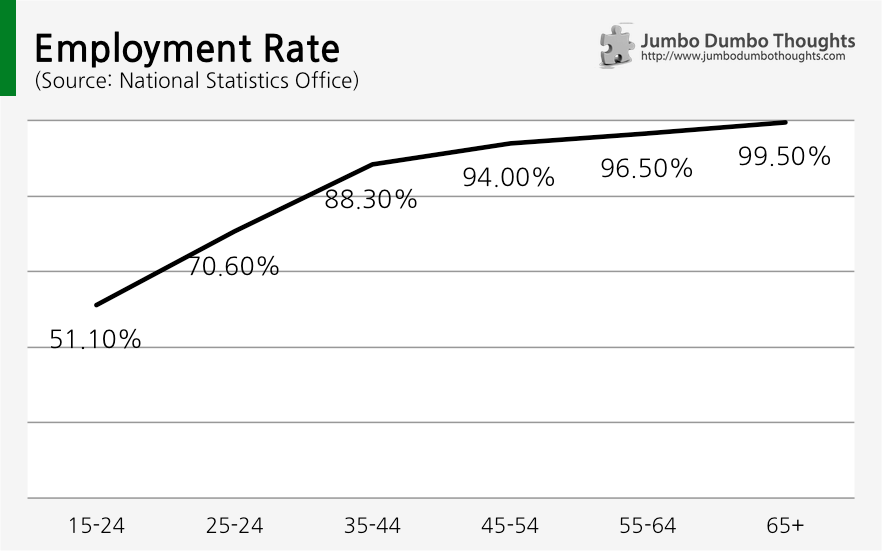
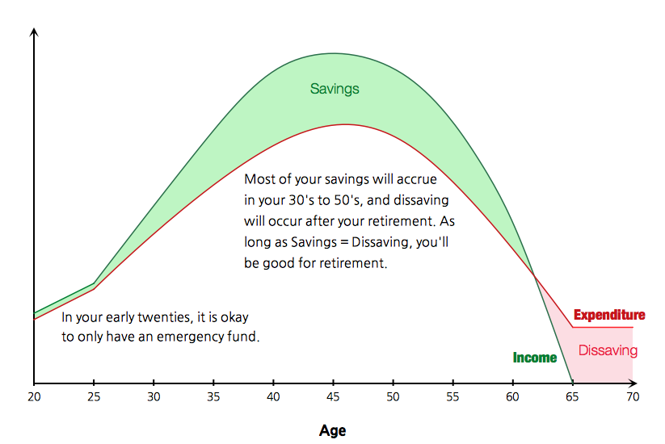

> "Save while you're young" is one of the most common pieces of financial advice for the fresh young professional, but there is an economic argument that it can be overdone. In your early twenties, you're better off having fun, learning, and making new connections, because YOLOETSI (You Only Live Once and the Earnings Trajectory Strictly Increases).

## Don't save? Blasphemy!

I'm sure this sounds like the worst piece of advice ever, but if you read what Steven Levitt, the author of Freakonomics, [has to say](http://freakonomics.com/2013/10/03/how-to-think-about-money-choose-your-hometown-and-buy-an-electric-toothbrush-a-new-freakonomics-radio-podcast-full-transcript/), it might sound a little less crazy:

> "One of the best pieces of financial advice I ever got was from a senior economist at Chicago when I got here named José Scheinkman. What he told me is actually something that he said Milton Friedman told him. And what he said was that you should spend more and save less. I think what happens to young people is that young people are always told to be thrifty, to save, save, save. But Jose’s point was this,<b> </b>you’re never going to be poorer than you are today."

I dug into the numbers to see where Levitt was coming from. As it turns out, his opinion is backed by data. The US Bureau of Labor Statistics put out [the following data](http://www.bls.gov/opub/ted/2012/ted_20121019.htm) for Q3 2012:

```{r out.width="300px"}

```

## You can only go up from here

For the Philippines, data from the Family Income and Expenditure Survey 2009 can be cobbled together to generate a similar chart. I added some error bars for the 95% confidence interval to account for the variability of the samples.

```{r, out.width="100%"}

```

The typical earnings trajectory for the entire population (dashed line) is strictly increasing from 15 years old to around 55 years old. For college graduates (dark line), the slope of the trajectory is even steeper, so diploma-equipped workers can expect to see their earnings grow consistently up to their retirement age. Moreover, the bulk of earnings are in the late stages (at around 45 to 65 years old), so any amount you save immediately is either insignificant or just excess. 

If you look at the space on top of the green line on the graph and believe that this can fund your retirement needs, then you are better off saving when you are 25 to 34 years old. Raise or lower the green line depending on your retirement needs.

Of course, not everyone will conform to this average. That's why I included error bars that represent the 95% confidence interval to account for the variability in earnings in each age group. Simply stated, 95% of the time, your earnings at a certain age will fall within this range. A quick inspection of the lower limits reveals that even in the worst case scenario, you can still reasonably expect an increasing earnings trajectory.

## With age comes wisdom

"But this only for employed persons," you say, "if you get kicked out of a job, you're going to need savings for sure!" Well, to consider that as a possibility, let's take a look at the employment rates across each age group:

```{r out.width="100%"}

```

The possibility of being unemployed becomes smaller and smaller as you grow older, either because older workers are already in tenured positions, or can rely on other sources of income. Unless you're really not confident of your college degree or your abilities, you should expect to land a good job sooner or later.

## Only the smooth stuff

Now that we've established the story behind Levitt's advice, let's go into what saving pattern would be best. Levitt describes:

> They should start saving in their thirties, and forties, and they should *dissave* when they’re in their sixties  and seventies, they should run down their savings.

The idea would be to transfer some of the earnings from the peak of your earnings cycle towards the end, so that you can have the desired consumption throughout the lifetime. This is where saving and dissaving come in:

```{r out.width="100%"}

```

Your savings in your 30's and 40's should be more than enough to satisfy retirement consumption, as you'll probably desire a simpler, less materialistic life by then.

During your twenties, however, you'll probably want to experience more of life's riches, so saving should only be limited to an amount for emergencies and unexpected shortfalls (or how about just don't get fired, okay?).

If you're *really* confident about your future earnings trajectory, though, you can go ahead and even <i>borrow</i> during this time in order to shift your peak earnings both to the present and to the far future. This is the most optimal consumption pattern, risks notwithstanding. 

## Live because YOLO (and the earnings trajectory)

```{r fig.cap="Copyright by <a href='http://earthincolors.wordpress.com/'>Moyan Brenn</a>", out.width="50%"}

```

I'm not advocating financial imprudence, of course. You shouldn't live beyond your means. Don't save doesn't mean "borrow to your heart's content" - it means spending just as much as you earn when you're young isn't the end of the world. Unexpected events will occur, and you're going to need a little saving (as an emergency fund) to tide you over such periods. Also, if you're not a college graduate, you might need to be a little more careful. 

I'm just saying that, for a young college graduate with strong prospects (who are usually the people most interested in saving), it's a little too early to be heavily investing for your retirement in your twenties, especially now when interest rates are near-bottom. 

People will keep encouraging you to save. After all, they will be blamed for discouraging saving if things take an unexpected turn for the worse, but they can't be blamed for the youth that you lost while tirelessly saving for some undetermined future. Some people will even try to scare you into saving - especially those that are interested in selling you saving products.

**Saving carries a high opportunity cost when you're young - time, effort, and energy.** You don't want to have boatloads of money but have neither the time, energy, or friends to enjoy life - it's [one of the top five regrets of the dying](http://www.theguardian.com/lifeandstyle/2012/feb/01/top-five-regrets-of-the-dying), after all. Your twenties is a time to learn, to have fun, to make connections, and to build your character. Too much emphasis on saving and prudence can be dangerous. If you spend your life planning for your old age, old age is the only life you will have.

Now, if only I could follow my own advice.

Thanks for reading. If you found this post interesting or otherwise enjoyable, I'd appreciate it if you commented, or if you shared, liked, tweeted, or +1'ed it on your preferred social network. 

Freakonomics is one of the earlier books that got me interested in economics and the hidden side to everything. They now have a blog and a podcast that continues the tradition of the book. If you want to know more about Freakonomics, you can [read the full transcript](http://freakonomics.com/2013/10/03/how-to-think-about-money-choose-your-hometown-and-buy-an-electric-toothbrush-a-new-freakonomics-radio-podcast-full-transcript/) of [listen to the podcast](http://freakonomics.com/2013/10/03/how-to-think-about-money-choose-your-hometown-and-buy-an-electric-toothbrush-a-new-freakonomics-radio-podcast/).
