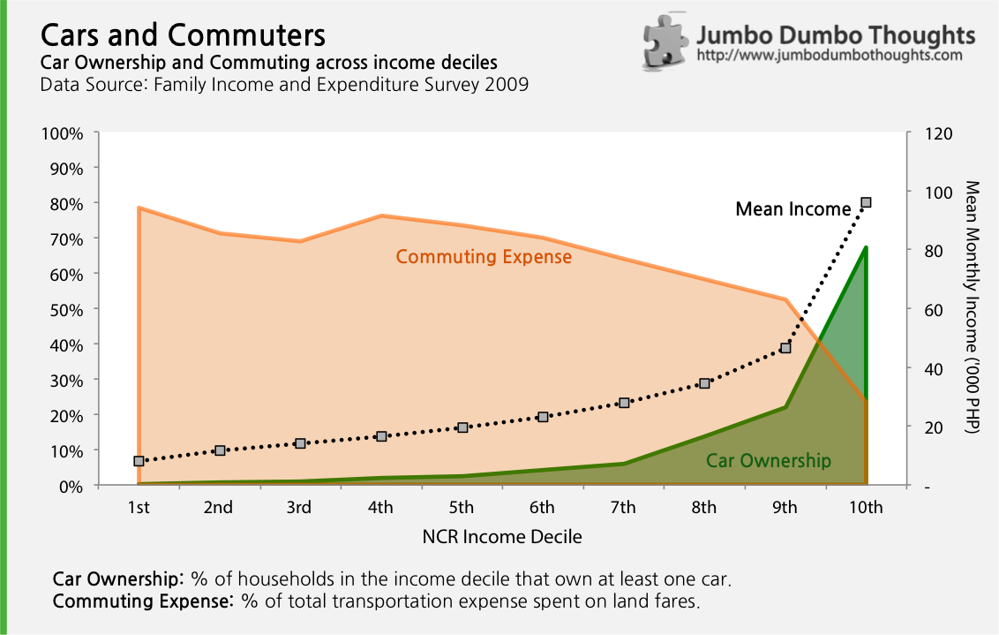
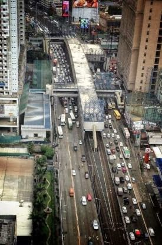
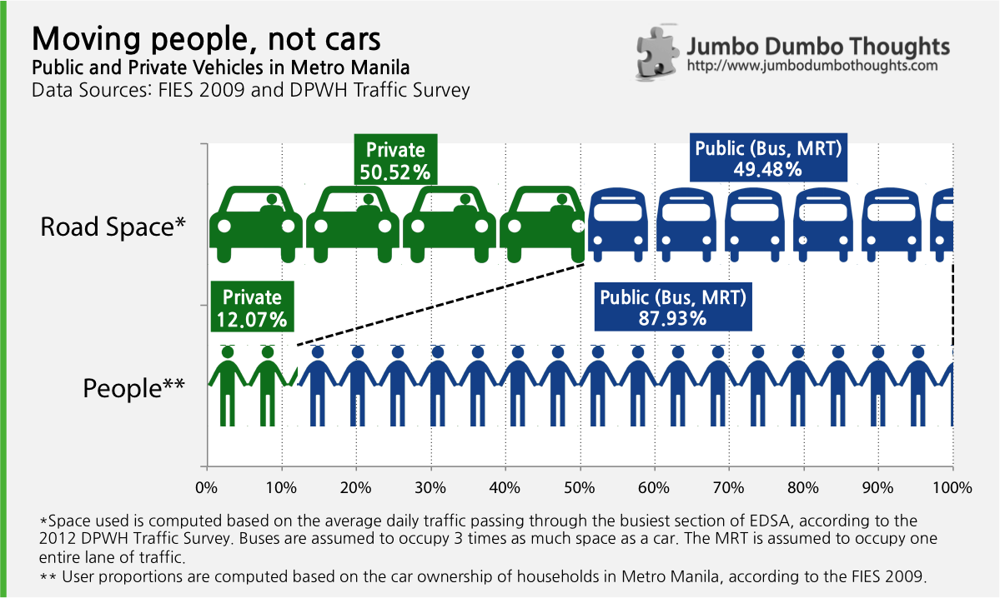

> With the rainy season in full swing, monstrous traffic jams yet again plague the Philippine capital. There is a lot of blame to go around - some say we're too reliant on private transportation, and others say undisciplined, unregistered, and reckless buses are the real culprit. Let's take a closer look at the data and see if it can provide some clarity.

## Bumper-to-bumper

You know it's ridiculous when driving is now as fast as walking to and from work, and that's the case in traffic-infested Manila. People constantly complain about it, and it just keeps getting worse - more and more cars, buses, jeepneys, and tricycles ply the streets of the Philippine capital every day.

Many solutions have been discussed and some implemented - a new NLEX-SLEX connector road, EDSA reblocking, and a bus segregation system ([that doesn't work](http://www.rappler.com/move-ph/34374-edsa-bus-segregation-system)). Congress is actually [taking the issue seriously](http://www.rappler.com/nation/41969-quezon-city-congressman-castelo-proposals-metro-manila-traffic), but there is still plenty of blame to go around. People have all sorts of theories and convictions about who is to blame. Let's take a look at the data.

## Your own set of wheels - a luxury

Has car ownership has become too widespread? Do old cars dominate the roads and slow traffic down? Does no one commute anymore?

To test this, I took a look at the data on car ownership as well as the portion of household transportation expense used in commuting, across income deciles in Metro Manila. An income decile is simply a 10% slice of the Metro Manila population, arranged by income: the 1st decile is the poorest 10% of the city, and the 10th decile is the richest 10% of the city.

```{r out.width="100%"}

```

### Car Ownership

What's immediately apparent is that cars are still luxury goods. If your family owns a car, you are most likely already in the top 20% of the population in terms of income.

Even with just a tiny fraction of the population with cars, traffic jams are already terrifying. Just imagine how many roads we have to elevate, widen, and construct just to accommodate the volume of traffic should cars become even more accessible - and imagine if such infrastructure wasn't built.

This may also be a reason why [two-day number coding and car age limits](http://motioncars.inquirer.net/14769/mmda-suggests-imposing-more-limits-on-usage-of-private-cars) won't work to full effectiveness - it's a regressive tax on the few people who could afford one car, but not two or a new one every time.

### Commuting Expenses

Some may say that owning a car doesn't imply that people take them out to the streets all the time, but the data doesn't seem to confirm that. Commuting expenses as a portion of total transportation expenses are highest on poorer deciles and significantly drop off as the income - and cars - increase.

Commuting is still a large part of the Manila worker's everyday life. It might make more sense to stop focusing on cars and start focusing on public mass transit. People don't inherently hate commuting; they hate the hellhole that it has become, which can be more easily remedied.

### Empty backseats

```{r fig.cap="This picture is often used as a prime example of why buses are to blame, but this is not the entire picture. One bus was actually stalled. (Photo: unknown - please contact me)", out.width="300px", out.extra="style='width: 300px;'"}

```

Still, many more are convinced that public transport - particularly buses - are to blame for the increased congestion. It's hard to disagree - unregulated and undisciplined buses engage in crazy road antics, blocking nearly the entire road in their scramble to pick up and drop off passengers wherever they please. This is not an argument against [regulating and monitoring bus behavior like this](http://manilastandardtoday.com/2013/07/30/buses-are-not-jeepneys/). This is rather an argument against bus bans and just general anti-public transportation sentiment.

```{r out.width="100%"}

```

Private cars take up half of the road space along EDSA, but only carry 12% of people. This isn't so hard to believe since most cars, especially on weekdays, usually carry only one person and a driver. The remaining 88% of the populace should be content to cram themselves in the MRT and buses which only take up the other half of EDSA road space. You may say that reckless driving results in even more road space taken up by buses, but I find it hard to believe that they can constantly take up 38% more.

Public transportation is about seven times more efficient that private cars, and transport officials should keep this in mind. Standardized rapid transit, such as Bus Rapid Transit or Rail Transit, is one of the most efficient modes of transportation. 

It's understandable that we migrate from the track to the road when we can - the train system is disjoint, dangerous, and severely uncomfortable. There are plans to extend LRT-1 to Las Piñas, but I think expanding capacity should take priority. This article, [What do we do about Metro Manila's headache?](http://www.philstar.com/opinion/2013/07/14/966491/what-do-we-do-about-metro-manilas-headache), might provide some practical solutions.

There is this oft-quoted statement by the mayor of Bogota, Colombia, that I believe sums up the point of this post:

> "A developed country is not where the poor drive cars, it's where the rich ride public transportation."

So there, data on why your car is your most definitive status symbol and at the same time your heaviest liability.

Thanks for reading! If you found this article interesting, I'd appreciate it if you contributed your thoughts in the comments, and liked, shared, tweeted, or +1'ed it on your preferred social network. 

### Notes

  * Data on income and car ownership are taken from a sample of 4,285 out of 2,000,000 (0.02%) urban households residing in Metro Manila. Relevant information risks include: (a) sampling risk from the way respondents were selected and the fact that people from nearby provinces commute in for work, (b) underreporting of income and vehicles, (c) and inaccurate recording.
  * How the variables were computed are presented at the bottom of each graphic.
  * Data and computation requests can be made through the contact form at the bottom of the page, or by commenting below.
