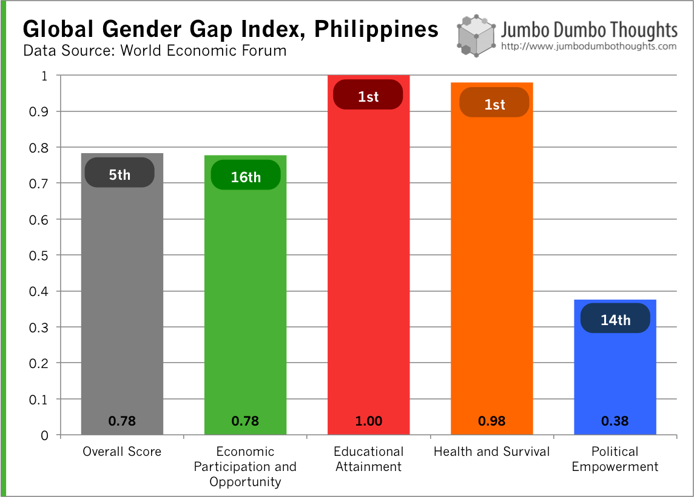
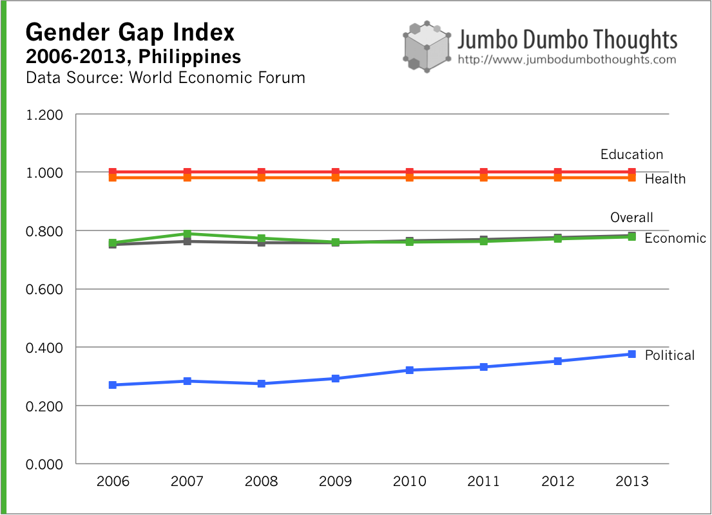

The World Economic Forum publishes a global gender gap index that attempts to measure the degree of gender inequality (or lack thereof) for various countries. According to the report, Philippines is one of the most gender-equal countries and is basically the only bright spot for gender equality in Asia.

## Explore the Infographic

Feel free to explore the great infographic that WEF has set up. You can see that nearly all of Asia is pretty gender-unequal, except for the Philippines.

<aside>
Unfortunately, it seems that this infographic has broken since this post was up.
</aside>'

## Breakdown

I've constructed the following charts to take a closer look at the Philippines.

The index can be broken town into four areas: (a) economic participation and opportunity, (b) educational attainment, (c) health and survival, (d) political empowerment, and the Philippines performance in such areas is highlighted as follows:

```{r out.width="100%"}

```

The country does well in terms of educational attainment, as well as health and survival. There really aren't any barriers for women to attain education as well as healthcare in the country.

However, economic participation and opportunity (wage equality and labor force participation) is lacking, probably reflecting the persistence of the "housewife" culture in our country - troubling for a country whose economic condition isn't stellar to begin with.

Political empowerment (number of women in politics) is also an area for improvement, probably because Congress is quite the sausagefest.

## Time Trend

We can also take a look at how the Philippines has narrowed its gap in recent years:

```{r out.width="100%"}

```

As you can see, everything's been pretty much stagnant, but political participation has improved quite a steadily over the years (Nancy Binay, anyone?).

There you go. At least we have something to be proud of other than celebrities, boxers, and being host to various movie sets.

Thanks for reading! If you found this post interesting or otherwise enjoyable, I'd appreciate it if you shared it with your friends on your preferred social network, or commented below.

## Read more

  * [World Economic Forum - Global Gender Gap Index 2013][1]
  * [The Guardian - Data blog - World gender gap index 2013][2]

[1]: http://www3.weforum.org/docs/WEF_GenderGap_Report_2013.pdf
[2]: http://www.theguardian.com/news/datablog/2013/oct/25/world-gender-gap-index-2013-countries-compare-iceland-uk
