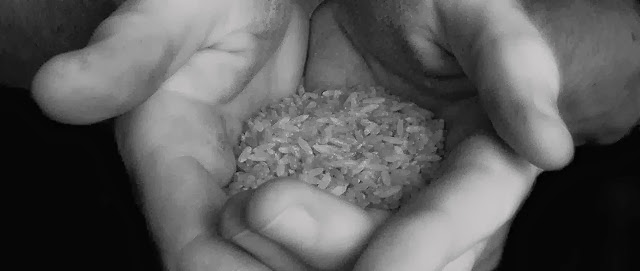
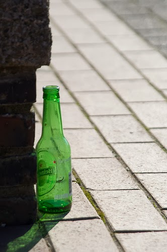
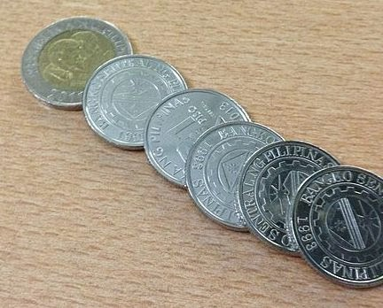
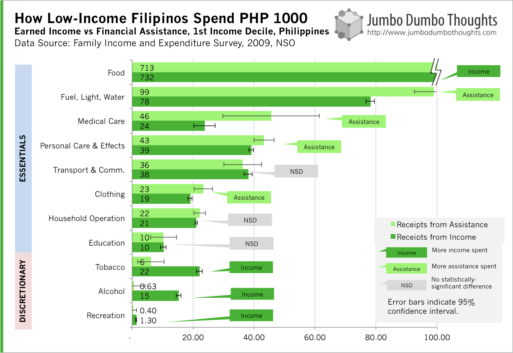

```{r fig.cap="(Photo: <a href='http://www.flickr.com/photos/26582941@N00/493626935/in/photolist-KBY6e-N67ck-VtxmJ-22qRw1-2mH7Ew-4f9d6M-4f9d6P-4nL9xS-4nL9AJ-4PTtbG-524A5H-5c7aqJ-5ErpYb-5KQyH9-5PpeMz-5SZ9TT-5WNSiz-6pfoVm-6piLgN-6rTCVs-6sKjVD-6sL8Pv-6sLq4K-6sMbR4-6sMzSD-6sMJnD-6sN5je-6sNfLi-6sNwMe-6sNZoz-6sP1wM-6sPtKY-6sPyHo-6sQLRb-6sRECY-6sRR1m-6sRWg9-6sS1cL-6sS59q-6sS99w-6sS9Nd-6sScn7-6sSe5S-6sSqTw-6sSCPA-6sSFPG-6sSKFs-6sTamG-6sXVLs-6sY19Q-6t497e'>Kris/Flickr</a>, <a href='http://creativecommons.org/licenses/by/2.0/deed.en'>CC BY 2.0</a>)", out.width="100%"}

```

> GIVE A MAN <strike>A FISH</strike> SOME CASH - New research suggests that unconditional cash transfers to the poor may not be as misguided as usually perceived. Some studies have found that providing cash increased spending on food, education, and healthcare, as well as investment in productive goods, contrary to the popular notion that the cash would go towards questionable purchases. Data for the Philippines suggests that this might have potential, providing a more cost-effective manner to deliver poverty aid.

## They'll surely spend it on drugs and alcohol!

How do you bring the poor out of poverty? The traditional approach to poverty alleviation has been to provide opportunities for the poor such as training and education, in-kind transfers (housing, food, or medical), or to provide cash transfers contingent on certain conditions akin to the current administration's flagship Pantawid Pamilyang Pilipino Program.

But how about, say, **just giving cash to the poor with no strings attached?** Most would probably be either amused or absolutely disgusted by the notion. "They'll only use it to buy drugs, alcohol, or to gamble!", or "They'll stop working because we pay them not work!", are common adverse reactions to the policy. <br/><br/> Intuition and "common sense" seem to have this one in the bag - case closed - but some recent studies have produced some interesting results: the [newest one (PDF)](http://web.mit.edu/joha/www/publications/Haushofer_Shapiro_Policy_Brief_UCT_2013.10.22.pdf) by MIT and Harvard economists studying the effect of unconditional cash transfers by the NGO GiveDirectly on households in rural Western Kenya from 2011 to 2012. <br/><br/> They provided a cash transfer of around $250 to multiple households, and explicitly told them that they could spend this cash in whichever way they want, no strings attached. The results are roughly as follows: (a) transfers increase consumption, investment in productive assets, reduce hunger, and improve the psychological well-being of participants, and (b) these unconditional cash transfers did not increase spending on alcohol, tobacco, and gambling.

<aside>
```{r fig.cap="Many say cash transfers to the poor only let them buy drugs and alcohol and gamble it away. (Photo: <a href='http://www.flickr.com/photos/53841372@N05/5067104057/in/photolist-8HLev4-c7Jj69-fqHWxS-a23afk-aiwgyn-cW3sYy-cW3w83-9n5iLN-9ksFrc-avFRsk-9pu8si-8dn5Y7-9tbKJC-9oQTVX-96yjoo-9czqox-9pLXnA-8m7DJy-a9Lqra-96sGHd-echHb6-dnXFQB-9MUZfK-9YCLtz-bzkpBs-cjVxtm-96vhac-buGBPo-ewLm3X-aHRwJz-aHRwVa-aHRwug-83vASe-aoSweV-daLpnX-bkadJf-855iug-bnGSaR-8RdVXj-eSvfbs-aEyBA8-gAR9Kh-8SG38P-7CtS27-97ANSU-fgRQhe-aNYE3e-81sp4c-ahrucR-aZH2da-8XjkBY'>Stefan van Bremen/Flickr</a>, <a href='http://creativecommons.org/licenses/by-nd/2.0/deed.en'>CC BY-ND 2.0</a>)", out.width="300px"}

```
</aside>

This evidence isn't just a fluke. [This study from Columbia University](http://papers.ssrn.com/sol3/papers.cfm?abstract_id=2268552) analyzed the effect of cash transfers in Uganda and found that they invested this in new business ventures and started paying taxes. [Another study (PDF)](http://www.poverty-action.org/sites/default/files/wings_full_policy_report_0.pdf) noted that transfers created earnings and savings increases, and that effect was the same regardless of whether they received mentoring or not.

This research is especially important since long-term evaluation of microcredit, once praised as the poverty panacea, [isn't as effective as originally thought](http://www.businessweek.com/articles/2013-05-30/new-research-indicates-microloans-dont-solve-poverty). <br/><br/>If an unconditional cash transfer programs are proven to be just as effective as in-kind transfers and conditional aid programs, it just might be more cost effective. By allowing the households to allocate resources themselves, you don't need to guess at their needs; a common problem of in-kind transfers is misallocation - too much food when they need clothing, or vice versa. Also, it can significantly reduce monitoring and administration costs of conditional aid programs as well as avoid corruption in the purchasing of goods and services for in-kind programs. <br/> <br/> This evidence also indirectly bolsters the conditional cash transfers in the 4 Ps program, by showing that cash isn't simply a large dole-out program and don't encourage the poor to stay out of work.

<aside>
```{r fig.cap="Unconditional cash transfers may provide the same benefit without the administration and corruption costs associated with complicated in-kind or conditional aid programs. (Photo: <a href='http://commons.wikimedia.org/wiki/File:Philippine_Pesos.jpeg' >glws/Wikimedia</a>, <a href='http://creativecommons.org/licenses/by-sa/3.0/deed.en' >CC BY-SA 3.0</a>)"}

```
</aside>

## How might this work in the Philippines?

Of course, people in other African countries may have different psychological characteristics and priorities than Filipinos. After all, the per capita income of Kenya is just half of that of the Philippines. Thus, there may be more need for subsistence and essentials in African countries.

To get a rough picture of how the poorest Filipinos treat cash assistance, I took data for receipts from cash assistance (government transfers, gifts, and charitable contributions) from the Family Income and Expenditure Survey and see where the poorest 10% of Filipinos tended to spend these items, versus how they would spend cash receipts from their own income. We can then know how the poorest Filipinos spend P1,000 in the form of aid, as opposed to P1,000 of their own income, as shown below:

```{r layout="l-body-outset"}

```

The results look promising. While poor Filipinos would spend a considerable amount of their own income on temptation goods such as tobacco, alcohol, and recreation, they spend significantly less when the cash comes from aid. Instead, they spent aid money more on utilities, medical care, personal care, and clothing. There might be two effects happening here:

  * **Aid money goes towards previously unaffordable expenses.** Aid money is spent on long overdue medical care, utility bills, or clothing that they would not have afforded without cash transfers.
  * **Recipients feel some responsibility for the aid money that they receive.** There might be a psychological *hiya* effect going on here: people think aid money as not really their own, and thus refrain from wasting it on temptation goods. For their earned income, however, they feel that they can spend the money in any way they please, and are thus inclined to spend more of earned income on cigarettes and liquor.
  * It seems that an unconditional aid program in the Philippines has potential, providing more or just as much benefit as conditional or in-kind transfers while avoiding the costs associated with the latter: costs of targeting and administration, corruption, and inefficient allocation.
  
## A grain of salt
  
However, this evidence is far from conclusive and shouldn't be taken as a shining endorsement for scrapping all other aid programs in favor of cash transfers. This little exercise is just intended to show that unconditional cash transfers have *potential*, and shouldn't be shunned at first glance. More detailed study and perhaps a pilot test is needed before full-scale implementation.
  
For something to ponder, let me leave you with this [quote from Bloomberg BusinessWeek](http://www.businessweek.com/articles/2013-06-03/for-fighting-poverty-cash-is-surprisingly-effective) talking about these unconditional cash transfer programs:

> It is comfortable for richer people to think they are richer because of the moral failings of the poor. And that justifies a paternalistic approach to poverty relief using vouchers and in-kind support. But the big reason poor people are poor is because they don’t have enough money, and it shouldn’t come as a huge surprise that giving them money is a great way to reduce that problem—considerably more cost-effectively than paternalism.

It kinda reminds me of those people who refuse to give money to kids on the street because "they'll buy drugs with it." Maybe it's time we give the poor a little more benefit of the doubt - they might just deserve it.

Thanks for reading! How do you think this will work in the Philippines? Let us know in the comments. I would also appreciate it if you liked, shared, tweeted, or +1'ed this post on your preferred social network. </b><b>Data and computation requests can be made through the contact form or by commenting.

**UPDATE(Nov 10 2013):** Planet Money, one of my favorite podcasts has just covered the story, and you can listen to it in the player below:

<iframe src="https://www.npr.org/player/embed/240590433/240686097" width="100%" height="290" frameborder="0" scrolling="no" title="NPR embedded audio player"></iframe>
