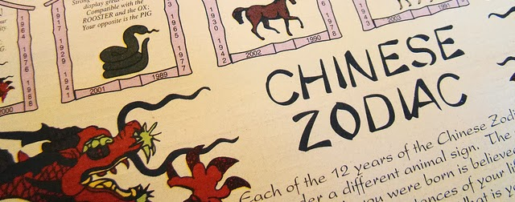
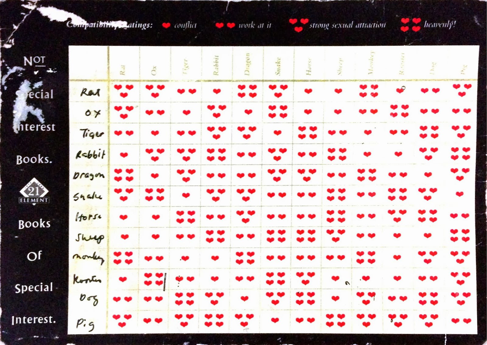
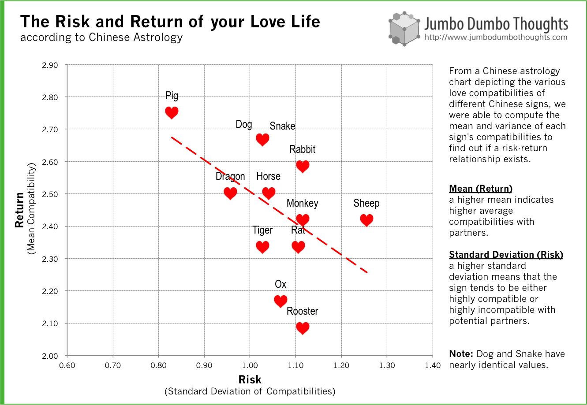

```{r fig.cap="The Chinese Zodiac predicts your love compatibility with people of other signs, but let's do more than that and bring statistics to the superstition.<br />(Photo: <a href='http://www.flickr.com/photos/veganfeast/4647978359/'>Janet Hudson/Flickr</a>, <a href='http://creativecommons.org/licenses/by-sa/2.0/deed.en' rel='nofollow'>CC BY-SA 2.0</a>)", out.width="100%"}

```

> RETURNS ON LOVE - Chinese astrology tells of certain animal signs that, because of their inherent characteristics, have varying love compatibilities with each other. By applying statistics to superstition, we can also determine - generally - how nice, and how rocky, your love life ought to be based on your ruling animal. Also, we find that there is no positive risk-return relationship in Chinese astrology; that is, having a tumultuous love life doesn't guarantee a reward.

## Animal Instincts

In Chinese astrology, the year you were born is associated with one of twelve animals in a cycle. The anima is thought to influence your personality, tendencies, and character traits. One of the more interesting predictions that Chinese astrology makes is regarding a person's love compatibility with people of other signs. They all have intricate explanations, but my mom is fond of using this summary chart to check our compatibility with other people:

To check your sign, [visit this page](http://www.holymtn.com/astrology/year.htm) and reference your birthday.

```{r layout="l-body"}

```

This Chinese love compatibility chart is basically a correlation matrix, with hearts indicating one sign's compatibility with another. More hearts = more compatible.

## Statistical Superstition

Of course, this is a data blog, and this chart is data, so I couldn't help but to try and dig in and find out more. You can easily check the chart for how compatible you are with that special someone, but what if you just want to know about your love life in general? Well, we can take care of that.

Let's assume that you have a nearly equal chance of meeting someone of each sign. This is a reasonable assumption because although you are likely to be paired with someone of the same sign, the chance of meeting someone on the upper and lower ends (twelve years older or younger) are much slimmer. Other signs would have more equal probabilities that balance out as they get nearer to your own sign.

Given this assumption, we can then extract two relevant characteristics about your sign's love life, the mean compatibility indicating quality, and compatibility standard deviation, indicating the volatility or variability, we explain what these mean after the chart.

Afterwards, we can go a step further. Plotting the signs on a risk-return or a quality-variability space can illustrate whether having a volatile relationship will lead to higher quality of love. In other words, does Chinese astrology postulate a positive risk-return relationship on love, similar to investments?

```{r layout="l-body-outset"}

```

On the graph, we measure two important characteristics about each sign's love life:

  * Quality (Mean) - this is measured by the mean of your compatibilities. The higher the average number of hearts that your sign has for each other sign, then you can reasonably expect a more pleasant love life. You could call this an "expected return" on love.
  * Variability (Standard Deviation) - this is measured by the standard deviation, or dispersion, of your compatibilities. Higher variability means that your compatibilities are far apart; you have many ones and fours for your sign. This indicates that you can be very choosy about your partners, and might mean that you will have a more turbulent love life. You can call this a "risk" on love.
  
It seems that those born in the Year of the Pig are most likely to have stable and happy love lives, because of the high mean and low volatility. On the other end are those born in the Year of the Sheep, who are rather fickle but don't end up with much quality of love. Other signs are several degrees in between.

But the more interesting conclusion is the negative risk-return relationship shown by the red trendline. Chinese astrology doesn't seem to favor those who are picky or switch partners a lot, like the Sheep, or the Ox, as these signs tend to have relatively lower mean compatibilities. **Unlike investments that reward you for taking on more risk, love (at least according to Chinese astrology) would prefer if you take it slow and steady.** 

Thanks for reading! If you found this post enjoyable or interesting, I'd appreciate it if you liked, shared, tweeted or +1'ed it, shared your thoughts in the comments, or liked the Facebook page to get the newest in the world of data in your news feed. Data and computation requests can be made through the contact form or the comments.
