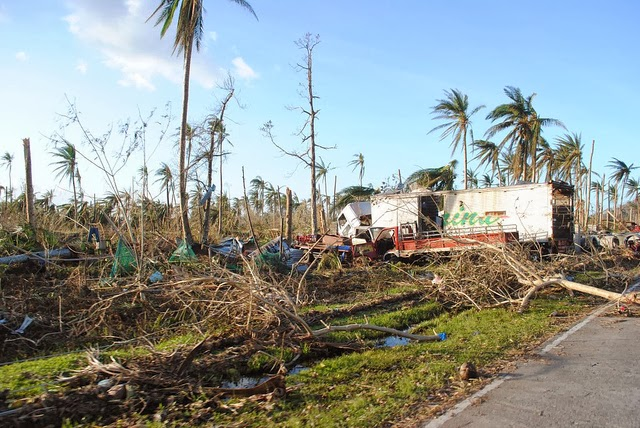
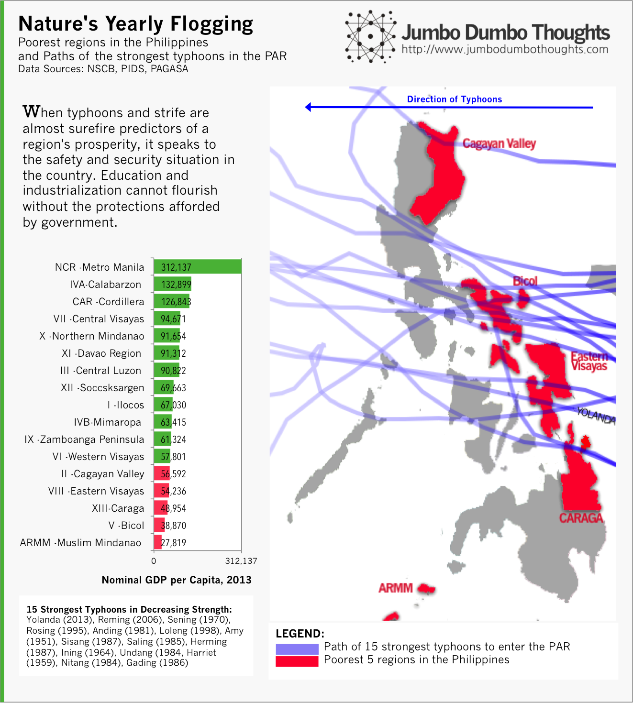
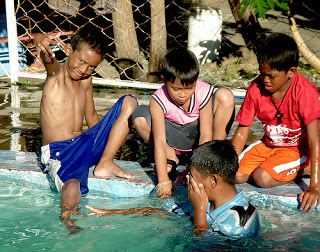

> TRUE RESILIENCE IS PREPAREDNESS - Super Typhoon Yolanda (international codename Haiyan) struck the Philippine central islands last November 8, 2012. The humanitarian disaster was immense, with the death toll well into the thousands. The Philippines will recover and get back to business, but by no means can this cycle of rebuilding and destruction continue for the island nation.

```{r fig.cap="The scale of death and destruction in the eastern provinces of Leyte and Samar is immense. (Photo: <a href='http://www.flickr.com/photos/69583224@N05/10800154344/in/photolist-hsnBBE-hpRyKv-hpRyeF-hpS9Gs-huA2Ub-hsRzzr-htZSgd-hu1rX9-hu2bDR-htZL6X-hu1rEL-hu1s4G-htZLgM-hu1rru-hu2aYx-hsodA6-hsnDbS-hsodfr-hsodUc-hsnDj7-hsn1P5-hsmW3k-hsnC1A-hsmX9i-hsn1a9-hsnC8E-hsn17o-hsnCgL-hsnCVm-hsodar-hsmX4D-hsmWve-hsoc6T-hsmZrq-hsmWXr-hsod18-hsnDfj-hsn15j-hsnCFd-hsnCZ9-hsn2zd-hsocZX-hsn21Y-hsmWhD-hsmWnt-hsQZ8m-hk1Qc5-huCGA6-hupj5Z' target='_blank'>EU Humanitarian Aid and Civil Protection/Flickr</a>, <a href='http://creativecommons.org/licenses/by-nd/2.0/deed.en' >CC BY-ND 2.0</a>)", out.width="500px"}

```

Typhoon Yolanda packed winds that broke scientific measurement scales, and is reported to be the strongest tropical cyclone in recorded history. It [killed thousands of Filipinos](http://newsinfo.inquirer.net/526485/yolanda-death-toll-breaches-1800-80000-houses-totally-destroyed-ndrrmc) and left even more homeless and desperate for basic necessities. Relief efforts are underway and [multiple countries have pledged support](http://www.interaksyon.com/article/74586/salamat-po--many-countries-extend-help-to-yolanda-victims) for the victims, but the lack of logistics and damage to critical transportation infrastructure hamper the flow of goods to critical areas. 

In 2006, Super Typhoon Reming, second only to Yolanda in terms of wind speed, blasted my hometown of Legazpi. The destruction was similarly catastrophic: a whole barangay succumbed to landslides, thousands of people left dead or homeless, which is why my first reaction, without knowledge of the actual death toll, was, "it happens nearly every year, anyway." It's a thought I'd be ashamed to admit, but then it hit me: **this happens every year,** and such a deplorable state of mind begs the question **"Why?"**

## It happens all the time

This may be the strongest typhoon on record, but the death and destruction from typhoons crossing the Philippines isn't an isolated event. Every year, the Pacific ocean breathes more than twenty storms to life and sends them off. First stop: the beautiful island nation of the Philippines. Every few years, however, there is a particularly strong typhoon, and that's where things start to get worse.

We can survive *despite* the typhoons, yes, but you'd be ill-advised to think that disaster response is to be taken lightly - confined only to reconstruction and feeding the survivors. <b>Turns out, if you want to predict the prosperity of a certain region in the Philippines, you don't look at education, health, or innovation, but rather whether it's shielded from typhoons or not.</b>

```{r layout="l-body-outset"}

```

If you plot the east to west paths of the strongest typhoons to make landfall in the Philippines since 1951, and also take a look at the five poorest regions in the country in terms of GRDP per capita, you can surmise that being on the country's Pacific coast - the front line against typhoons - can definitely take a toll on a region's prosperity. The only other poorest region, ARMM, is constantly under strife.

What we can take away from this: when a region's prosperity is highly determined by whether there is strife or natural disaster, it's a sign that protections have not been put in place. All talks about education, development, infrastructure, and foreign investment fly out the window when safety and security isn't addressed. Residents can't think about going to school when they to rebuild their first home. Businessmen can't think about new factories and warehouses if they worry that they won't be there next year. Civilized society cannot flourish without the public good of civil defense. <br/><br/>The region where I come from, Bicol, is the poorest among typhoon-freuqented regions. Destruction of coastal residences happens every year, but people don't mind, because it's easy to rebuild it anyway. The problem is: we take one step forward, and one step back. Constant rebuilding has non-pecuniary costs far beyond what we can imagine: time, dreams, aspirations, and progress that could have been realized, only to be slowly whittled away by the annual storms.

<aside>
```{r fig.cap="Filipinos are always praised for their optimism, resilience, and ability to overcome hardship, but that can hardly be an excuse to let things be. (Photo: <a href='http://www.flickr.com/photos/51873750@N07/5356610628/in/photolist-9am2HE-fiTTuR-f8CdXP-f8StWq-efG5fD-f8BAAk-9rxybJ-7HxdDK-7ziW5H-9mD6sz-8yVbwG-fcZqeW-8qboz6-bwYSRZ-9BCSwq-8yVcM9-fapX9j-fgvPyS-f8C8aT-bMAqh2-byFKUY-byFKY7-byFLjy-bMAqrR-bMAqoc-byFLvf-byFLgA-byFLoL-byFL6C-bMAqFK-bMAqLi-byFLAQ-byFLE9-a7Swd2-fggC2r-fggwFD-fggAYa-fgvL7L-fgvLQh-fggzQi-fggybZ-fggBsH-fggv8t-f8N4uj-fgwgMC-fggsKD-dKzqds-dhKJmv-e85pkq-cHA3q1-7AAivH' target='_blank'>Chun Xing Wong/Flickr</a>, <a href='http://creativecommons.org/licenses/by/2.0/' rel='nofollow' target='_blank'>CC BY 2.0</a>)", out.width="300px"}

```
</aside>

I have always been proud of Filipino resilience and optimism; a different mindset would've quickly plunged the country into chaos, but resilience shouldn't stop there.  Joe America writes [a blog post](http://joeam.com/2013/10/21/the-philippines-the-most-dangerous-land-on-the-planet/) on the first things we need to do to prevent this type of disaster from happening again. He delivers his case in three simple steps:  

  * Pre-Planning - this includes establishing a system of accountability for disaster prevention, enforcement of zoning laws, relocation of endangered structures, and investment in a large-scale disaster response effort.
  * Mandated Evacuations - too many lives are lost in vain because of the desire to protect material wealth and a complacency that results from too much optimism.
  * Develop a Playbook - each local government should have a checklist of things to do so that they won't spend so much time paralyzed during a disaster. This includes media control.
  
I implore you to read his article as he justifies and makes a really good plan of action.  Survivors have not really been the strongest, fastest, or smartest; it's been those that had enough foresight and flexibility to adapt to this ever-changing environment.  

Thanks for reading! If you found this post useful or interesting, please share, like, tweet, or +1 it on your preferred social network, or comment below. Data and computation requests can be made through the comments or the contact form.

### Further Reading:

  * [Wall Street Journal - Before and After Typhoon Yolanda](http://online.wsj.com/article/SB10001424052702303914304579193971305978200.html?mod=wsj_share_twitter)
  * [The Society of Honor - The Philippines: the most dangerous land on the planet](http://joeam.com/2013/10/21/the-philippines-the-most-dangerous-land-on-the-planet/)
  * [Rappler - Things will get worse before they get better](http://www.rappler.com/thought-leaders/43598-things-will-get-worse-before-they-get-better)
