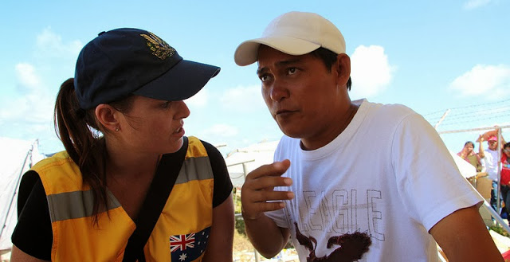
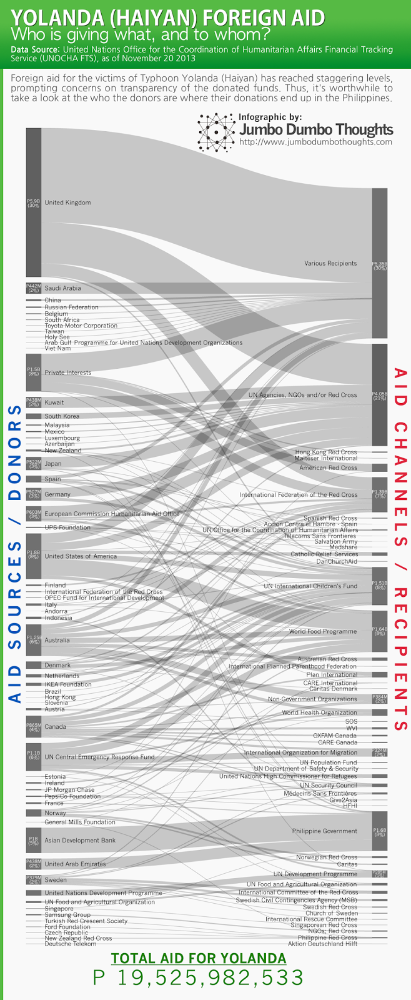

## Money in motion

```{r fig.cap="An Australian aid worker receives a briefing from the mayor of Guiuan, Eastern Samar, where Yolanda first made landfall. (Photo: <a href='https://www.flickr.com/photos/106853342@N04/10952484034/in/photolist-hFQkVC-hFRefF-hFQLVB-hFPTG7-hFQjx9-hFQ2Bq-hFPJgT-hFPZuj-hFPKvr-hFR3gM-hFQLYd-hFQPg8-hFQZTR-hFQZ7v-hFQHpP-hFPPN5-hFQSGX-hFR8dv-hFQHvw-hFPSe6-hFPVxF-hFQcJE-hFQ3BS-hFQpxh-hFPBGk-hFQxnq-hFQCCA' target='_blank'>AUSAID/Flickr</a>, <a href='https://creativecommons.org/licenses/by/2.0/'>CC BY 2.0</a>)", out.width="400px"}

```

When Typhoon Yolanda (Haiyan), the strongest typhoon to ever make landfall, cut through the central Philippines last November 8, 2013, it caused damage of unprecedented proportions. The [most recent National Disaster Risk Reduction Management Council (NDRRMC) estimates](https://www.abs-cbnnews.com/nation/regions/11/23/13/yolanda-death-toll-spikes-5235-damage-p22-b) place the death toll at 5,235 and damage of P22 billion, making it the third costliest typhoon in the Philippines.<br /><br />If there is a silver lining to this disaster, however, it is the overwhelming response of the international community to the disaster. Foreign aid has reached P19.5 billion as of November 20, 2013, according to the UNOCHA Financial Tracking Service. However, concerns arise regarding how these aid flows are being managed and delivered, and it's useful to take a look at how aid money is flowing though the system, which we can visualize using data from the UNOCHA-FTS:

```{r layout="l-body-outset", out.width="100%"}

```

## Developed country aid

The major donors include: the United Kingdom (P5.9B), the United States (P1.8B), Private Interests (P1.5B), Australia (P1.25B), the UN Central Emergency Response Fund (P1.1B), along with several European and Middle Eastern countries.

## Malversation blues

The largest aid channels are UN agencies, Red Cross organizations, the Philippine government, and Non-Government Organizations.

Many are worried that these aid contributions, when coursed through the government, won't reach intended beneficiaries. The Philippine government has received a significant amount - around P1.6 billion or 8% of total aid provided - but not a majority of foreign aid. This has come mainly from the Asian Development Bank and the United Arab Emirates. However, the largest yet undisclosed "Various Recipients" category may change these facts. 

Thanks for reading! If you found this post informative, I'd appreciate it if you liked, shared, tweeted, or +1'ed it on your preferred social network

## Explore the data

If you'd like to explore the data in more granular data, you can take a look at this excellent compilation by The Guardian's Data blog. It's great because it makes the distinction between uncommitted pledges (non-binding announcements to deliver aid), and actual funding (legal or fulfilled aid commitments):

<script type='text/javascript' src='https://public.tableau.com/javascripts/api/viz_v1.js'></script><div class='tableauPlaceholder' style='width: 944px; height: 809px;'><noscript><a href='https://www.theguardian.com/news/datablog/interactive/2013/nov/20/aid-philippines-typhoon-haiyan-who-gives-what'></a></noscript><object class='tableauViz' width='657' height='600' style='display:none;'><param name='host_url' value='http%3A%2F%2Fpublic.tableau.com%2F' /> <param name='path' value='views/Altogether/Sheet1?:embed=y&amp;:loadOrderID=0&amp;:display_count=yes&amp;:toolbar=yes' /> <param name='toolbar' value='yes' /><param name='static_image' value='https://public.tableau.com/static/images/YZ/YZKR34WG5/1.png' /> <param name='animate_transition' value='yes' /><param name='display_static_image' value='yes' /><param name='display_spinner' value='yes' /><param name='display_overlay' value='yes' /><param name='display_count' value='yes' /></object></div>

## Data Sources

  * [The Guardian DataBlog - Aid to the Philippines: who is giving what?](https://www.theguardian.com/news/datablog/interactive/2013/nov/20/aid-philippines-typhoon-haiyan-who-gives-what)
  * [UNOCHA Financial Tracking Service - Philippines 2013](https://fts.unocha.org/pageloader.aspx?page=emerg-emergencyCountryDetails&amp;cc=phl)
  
Data and computation requests can be made through the contact form or by commenting below.
