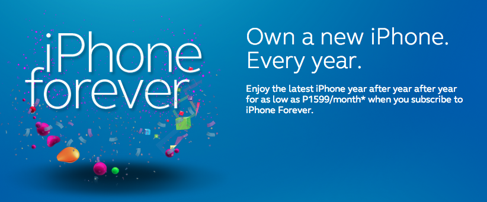
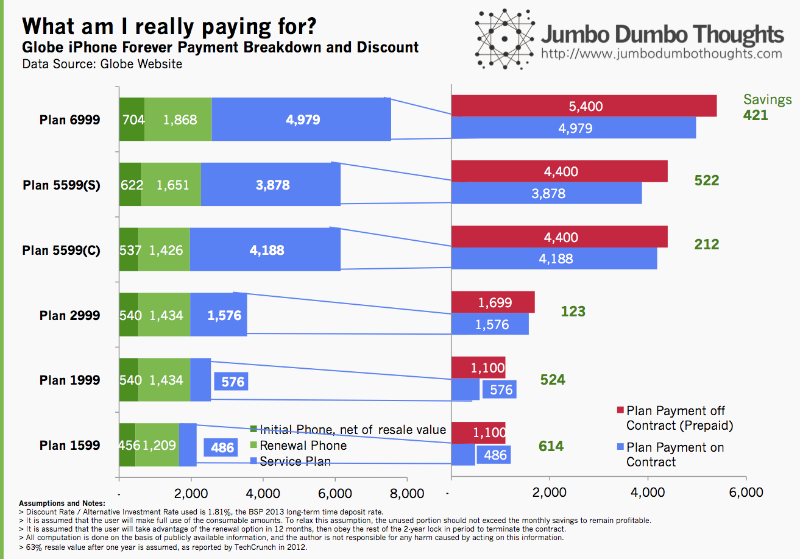
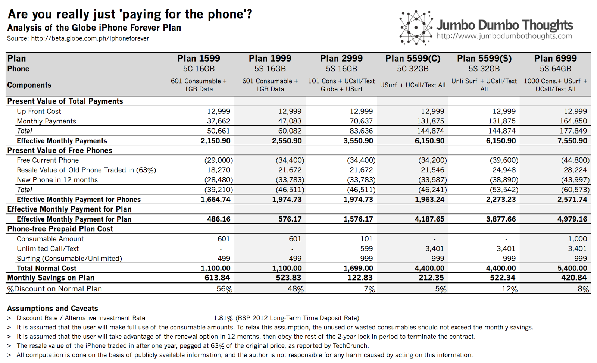

```{r fig.cap="An iPhone, every year, forever! But is it worth it?", out.width="100%"}

```

> FOREVER? - Globe Telecom has recently announced a new postpaid plan for iPhone-loving subscribers. You can trade-in your old iPhone every year for the latest model, provided that you abide by a lock-in period, of course. The question is: are you getting some benefit or do you just 'pay for the phone' with the plan payments?

Globe has just launched a new postpaid plan for those who want the latest iPhone every year - [the iPhone Forever Plan](http://beta.globe.com.ph/iphoneforever). Basically, if you allow yourself to be locked-in to a certain plan for a 2-year period, you get a free iPhone now, and after a year, you get to trade the phone for the newer model without charge. More expensive plans get the higher-end configurations. The contract period does not extend when you trade in the phone. Yugatech [provides a clear summary](http://www.yugatech.com/telecoms/globe-iphone-forever-plan-explained/) for those interested.

However, whenever something like this comes out, the question that pops up in everyone's minds is...

## Is it worth it?

Well, using the schedule of cash-out and payments, as well as the value of benefits and phones received, we can compute how much you'll save under the plan; but first, I'd like to point out the assumptions:

  * Full use of consumable amounts - I assume that if you're going to get a plan, you're planning to use all of it. Any unused consumable amount counts against potential savings from the plan.
  * Use of renewal option - I use a 24-month period with a renewal exercised after 12 months.
  * Alternative investment rate - To discount the amounts, I used the 2013 BSP long-term time deposit rate to proxy for the cost of money.
  * Resale Value after a year - As reported by TechCrunch, iPhones fetch around 63% of their original price after one year.
  
<strong>Using these facts, the results are as follows (detailed computations are at the end of the article):</strong>

```{r layout="l-body-outset", fig.cap="Value of Loyalty. Breakdown of monthly payments for the Globe iPhone Forever plans."}

```

I first computed the aggregate value of payments made to Globe, including the initial cash out, and computed the monthly amounts attributable to the free initial iPhone (net of the resale value of the phone after one year, which is given up upon renewal) and the renewal iPhone. The residual amount should be what you would really be paying for the plan, which can be compared with the cost of an equivalent plan without the phone option.

As you can see, all of the plans generate savings as compared to a prepaid, phone-less plan.</b> For the lower tier of plans, savings are much higher as a prcentage of the cash-out. The middle tiers seem to be a little ill-priced, offering much lower savings &nbsp;because of the low consumable amount. Higher tiers recover, but for savings as a return measure the percentages are lower.

You could think of these savings as a combination of two things:
  * Allowable wastage - the savings are the maximum amount of consumables that you can afford not to use for the plan to still remain a good deal.
  * Loyalty Value - it tells you about how much revenue Globe is willing to sacrifice to keep you as a subscriber for two years.
  
There are, of course, some caveats. First, you have to be reasonably sure to maintain both your usage rate and interest in iPhones for the entire contract period. Also, if you want a higher-end model but at a cheaper plan, you will probably have to pony up some additional cash.

Bottom Line: Overall, if you will use the plan fully, and really want the newest iPhone every year, then the plan is a great deal, saving you from 5% to 56% of your plan costs.

## Detailed Computation

If you're interested in how the numbers were computed, I've provided them to avoid misleading anyone. Take note of the assumptions provided at the bottom of the table.

```{r layout="l-body-outset"}

```

Thanks for reading! If you found this post useful, I'd appreciate it if you liked, shared, tweeted, or +1'ed the article, or commented below. Data and computation requests can be made through the contact form or the comments.

---

<strong>UPDATE (11/28/2013):</strong> Thank you to Don Soriano for pointing this out. I neglected to consider the fact that the current phone will only be used for a year, and thus you are giving up the resale value of the old iPhone traded in. If you are wondering how this changes the results, the savings are lower, but still positive for all of the plans, but Plan 5599(C) becomes the worst purchase in terms of savings return on cash-out.
