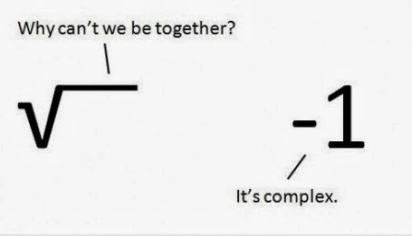
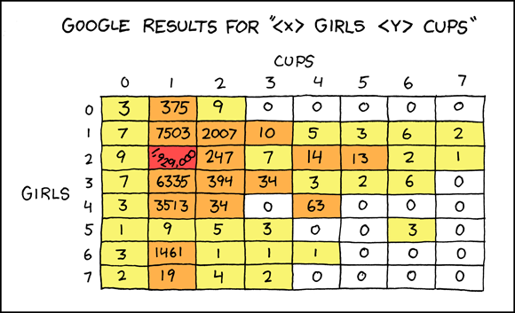
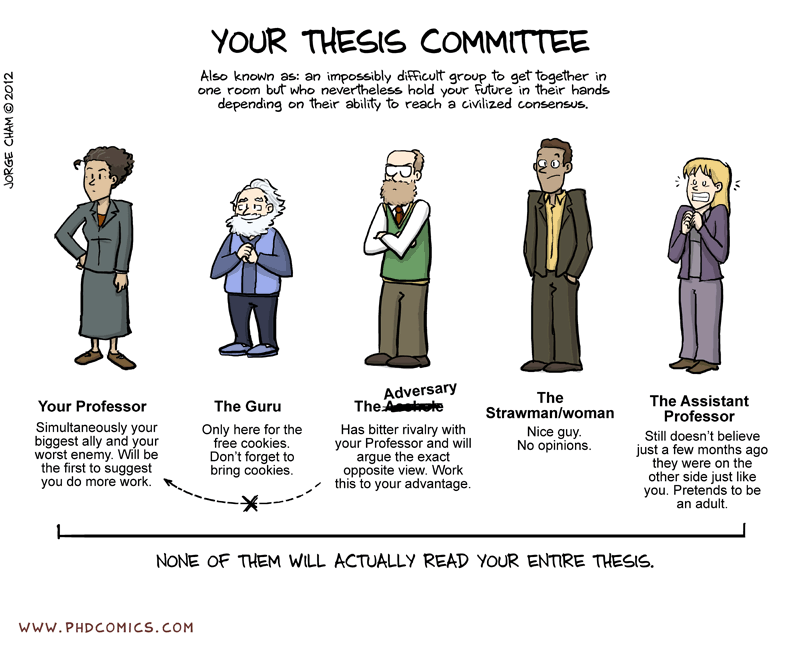
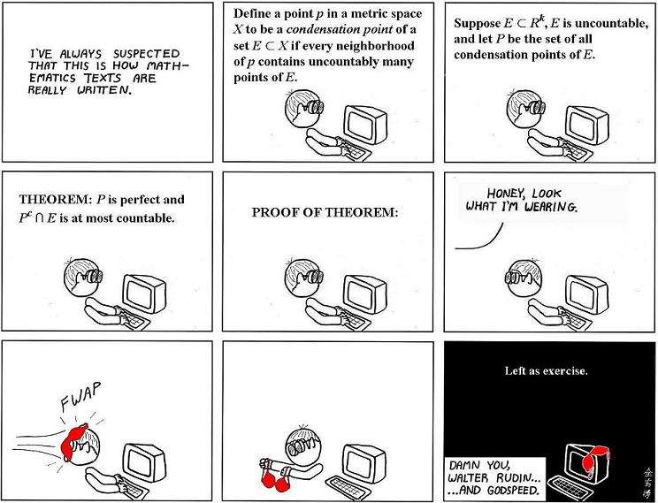
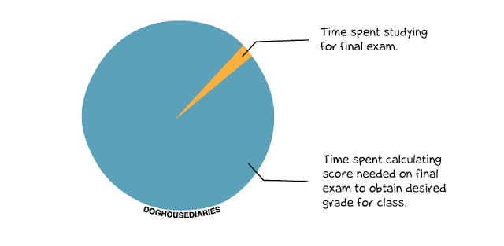
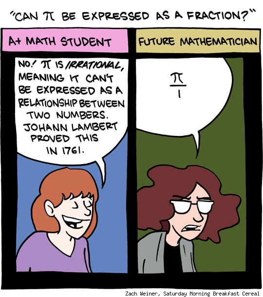
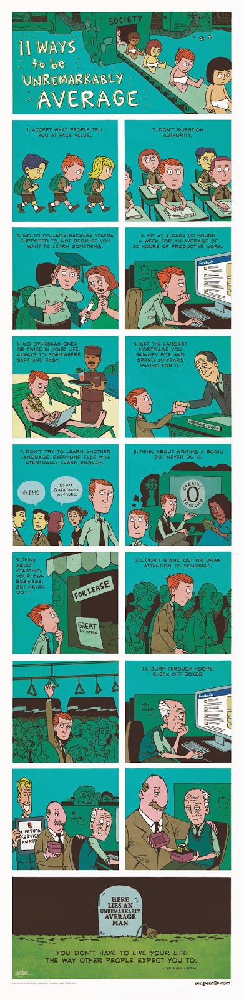

SATISFY YOUR INNER NERD - If you're looking for a place to get laughs, there are various free webcomics that can cater to your inner egghead (don't kid yourself - everyone has one), so here are six webcomics that can start you off, and how to subscribe to them.

```{r fig.cap="Don't pretend it's not funny"}

```

A note on subscriptions: I provide subscription links at the bottom of each webcomic, but some don't have as many subscription options as one would like. Most comics have RSS Feeds, which you can follow with a feed reader like [Feedly](http://feedly.com/). If you want to receive updates by e-mail and don't want to mess with RSS, you can use [Feed My Inbox](https://www.feedmyinbox.com/) to transform the RSS Feed into an e-mail subscription.

Well, let's get right to the funnies, shall we?

---

## XKCD

```{r layout="l-body", out.width="100%"}

```

The webcomic of "romance, sarcasm, math, and language" is a venerable classic in nerd circles, and for good reason - the comic can get so meta but still deliver a killer laugh. The comic, founded by NASA roboticist and programmer Randall Munroe, been around since September 2005.

Subscribe: [Website](http://xkcd.com/), [Facebook](https://www.facebook.com/TheXKCD), [RSS Feed](http://xkcd.com/rss.xml)

---

## PHD Comics

```{r layout="l-body", fig.cap="PHD Comics easily captures the madness of a researcher-student's life."}

```

If you're a student that has to do a lot of quantitative research or are otherwise doing your thesis, you can easily relate PHD Comics, which is about the life (or lack thereof) in academia. Created by an MIT Engineering Ph.D., "Piled Higher and Deeper"takes jabs at difficult advisers, even more difficult researchwork, and the stress that comes with life (or lack thereof).

Subscribe: [Website](http://www.phdcomics.com/comics.php), [E-mail](http://www.phdcomics.com/comics/subscribe.php), [Facebook](https://www.facebook.com/piledhigheranddeeper), [Twitter](https://twitter.com/phdcomics), [RSS Feed](http://www.phdcomics.com/gradfeed.php)

---

## Abstruse Goose

```{r layout="l-body", out.width="100%"}

```

Abstruse Goose is a wonderful webcomic that revolves around math, life, and everything in between. It's one of the more nerdy and involved ones out there, but it makes for a really good laugh.

Subscribe: [Website](http://abstrusegoose.com/), [E-mail or RSS](http://feeds.feedburner.com/AbstruseGoose)

---

## Doghouse Diaries

```{r layout="l-body", fig.cap="Let's see. If I have a 30% chance of getting a 3.5, and the probability that I can sweet talk my professor is 50%...", out.width="100%"}

```

Calling itself a "commentary on the love life of sandwiches," Doghouse Diaries is a little less nerd-oriented, but the observational humor is just as hilarious.

Subscribe: [Website](http://thedoghousediaries.com/), [E-mail](http://feedburner.google.com/fb/a/mailverify?uri=thedoghousediaries/feed&amp;loc=en_US), [Facebook](https://www.facebook.com/thedoghousediaries), [Twitter](https://twitter.com/willrayraf), [RSS](http://feeds2.feedburner.com/thedoghousediaries/feed)

---

## SMBC (Saturday Morning Breakfast Cereal)

```{r layout="l-body", fig.cap="Sassy math. The best kind of math."}

```

SMBC is one of the funniest and most relatable comics out there.

Subscribe: [Website](http://www.smbc-comics.com/), [Facebook](https://www.facebook.com/smbccomics), [Twitter (Zach Weiner)](https://twitter.com/ZachWeiner), [RSS or E-mail](http://feeds.feedburner.com/smbc-comics/PvLb)

---

## Zen Pencils

```{r layout="l-body", out.width="100%"}

```

This one doesn't really count as a 'nerdy' webcomic, per se, and isn't geared to be funny, but I think it still warrants a mention because it might appeal to your inner nerd. Zen pencils brings otherwise drab quotes, speeches, and poems to life with illustrations and comics. They can range from inspirational to touching, and depressing. It's worth taking a look.

Subscribe: [Website](http://zenpencils.com/), [E-mail](http://zenpencils.com/free-posters/), [Facebook](https://www.facebook.com/zenpencils), [Twitter](https://twitter.com/zenpencils), [Google+](https://plus.google.com/u/0/112196888431999809093/posts), [Tumblr](http://zenpencils.tumblr.com/), [Instagram](http://web.stagram.com/n/zenpencils/), [RSS](http://feeds.feedburner.com/zenpencils)

---

There you go - six webcomics for your inner nerd! Hopefully, one of these comics will brighten up you day. Enjoy!

Thanks for reading! If you found this post interesting, please like, share, tweet, or +1'ed it on your preferred social network, and commented below.
