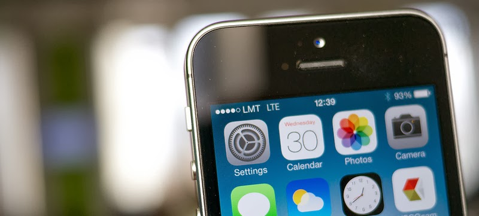
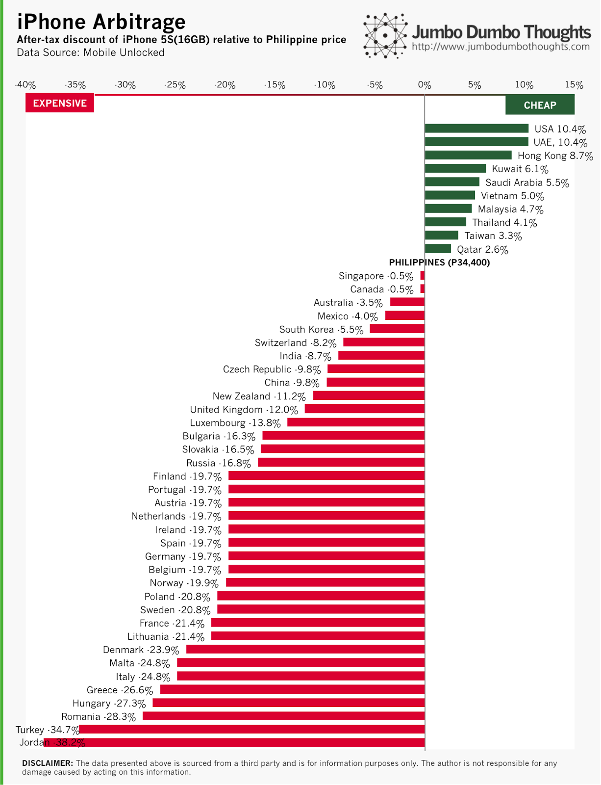

```{r fig.cap="iPhones and iPads are all set to be the top gifted items during the Christmas season. (Photo: <a href='http://www.flickr.com/photos/janitors/10576047413/sizes/l/'>Janitors/Flickr</a>, <a href='http://creativecommons.org/licenses/by/2.0/'>CC BY 2.0</a>", out.width="100%"}

```

> ARBITRAGEURS REJOICE - Due to exchange rate and tax differences, the effective cost of your favorite gadget can vary from country to country, so if you're looking to buy yourself or a loved one an iPhone or other similar item during your Christmas vacation, here the most attractive 'iPhone tourism' sites. Read on to find out more.

It's common for Filipinos to ask favors relatives from abroad, or go abroad themselves, in order to buy them big-ticket items such as gadgets and jewelry, because it's relatively cheaper and no 'taxes' have to be paid. iPhones are among the most commonly requested items, partly because of the carrier-locked nature of those sold locally and partly because the foreign currency prices are much cheaper.

These differences in prices are to be expected, of course, because Apple cannot adjust its own prices in pace with fluctuations in both currency exchange rates and tax (sales tax, VAT) rates. The difficult question, however, is where we can most take advantage of this opportunity, or where the largest iPhone arbitrage opportunity exists. In other words, where in the world can I find the cheapest factory-unlocked iPhone?

## iPhone Arbitrage

Luckily, the folks over at [Mobile Unlocked](http://www.mobileunlocked.com/iphoneprices.asp) have done the dirty data gathering for us, and we can determine the relative after-tax prices of iPhones around the world converted to Philippine pesos. The results of their study are summarized in the following chart:

```{r layout="l-body-outset"}

```

If you take a look at the relative positioning of the Philippines, you can see that our iPhones are actually priced much, much lower compared to most of the world.

There are still places where they're cheaper, such as the United States, United Arab Emirates, Hong Kong, some Middle Eastern nations, Taiwan, and some of our Southeast Asian neighbors Vietnam, Malaysia, and Thailand. On the other end of the spectrum, other Apple-lovers, mostly in Europe, are worse off.<br /><br /><b>A note about tax refunds. </b>If you are going as a tourist, then some countries offer a tax refund (such as Thailand and Singapore), so you might want to factor that into the savings computation. Simply add the tax rate refunded to the discount to get the net savings. For example, Singapore offers a 7% goods and services tax refund for tourist, so the net savings will be -0.5%+7%=6.5% savings compared to the Philippines.

Another note about LTE compatibility. Thanks to Gladys for pointing this out. Phones sold in the US may not be compatible with the LTE bands used by networks in the Philippines, so you might need to take that into consideration. UAE and Hong Kong do have compatible phones, however! You can check the [full compatibility list here](http://www.apple.com/iphone/LTE/).

## Death and taxes

As [Ben Franklin once said](http://freakonomics.com/2011/02/17/quotes-uncovered-death-and-taxes/), "Nothing is certain except for death and taxes," and such is true when it comes to iPhone price differences. If you break down the after-tax price of the iPhones in different countries into the base price and the tax effect, the result is as follows:

<iframe allowfullscreen="allowfullscreen" allowtransparency="true" frameborder="0" height="487" mozallowfullscreen="mozallowfullscreen" msallowfullscreen="msallowfullscreen" oallowfullscreen="oallowfullscreen" src="https://cf.datawrapper.de/OUE0V/1/" webkitallowfullscreen="webkitallowfullscreen" width="648"></iframe><br />

The base prices for the iPhones, which also incorporate exchange rate fluctuations, are relatively stable, and it's pretty apparent that the main driver of the price differences is actually the taxes imposed on such goods. This may be why Middle Eastern countries, despite having none of the advantages of proximity to manufacturing in China or free trade agreements, are priced lower because petroleum exporting countries don't need to impose high taxes.

There you go - iPhone prices around the world the next time you want to grab those gadgets abroad, at least you'll know whether and how much you'd be saving. Just don't start an illegal iPhone smuggling empire, okay?

Thanks for reading! If you enjoyed this post, I'd appreciate it if you liked, shared, tweeted,&nbsp;+1'ed, or commented.&nbsp;Complete data and computation requests can be made by using the contact form or by commenting below.

## Notes

Data Source: [Mobile Unlocked - iPhone 5S Prices](http://www.mobileunlocked.com/iphoneprices.asp). The data was collected on November 18, 2013, from the listings of the iPhone 5S from official Apple stores or listed official resellers.
