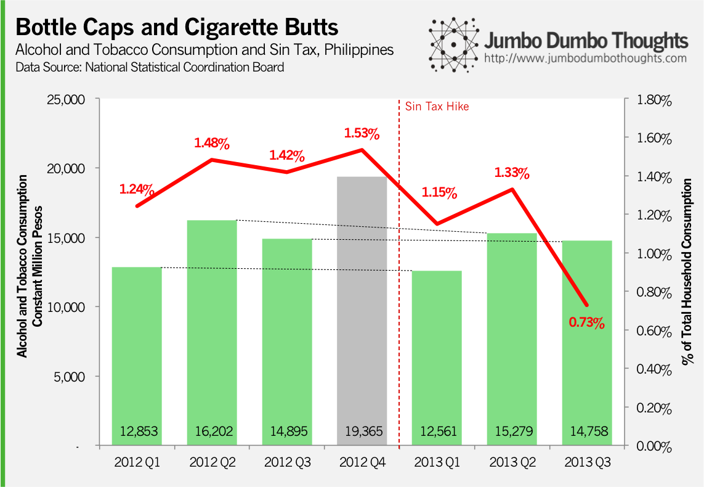
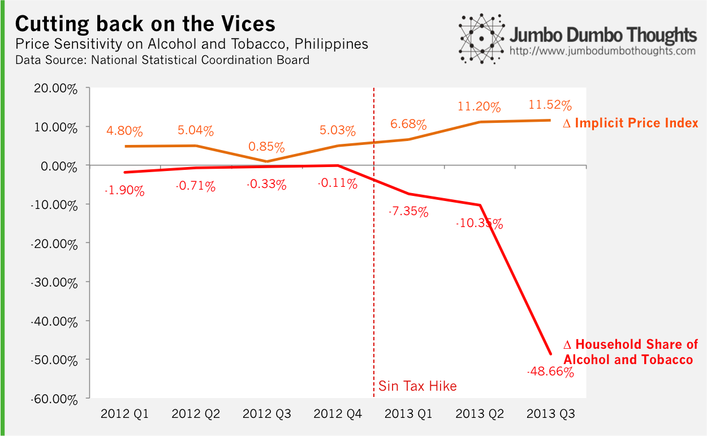

```{r out.width="100%", fig.cap="How are the new sin taxes faring in the 3rd quarter after their implementation? The numbers say - pretty good. (Photo: <a href='http://www.flickr.com/photos/42787780@N04/6447396935/in/photolist-aPJAu8-aPJA2K-aPJiY6-aPJjrx-eXvDMN-fmXy7c-btTEZa-9yka4g-9ykbXK-9ykbtx-9ykaT4-9yo9XG-9yob4h-9ykakx-9ykaAZ-9yobFu-9ykbaV-9yobRy-9ykbk8-9yoayw-eXvCPq-bMk2TX-eXjgdp-dEMcLv-g5LvKo-9ykadv-cdvXhy-epGBdG-epGBUU-ebNTL5-ebHf9v-ebNTAC-ebNTR1-ebNTH5-cnPApL-9Y8WeF-dpWNyc-dpWNCi-dpWNoF-dFyVMS-dgDLUo-dYA2Yy-d9k397-d9k3gu-d9k3kh-d9k3d1-99ZyZV-83eMed-ahbVQG-aa63H9-ahbVPf/'>Fried Dough/Flickr</a>, <a href='http://creativecommons.org/licenses/by/2.0/'>CC BY 2.0, cropped</a>)"}

```

> SIN TAXED - How effective are higher sin taxes at reducing alcohol and tobacco consumption? Some say it's a 'tax on the poor' and it would only lead to downshifting to cheaper, more dangerous brands, others are all for it, armed with the basic principle of demand. Newly released 3rd quarter national accounts can shed light on the situation.

**UPDATE (Sep 16, 2014):** This post has been updated with 2014 Q2 data. Please [click here](/2014/09/sin-taxes-2014q2-update.html) to see the updated article.

**Note:** This is an update of a [previous post](/2013/09/effectiveness-sin-taxes.html) I made a few months back to incorporate the new Q3 statistics. If you want to see the details of the sin taxes, you can check the previous article.

The National Statistics Coordination Board (NSCB) has just released the 3rd quarter national accounts, and one of the more interesting datapoints to look at are the ones for household consumption, particularly alcohol and tobacco consumption, because they tell a story on the newly enacted sin taxes.

## Bottles and Butts

First, we can take a look at absolute consumption levels for alcohol and tobacco, but a more salient measure is the share that alcohol and tobacco takes up in total household consumption, as income and expenditure levels may vary across the periods.

It's also important to note that comparisons between 2012 (pre-sin tax hike) and 2013 (post-sin tax hike) should be made by quarter (2012Q1 to 2013Q1, 2012Q2 to 2012Q2, and so on) to discount the effect of seasonality. There is a 'new year's resolution effect' where sin consumption is much less during the first quarter but spikes up during summer and winter holidays.

```{r layout="l-body", out.width="100%"}

```

So far in 2013, alcohol and tobacco consumption had maintained their levels or decreased slightly, but that's significant as it's been constantly increasing. That's apparent when you look at alcohol and tobacco's share in household consumption dropped for all three quarters, and from 1.42% to 0.73% during the third quarter, presumably due to full implementation or the turnover of inventories taxed at old rates.

The effect of sin taxes is more apparent if we look at price elasticity. As the prices of cigarettes and alcohol rose during the first three quarters, the household consumption share of sin products fell dramatically, falling nearly 50% in the third quarter.

```{r layout="l-body", out.width="100%"}

```

There you go! It looks like the higher sin taxes do have a behavioural effect, after all. It's not as pronounced as proponents would have you believe, but the basic economic principle of people responding to incentives still holds true. Now, the question is whether Christmas season will see less vices.

Thanks for reading! If you found this post interesting, please like, share, tweet, or +1 it on your preffered social network, or comment below to share your ideas. Specific data and computation requests can be made through the contact form or by commenting.
