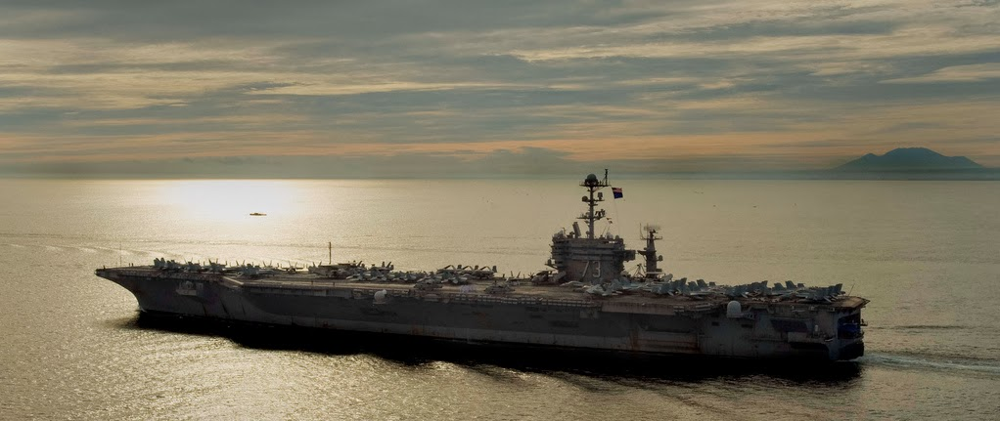
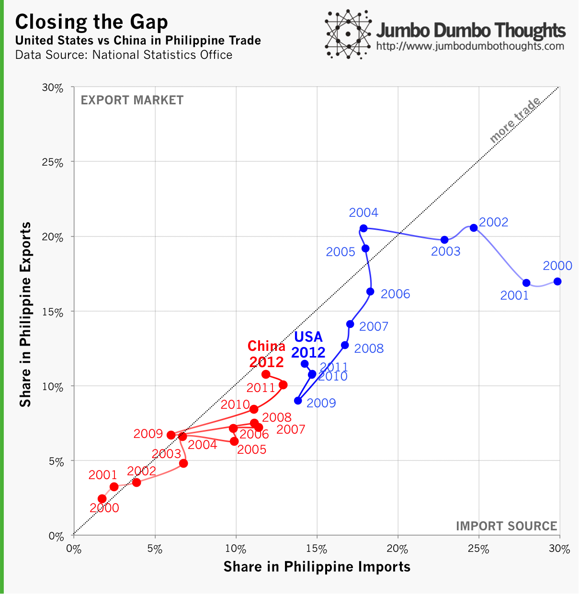

```{r fig.cap="GOLD VS GLORY - There is a legitimate debate as to whether economic or military power is more relevant in the long-run. In this photo, the USS Washington enters the Manila bay for a 2010 port visit. <a href='http://www.flickr.com/photos/usnavy/5450495185/sizes/l/' target='_blank'>Flickr/US Navy Official Imagery</a>,<a href='http://creativecommons.org/licenses/by/2.0/' rel='nofollow' target='_blank'> CC BY 2.0</a>)", out.width="100%"}

```

> RED TIDE - The world is in the middle of an epic struggle for political influence between the USA and China, but what does this mean for Filipinos, who are trapped in the middle, both in the geographic and political sense? We can take a look at the data on one of the avenues of influence, foreign trade, and find out a little bit more.

The conflict between East and West is heating up - [US bombers defy the Chinese Air Defense Identification Zone (ADIZ)](http://thediplomat.com/2013/11/us-bombers-challenge-chinas-air-defense-identification-zone/) over the East China Sea, and [US and China Naval Vessels almost collide with each other](http://www.theguardian.com/world/2013/dec/14/chinese-warships-nearly-collide-airspace) in the West Philippine Sea. 

All this leads me to think how this will impact the Philippines, a tiny country literally and figuratively caught in the middle. Situated in the Pacific Ocean, the island nation has always aligned itself with US interests, but recent developments over the past few years have resulted to Philippine officials taking a more measured approach to Chinese foreign policy.

While the political and military influences surrounding the situation are murky and rather hard to decipher, we can take a look at the economic side of things, which is much easier to understand and quantify. More specifically, let's take a look at foreign trade. **Economic power, as opposed to military or political power, is peculiar in the sense that trade relations between two countries are totally voluntary.** Countries cannot unilaterally force another to trade with them, which is why states have historically resorted to using military force to open up otherwise closed economies (take the case of the Opium Wars). Also, the more countries trade with each other, the more dependent they become on <i>each other, </i>as opposed to a typical protector-protected relationship.

## Trade wars

By taking a look at the relative importance of the two countries in Philippine foreign trade, we can at least see a story developing in the data:

```{r fig.cap="CLOSING THE GAP - In the past decade, the Philippines has the majority of its trade shift from the United States to China, shedding light on why Philippine officials might take a more measured approach to dealing with its red neighbor.", out.width="100%"}

```

As you can see, at the start of the millennium, China played an almost insignificant role in trade with the Philippines, and the US was the Philippines' largest trading partner, receiving 20% of exports and supplying 30% of imports. As China's political situation stabilized throughout the 2000s, it has become more and more of a major trading partner. As of 2012, the trade gap for the Philippines between US and China is starting to close, and they now possess almost equal shares in imports and exports of the country.

It is true that when things take a turn for the worse, military strength will decide the end game. However, the current situation calls for more diplomatic than military pressure, and economic power can more readily be wielded in this case. **This is why I do not envy the President and DFA who are constantly stuck between a rock and a hard place.**

## Explore the data

If you want to explore more of the Philippine foreign trade data, here's a motion chart that allows you to browse through major trade partner data for years 2000-2012. The play button allows you to track and trace the motion of the different trade partners. On the Y axis is the share in imports, and the X axis contains the share in exports. The size of the bubble is the relative size of trade.

<aside>
This bubble chart is no longer functioning because the API that powers it has been deprecated. Shame on you, Google. :(
</aside>

Thanks for reading! If you found this post interesting, I'd appreciate it if you liked, shared, tweeted, or&nbsp;+1'ed it on your preferred social network. Complete data and computation requests can be made through the contact form or by commenting on this post.
