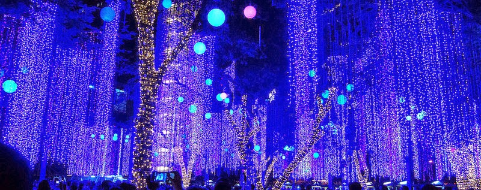
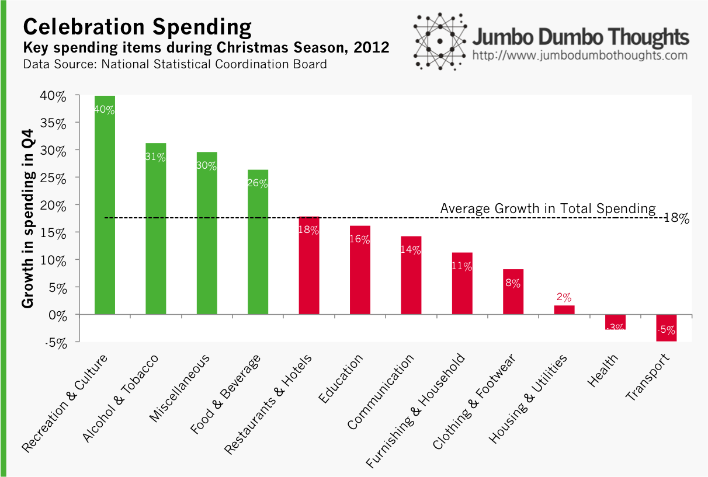
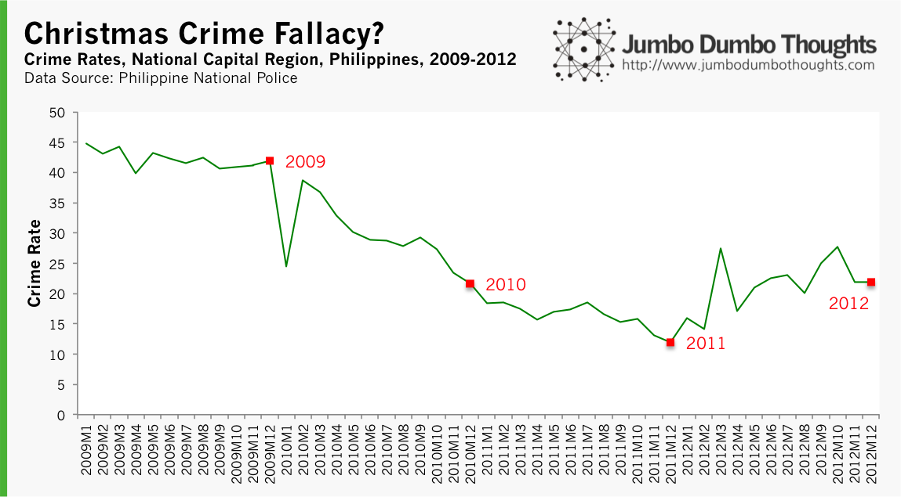
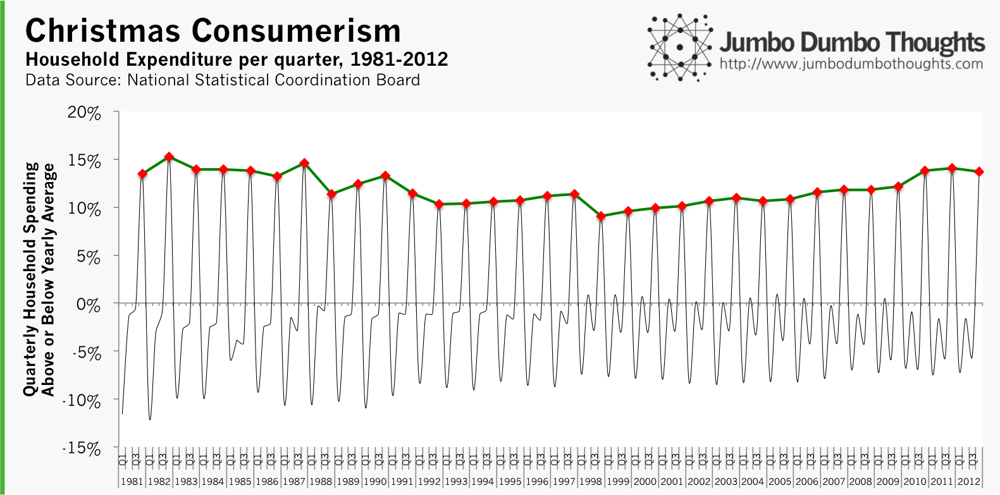

```{r out.width="100%", fig.cap="The Ayala Triangle light show in Makati City is just one example of how Filipinos celebrate the holidays. (Photo by <a href='http://www.flickr.com/photos/kameraderie/9491833509/in/photolist-fsL8pT-fsLdWk-ft1JeW-ft2nbL-fsM9KP-fsLQb2-fsLHcT-ft2Ceb-fsLSxi-fsLLZ2-ft2qLw-ft2htj-ft2A53-ft2f2Q-fsLhFM-ft2ykf-dyHwzz-8U79pB-dE8P2d-dyHwnn-dyHw9P-8U79pv-8U79pz-8U79pt-8U79pk/'>kamaraderie/Flickr</a>, <a href='http://creativecommons.org/licenses/by-sa/2.0/'>CC BY-SA 2.0</a>)"}

```

The Philippines seems to be having its fair share of the international limelight nowadays - including with regard to [how Filipinos celebrate Christmas](http://edition.cnn.com/2012/12/05/world/asia/irpt-xmas-philippines-traditions/). We like to use data to see things from a new perspective here, so let's take a look at how the numbers celebrate the holidays as well!

## Holiday priorities - a time for pleasure

First, we can uncover the key spending items during the Christmas season. What do Filipinos spend most on during the 4th quarter compared to the rest of the year?

```{r out.width="100%"}

```

The results aren't that surprising, but they're nonetheless interesting. Christmas is a time for celebration, and thus households splurge on recreation, food and drink, as well as alcohol and tobacco. What's a little surprising (and troubling), though, is that we spend 31% more on vices, compared to 26% on food and beverages. Also, necessities like health and transport take the backseat.

## Christmas crime wave?

It's always been common knowledge that crime spikes in the capital in the run-up to the holidays, but is that reflected in the data?

```{r out.width="100%"}

```

The data doesn't seem to show any significant increases during the "ber" months (December for each year is marked with a red dot). This may be because of underreporting by either the PNP or by the victims, or because of increased police presence in response to the perceived threat. The fact that increased spending requirements drive crime seems so logical that it just has to be true. Then again, the Christmas crime wave may actually just be a product of collective fiction.

## Yuletide Consumerism - on the rise

Foreigners are always awed at the mall culture in the Philippines, with most Filipinos spending Christmastime in [malls that are open all year round](http://www.abs-cbnnews.com/business/12/23/13/shopping-mall-hours-december-24-25). Some express disdain over this apparent consumerism, but I'm more interested in measuring it:

```{r out.width="100%"}

```

For the past 30 years, household expenditure was around 10-15% higher during the holidays than the yearly average. If you use this metric as a measure of consumerism in the Philippines, the culture is on the rise; from its lowest point in 1998 at 10% above average, it has slowly climbed to15% above average.

There you go, a look at the Christmas season through data - filled with vice and consumerism, but surprisingly not crime. Merry Christmas and have happy holidays!

Thanks for reading! If you enjoyed reading, I'd really appreciate it if you liked, shared, tweeted, or +1'ed it on your social networks. Detailed data and computations may be requested through the contact form or in the comments.
