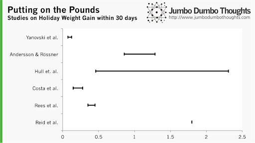
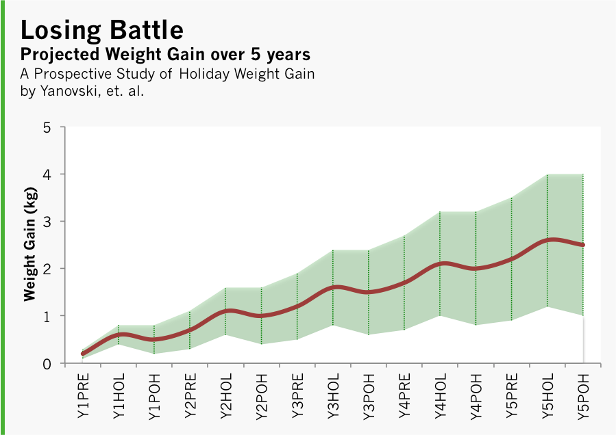
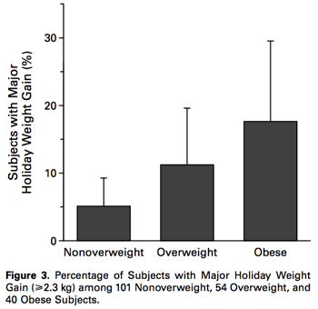

```{r fig.cap="Holiday weight gain - can you beat it? (Photo: <a href='http://www.flickr.com/photos/wicker-furniture/8729893568/sizes/c/in/photolist-eiqZdm-9PKjgi-dSk5Ev-ee64kA-9FkTJM-7zu36u-7zqgSk-7zqhWc-7zu2qd-biiBfZ-8VBnU1-8eavNp-dVmUJU-dVgjY4-dVmUUd-dVmUUy-dTggJ4-duncC7-dVgjCa-be7FQz-eeheRM-7TCkTT-bCmVwL-deBW7y-dJpcXp-b4LoX8-9cNWxb-9chjun-bpQnUg-cKYaY5-8vGnwi-aCsk8a-7KQ51L-dAhoFg-dd5Jgi-7yoDnQ-dfwcyN-cNDgeu-bc8vjc-9PZF4C-7zazk6-cFb9WE-a2XVAj-9Jcbq7/' style='font-size: medium; text-align: start;' target='_blank' title=''>WickerFurniture/Flickr</a>, <a href='http://creativecommons.org/licenses/by/2.0/' style='font-size: medium; text-align: start;' title=''>CC BY 2.0</a>)"}

```

## Everyone gains weight anyway, right?

As utterly trivial as it may seem, holiday weight gain is something well-studied by medical journals. Here's a quick summary of the weight gain findings of various studies, normalized to a period of 30 days. The bars indicate the range between minimum and maximum findings.

```{r out.width="100%"}

```

The studies are ordered by decreasing sample size, as we can rely more on evidence that is generated from larger samples. Still, the results are very diverse, estimates range from a measly 0.1kg to a whopping 2.2kg. If you've kept tabs on the scale and it's within this amount, then you can take comfort in the fact that most other people will be experiencing this weight gain, too.

## Battle of the bulge: one step forward, two steps back 

However, there is little solace in remaining within the 'normal' range, as a [study by Yanovski, et. al.](http://www.nejm.org/doi/pdf/10.1056/NEJM200003233421206) found that weight gained in the preholiday season (October and November) and holiday season (December) is not lost in the following 'postholiday' period, so the fat gained during the holdays is probably a major contributor to the weight gain during a person's lifetime. Here's a projection over 5 years that I've constructed using data from the study:

```{r out.width="100%"}

```

The green area indicates probable weight gain tracks, while the red line is the mean or the most likely weight gain. At the end of 5 years, your weight will probably have increased by 0.5 to 4 kg. Your goal, of course, is to be an outlier - on the negative side, that is.

There is another motivation for staying on top of your weight as early as possible, though - the same study has observed that overweight and obese persons are much more likely to experience 'major' holiday weight gain in excess of 2.3kg, as follows:

```{r out.width="100%"}

```

Only 5% of non-overweight individuals experienced major weight gain, while it was 10% and 18% for overweight and obese individuals, respectively. It's a slippery slope, and once you pop, it's hard to stop!

## Secure your new years' resolution with a commitment device

Most of us will probably want to overcome the trend and lose all the holiday weight before summer, and made it our new years' resolution. Sadly, most of these resolutions will be broken after a few trips to the gym or a few weeks on a diet, but you can control the actions of your future self with what's called a commitment device. For example, as Steven Levitt describes it:

> LEVITT: If you’ve ever had really bad canker sores, or kind of cut your gums, it’s so unpleasant. So why not just slice up your gums a little bit, you know, cut up your mouth so you just don’t feel like eating at all? I think that would be a great diet approach. But people say, “No, no, no too violent, I couldn’t cut myself.” One thing I know would work is just take a little can, like say a baby food jar, and fill it with vomit. And wear it around your neck. And every time you decide that you’re hungry just open the jar and take a little sniff. And I guarantee you you will lose weight, guaranteed.

Well, it's not that bad, of course! It can be as simple as giving a friend a sum of money to be donated away upon failure. I could go on, but you would be better served by listening to one of my favorite Freakonomics podcasts:

[**See here**](https://freakonomics.com/podcast/save-me-from-myself-a-new-freakonomics-radio-podcast/)

Have a great new, year, folks! If you found this post interesting, a share or comment would be greatly appreciated. Thanks!
