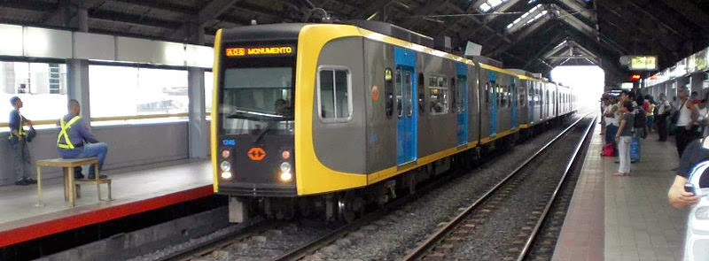
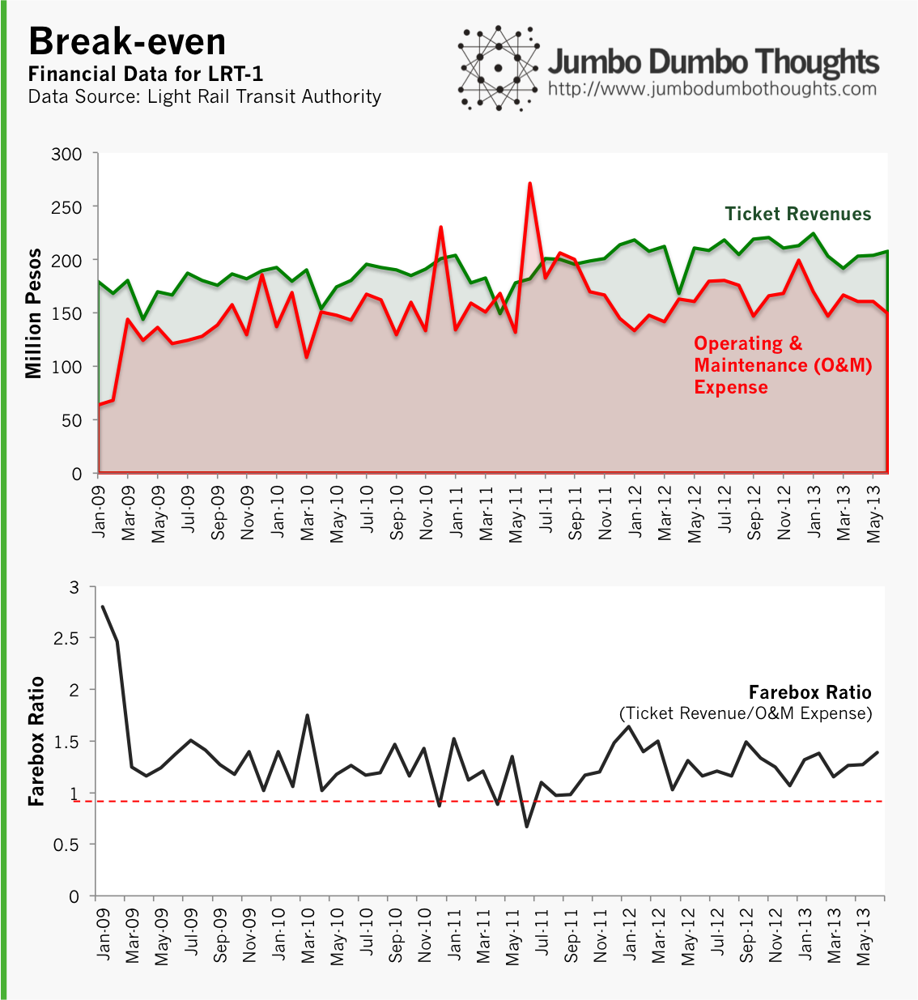
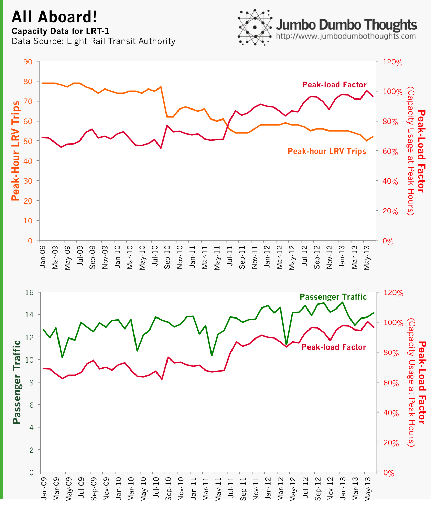
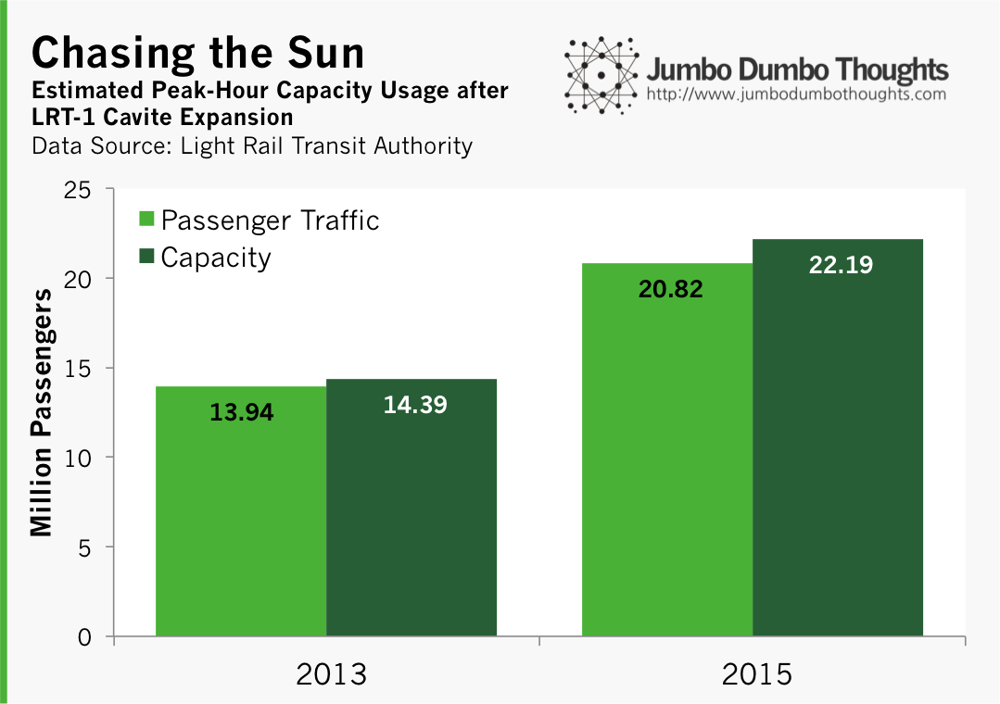
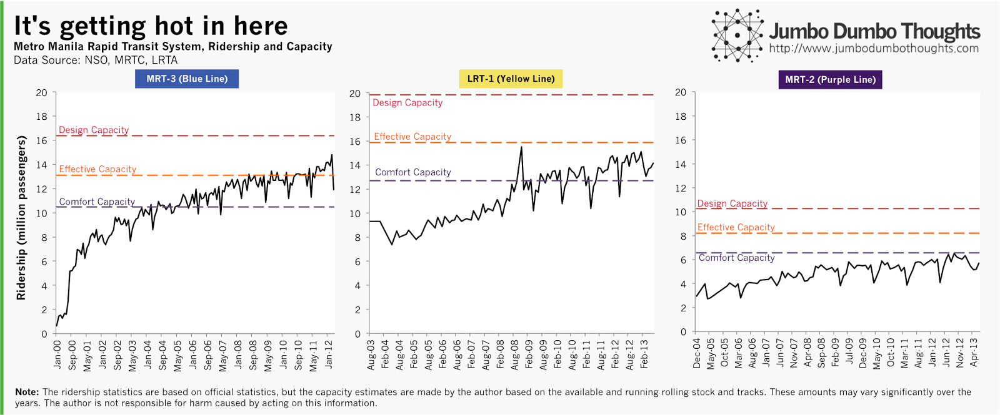

```{r fig.cap="It's a fact of life in Manila that you won't really know when you'll arrive at your destination, resulting from intolerable congestion and poor public transport, a problem that has gained political traction in recent years. In this photo, an LRT-1 train arrives at Blumentritt station. (Photo: public domain/Wikipedia)", out.width="100%"}

```

President Aquino's [talk of the need to raise fares on the Manila's transit system](http://www.rappler.com/nation/special-coverage/sona/2013/34517-aquino-mrt-lrt-fare-hike) in his most recent State of the Nation Address sparked intense political opposition, and as a result the fares have stayed put. Now, the LRT-1 South Extension project to Cavite is up for bidding through the Public-Private Partnership scheme, bringing rapid transit to the southern suburbs of Manila. [Valued at around P63.55 billion](http://ppp.gov.ph/?p=7641), the project is the biggest infrastructure project of the current administration.

All this leads us to ask some important questions: (a) we all know that prices should rise with wages and government susbidy distorts incentives, but should fares really rise to as much as P40 per trip?, (b) can the existing line handle all those new commuters from the south in 2015?, and (c) what about the other lines? We can try to provide some answers through data.

## Substandard Subsidies

The President states that the true cost of riding the LRT is at around P40, meaning that P25 has to be shouldered by the government for each commuter. Let's take a quick look at some LRT financial data:

```{r out.width="100%"}

```

As you can see, the throughout the past four years, ticket revenues (revenues gathered from the P15 paid by each commuter) have pretty much run in place with the operating and maintenance expenses of the rail line. The farebox ratio (the proportion of O&amp;M costs covered by ticket revenues) has hovered at just above 1.0.

What does this mean? **Other expenses notwithstanding, the rail line operates at its *current* state with a P15 ticket price (take note: *current state*)**. The P25 that the government pays goes to expenses other than regular operation and routine maintenance, such as replacement of spare parts and rail equipment, as well as capital expenditure, according to a reader who has worked on the LRTA/DOTC on these projects. (Thank you to the reader for pointing out that it was <i>not, </i>in fact, going to debt service, as alleged by some ideological groups.)

This is why the 'acceptable' farebox ratio doesn't mean that the LRT is operating fine. Raising the farebox ratio provides financial capability to improve and better maintain existing equipment. Expenses, especially maintenance, may have been kept down, resulting in substandard service. Frequent breakdowns and delays are but a symptom of cost cutting due to the inability to raise fares.

## Capacity Conundrum

It doesn't take data to figure out that the LRT is reaching the stage of severe overcrowding. Couple that with increased volume from the south extension project, and rush hour commutes can turn into complete nightmares.

The peak-load factor, a statistic that measures the usage of train capacity during rush hour breached 100% during the summer of 2013. I have no idea how you can breach 100%, but it did, and I just chalk it up to Filipino ingenuity. What data can answer for us, though is why this is so.

```{r out.width="100%"}

```

The most obvious answer is increased passenger traffic, but is that all? Take a look at the peak-hour LRV trips on the top chart. The number of trips made during rush hour has been on a steady decline since 2009, and the decline in LRV trips has translated to a pretty proportional increase in the peak-load factor.

In the face of increased passenger volume, why would the LRT trains take less trips during peak hours? The answer may lie in poor maintenance reducing the number of operable trains, or deliberate creation of scarcity to justify fare hikes. As in most cases, it's probably a little of both.

## LRT-1 South Extension Project: It's hard to hit a moving target

I've had my doubts about the extension project. Given overcrowding issues with our rail system, shouldn't we focus on expansion first, before extension? According to the project brief, the government plans to purchase 30 additional rolling stock to handle the projected 40% increase in ridership. My estimations produced the following results:

```{r out.width="100%"}

```

The additional 30 trains and the increased ridership translate to the peak-load factor falling a modest 2% from 96% to 94%. It's definitely an improvement, of course, but the government will find it hard to keep up with rapid population growth.

Also, more riders can spell disaster for the other train lines, as we can see in the following chart:

```{r layout="l-page"}

```

The MRT-3 along EDSA is definitely in need of some rail rehab. It's exceeded effective capacity and is way beyond what anyone can call comfortable. Since most people from the south extension will probably take the MRT to their workplaces in Makati, Pasig, or Quezon City, the need to do something about this escalates. The LRT-1 is already beyond comfortable capacity and is almost at effective capacity, while Line 2 is still smooth sailing.

There you go: numbers to ponder on the next time you get on a train. There's no room to do anything else but think, anyway.

Thanks for reading! If you found this post interesting or enjoyable, I'd appreciate a like, share, tweet, +1. I'd also like to hear some of your thoughts in the comments. Detailed data and computation requests can be made through the contact form or the comments.
