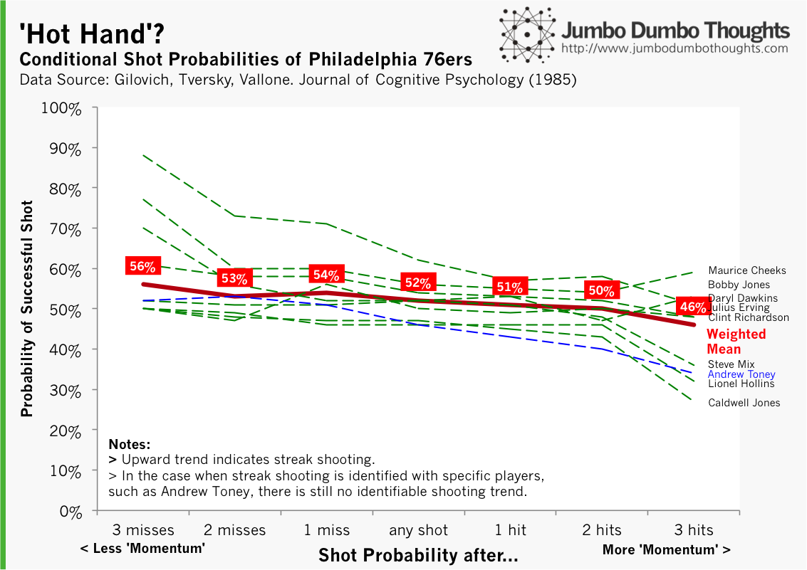
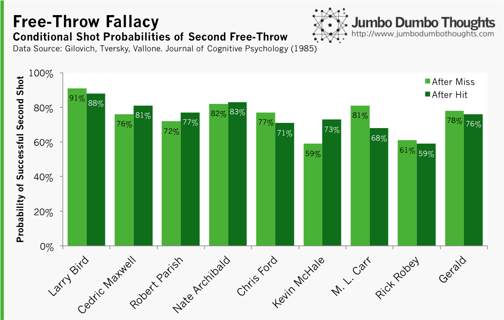
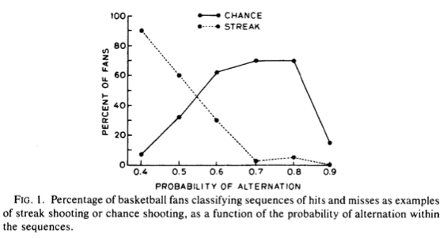
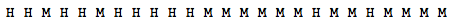
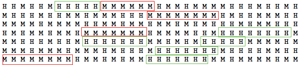

```{r fig.cap="The Hot Hand Hypothesis. Many basketball fans believe that there are periods during a game when a player has 'hot hands', but does it hold up under statistical rigor? (Photo:<a href='http://www.flickr.com/photos/ryan_fung/2239687100/sizes/o/in/photolist-4pUYWQ-6egVNf-6pC6ZM-6qU5pB-6reH4r-6RuDLM-7bK7K2-7hR4Xy-fNL5iv-fNL5pT-9AoK2z-974pij-btuyo9-bLS29P-8St5Gc-aeXB9f-835JJe-dQQANP-bf6sNT-9io9am-9e3eeJ-9e3fhs-9dZ9kk-9e3dBL-9e3fEC-9dZamr-9e3fVq-9e3eEd-99MsjF-9j7HGC-bwdcKe-bwdAnn-bwdB5R-bweiu6-bwdbng-bwdRKF-bweGyp-bweMaK-bweUgi-bwdqgT-bwen7k-bweQz4-bwdejF-bwdu8M-bwdCmc-bweA82-bweo5V-bwdiR4-bwdngk-bwek9K-bwd5Tk/' rel='nofollow' target='_blank'> ryan_fung/Flickr</a>, <a href='http://creativecommons.org/licenses/by-sa/2.0/deed.en' rel='nofollow' target='_blank'>CC BY-SA 2.0</a>)"}

```

<div class="uk-alert-warning" uk-alert>
**UPDATE (2018-04-15):** We recently discovered more evidence in support of the hot hand and also assailing the 1985 paper featured in this article due to lack of statistical power. See [here](https://www.thecut.com/2016/08/how-researchers-discovered-the-basketball-hot-hand.html) for a digestible piece of analysis.
</div>

We feature a journal article published in the Journal of Cognitive Psychology by Cornell and Stanford researchers Gilovich, Tversky, and Vallone entitled "The Hot Hand in Basketball: On the Misinterpretation of Random Sequences." They proved, statistically, that there was no such thing as a 'hot hand', busting the myth that players have an inherent 'momentum'. Instead, they found that these streaks were simply a result of our brains trying to detect patterns where none actually exist.
  
## Debunking the 'Hot Hand' Hypothesis

The study tested the hypothesis in three ways: (a) they looked at player shooting data of the Philadelphia 76ers to determine any positive correlation between the outcomes of successive shots, (b) to cancel our defensive presure, they analyzed free-throw data for the Boston Celtics for the same correlation, and (c) to isolate any exogenous forces, they ran a controlled experiment with the members of the Cornell basketball varsity.

**If 'hot hands' or shooting streaks were true, then the probability that one makes a shot after one, two, or three hits must be higher than if one makes a shot after one, two, or three misses.** This is what they tested by comparing conditional shot probabilities computed from shot data on the Philadelphia 76ers in 1985.

They also performed a runs test and tests of serial correlation. A runs test is done by counting the sequences of consecutive hits or misses in the record. For example, HHMMMHM contains four runs. If evidence of the hot hand is to be gathered, there must be fewer runs that those expected by chance alone. Also, there must exist significant and positive serial correlation in the runs.

The following are their results for their analysis of shooting data for the Philadelphia 76ers:

```{r fig.cap="HOT HAND? - The data seems to show that successful shots are more likely to follow misses rather than hits.", out.width="100%"}

```

If there is to be evidence of shooting streaks, there must be an upward line for each player and for the weighted mean. These results run counter to the 'hot hand' hypothesis; there seems to be, on average, a higher probability of successful shots following *misses* rather than *hits*. 

Additional tests of serial correlation and runs test show that there the probability of making a shot does not significantly depend on whether the player made or missed his previous goal.
  
Others may argue that running hot or cold isn't universal to all players; there are certain players who might be more psychologically prone to momentum. However, *Andrew Toney* (marked in blue), a player that many basketball fans at the time regarded as a streak player, did not fit the profile of the 'hot hand' either.
  
## What if the defending team reacts?

What if, you say, there are other factors that influence the probability? After making successive shots, the player may have become confident and attempted more difficult shots, or the defending team might have reacted by doubling up the defense on that certain player, forcing him to take less advantageous shooting positions.

This is the reason why the researchers also analyzed free-throws, which are taken in the same place and without defensive pressure. They determined the conditional probability of making the second free-throw depending on the outcome of the first, this time for the Boston Celtics, and they found the following:

```{r fig.cap="FREE THROW FALLACY - There seems to be no significant difference in shot probabilities for those following a missed first free-throw or shots following a successful first free-throw.", out.width="100%"}

```

The light green bars represent second-shot percentages for each player after missing the first free-throw, and the dark green bars are for the probabilities after making the first basket. **As you can see, there is no significant difference in the probabilities, regardless of the outcome of the first free-throw.** Some do better after misses, and some do better after hits.
  
They also ran a controlled experiment with the members of the Cornell basketball varsity, and yielded similar results.
  
## But I've seen (favorite player) do shooting streaks so many times!

As the authors state: "**People's intuitive conceptions of randomness depart systematically from the laws of chance.**" In other words, what we see as a shooting streak, especially in small samples like shots made during a single game, may simply be our brain seeing patterns where none exist. The shot probability of that player may not really have changed.

To test this, the researchers generated a series of random runs with different probabilities of *alternation* (alternation means that the streak is cut, or that a series of misses is followed by a hit and vice versa) and asked a sample of basketball fans to determine whether the can be characterized as 'chance shooting' or random shooting, 'streak shooting', or 'alternate shooting'. The results are summarized in their graph:

```{r, out.width="100%"}

```

As you can see, even at 0.5 probability of alternation (same as a coin flip), more (~60%) fans characterized the run as 'streak shooting' than 'chance shooting' (~30%) when the data-generating process was really actually random. **This suggests that people can spot, in totally random processes, trends that don't really exist.**
  
If you still don't believe me, then consider this example. I've gathered this run from shots made by a UAAP basketball player during a single game, and I want you to see whether there is any evidence of streak shooting (H = hit, M = miss):


  
I bet you already saw the streak of 5 hits, then 6 misses in the middle of the run. Surely, this is an example of the player with a 'hot hand.' However, if you take a look at shots made during the entire season, the randomness is more apparent:


  
To make it easier, I've marked out consecutive hits or misses of 5 or more. Surely, these are shooting streaks, right? No; this is just our brain isolating patterns that don't have to be there.

If you focus on the area that is outside the boxes, you can see that, more often than not, the shot probabilities are totally independent from the previous shots.

<div class="uk-alert-success" uk-alert>
**In fact, this data isn't really from a basketball player, it's from a random generation of successive coin flips from random.org.**
</div>

**This is why 'momentum' in basketball is more of our brains' thirst for drama than statistical fact.** If you'd like to read the original article, you can access it at the [Cornell University website](http://psych.cornell.edu/sites/default/files/Gilo.Vallone.Tversky.pdf).
  
**Do you think that the 'hot hand' hypothesis holds water? Let us know! I'd also appreciate a like, share, tweet, or +1! Data and computation requests can be made through the contact form or the comments.**
