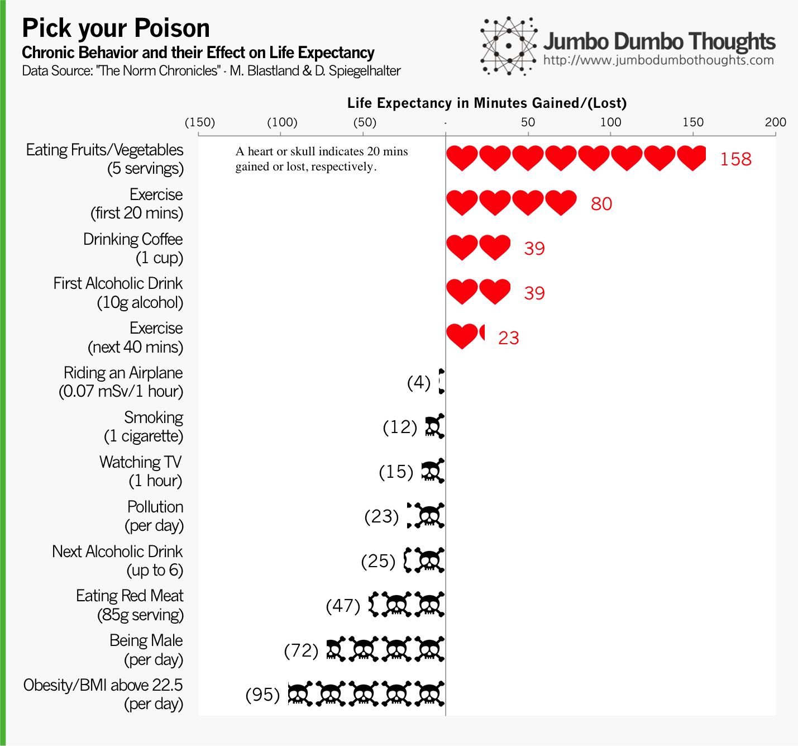

```{r fig.cap="HOW LONG WILL YOU LIVE? - Certain life choices and behaviors have corresponding increases or decreases to your life expectancy. Let's measure the tradeoffs! Photo: <a href='http://www.flickr.com/photos/uncalno/8538709738/sizes/o/in/photolist-e1x7Vq-e1MS38-8MBnLE-9WzeuW-96WykC-9fAmSe-auFdwu-arEiYB-ec3DHB-jot3jf-7KKV2D-9RbbJu-8GTsat-bbFkRH-9af5Ht-7U3KDk-7zMAV4-7CNcLm-fb3Zwj-dBvcrN-aakx9m-7T2Hnk-7Va8gG-7Pt7Ue-8XHun3-ammjb3-b8rU6P-8R8SQQ-bcANPe-ai89o5-9MBzFJ-81TBBc-cLgsbs-egxmif-boJEtt-b3Ctfg-bBm3pL-8XHuCS-9WwoSB-aq1zDr-aq4hbs-b8AtQc-dR7Pi5/' target='_blank'>Uncalno/Flickr</a>,<a href='http://creativecommons.org/licenses/by/2.0/deed.en' target='_blank'> CC BY 2.0</a>)", out.width="100%"}

```

Let's say you're a smoker, and someone tells you to stop smoking because it's shortening your life. You'd probably decline by saying that you derive some sort of benefit from it - whether it be physiological, emotional, or social. This is why a lot of anti-smoking activists try to make that benefit look insignificant compared to the costs, through warning labels, graphic illustrations of smoking complications, and advertisements - but these strategies don't necessarily work that well.

I think part of the reason is because the costs can't necessarily be weighed against the benefits. **How do you measure the high of a cigarette against the cost of complications in some far, distant future?** But what if you could actually pinpoint how much of your life you are sacrificing? Well, you can then decide for yourself whether the tradeoff is worth it or not. If one stick reduces life by a day, everyone would probably quit immediately. Conversely, if it were 10 seconds, many might just decide to continue the habit.

## Tempting tradeoffs

Fortunately, researchers have been working on determining just how much time, in minutes, you are losing with each puff, and they've also done this for various chronic life choices, such as drinking, diet, coffee, TV, among others. That way, we can calculate *exactly* how much time one is sacrificing by making certain life choices. We summarize the results in this chart:

```{r layout="l-body-outset"}

```

It's a load of information, but here are some of the highlights:

  * **Drink moderately!** The first drink of the day (10 g of alcohol) increases life expectancy by 39 minutes, but each successive drink chips away at that by reducing life expectancy by 25 minutes per drink for up to 6 drinks.
  * **Coffee is good!** A cup of coffee can increase your life expectancy by 39 minutes.
  * **Exercise is subject to the Pareto principle.** The first 20 minutes of exercise in a day increases expectancy by 80 minutes, but the next 40 minutes only provides 29 minutes.
  * **Eat right and stay fit!** Fruits and vegetables are a great boon with about 2.5 hours, while red meat can take away 47 minutes of your time. Furthermore, having a BMI greater than 22.5 takes away and hour and a half per day.
  * **Stay away from airplanes, televisions, and pollution.** They all have slight negative impacts on longevity.
  * **It's no good being a man.** It's not a life choice, but males tend to live shorter than females, all factors considered.
  * Finally, **each cigarette takes away 12 minutes.** It's not that high, but not insignificant either. So I guess it's up to you to decide!
  
## Know the data!

I'd like to point out some things that you might need to understand about the data:

  * These are averages. They're called life *expectancy* for a reason. As with any summary statistic, you shouldn't treat these values as exact, but as ballpark figures.
  * You shouldn't use this to 'budget' your life expectancy. Just because something reduces life expectancy, doesn't mean you can offset it with a life expectancy increasing behavior. The human body is complex and so are its interactions.
  
So the next time you take a shot of tequila, think about the benefits! The next shots (and there will be next shots) will probably erode all of that, anyway.

Thanks for reading! If you found this post interesting, I'd appreciate a like, share, tweet, or +1. Share your thoughts or request for data in the comments or through the contact form.
