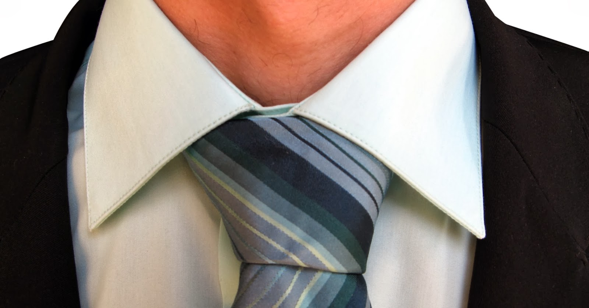
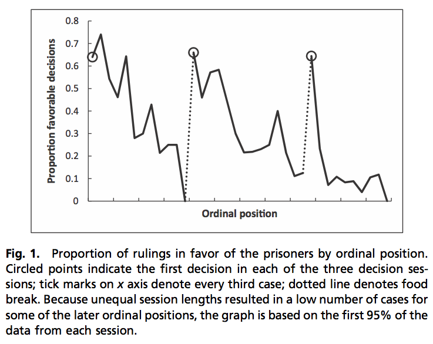

```{r fig.cap="Researchers find that, all other things equal, people tend to make nicer decisions right after they've had a break. (Mart1n/StackXCHNG)"}

```

When you have an extremely important interview coming up, you'd want to use every single factor to your advantage - what you wear, how you look, and how you walk becomes extremely important to you. One of the things that prove to be most relevant, however, is more about the interviewers than the interviewee - *a study on parole boards found that the judges tend to give more favorable decisions when they are fresh from their food breaks.*

## Famished Findings

The data was based on 1,112 rulings collected over a 10-month period on two parole boards in Israel. The types of decisions were not only for parole, but also for changing incarceration terms (location of prison, removal of tracking device). The board took two food breaks during the day, creating three distinct 'decision sessions,' as the researchers would call them. They analyzed the proportion of favorable decisions (decisions permitting the request of the prisoner) made during these decision sessions and found the following:

```{r out.width="100%"}

```

The results are astounding. The percentage of favorable decisions starts at approximately 65%, then drops abruptly as the session continues. After the judges have taken their food break, however, the proportion once again jumps up to around 65%. *This points to the possibility that mental depletion, where repeated rulings increase the tendency of the judges to rule in favor of the status quo (that is, not grant the request) because it is easier and less mentally taxing to do so.* The study found that favorable decisions took much longer to deliberate and were documented in longer written reports.

In order to rule out possibilities other than the one they proposed, they performed the following robustness tests:

  * **Variations in 'acceptability' of prisoners.** In order to account for the possible role of covariates, they performed a more rigorous regression approach to control for factors such as severity of offense, previous imprisonments, existence of rehabilitation program, etc. They were found to be significant alongside the significant effect of the ordinal position of the interview. 
  * **Judges 'quota' of favorable decisions.** It might also be that judges have a certain quota of favorable decisions to give out, and unfavorable decisions follow after the quota is reached. They ruled out this possibility by including number of previous favorable decisions rendered and found it to be positive and significant, meaning that more favorable decisions rendered during the decision session makes it more likely, not less likely, to produce another favorable decision.
  
This is a short journal article - only 4 pages long. I suggest you [take a look](http://www.pnas.org/content/early/2011/03/29/1018033108.short). A survey of the participants revealed that both prisoners and judges have little idea of the extraneous factors that affect their decisions, proving once more that the human psyche is much more complicated than our rules and procedures make them seem.

So the next time you go on an interview, use statistics to your advantage and catch them after a food break.

Thanks for reading! If you found this post interesting or enjoyable, I'd appreciate a like, share, tweet, +1, or for you to share your thoughts in the comments.
