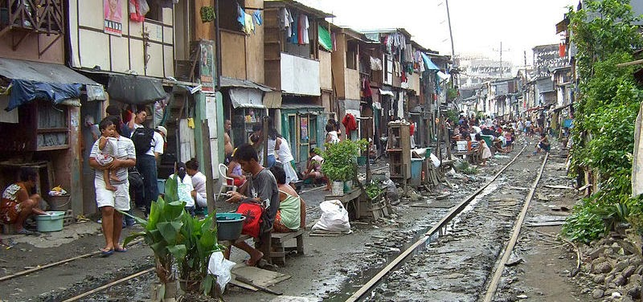
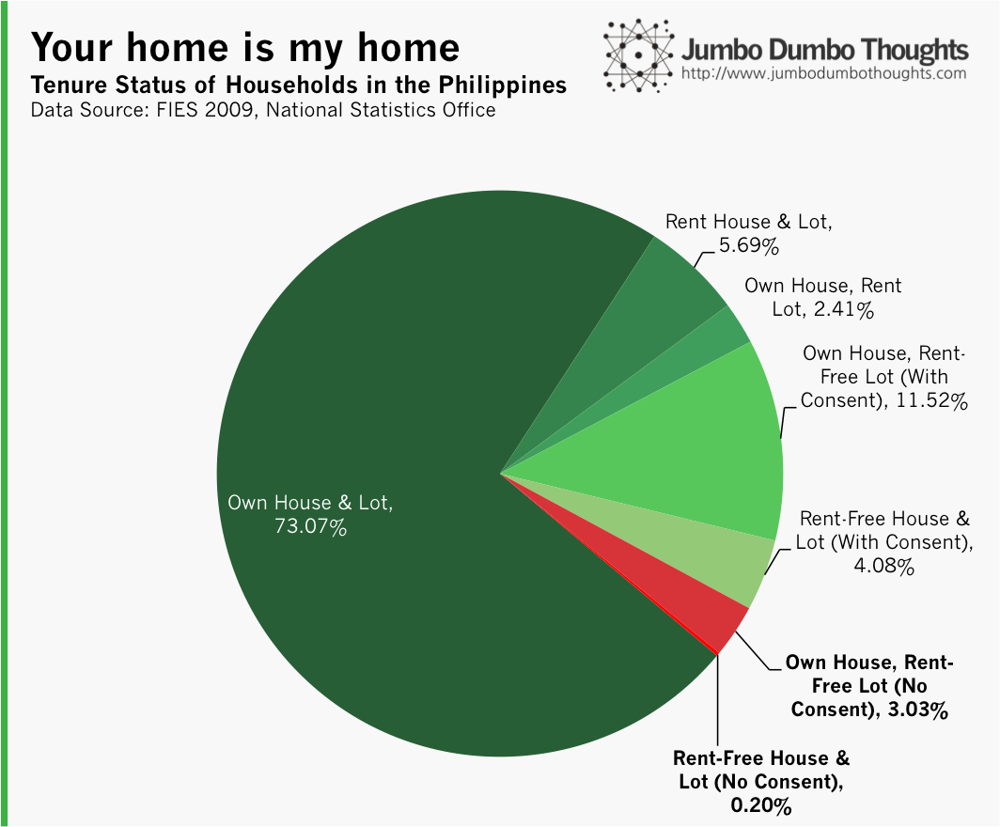
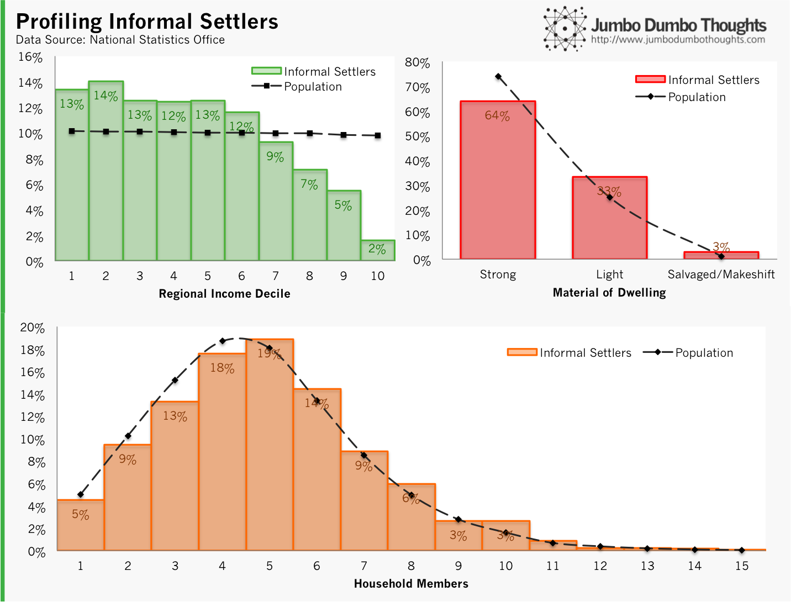
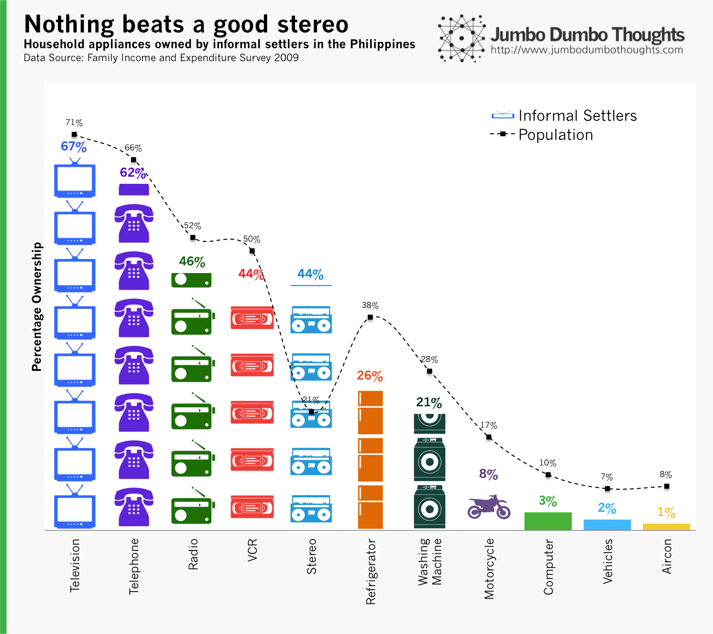
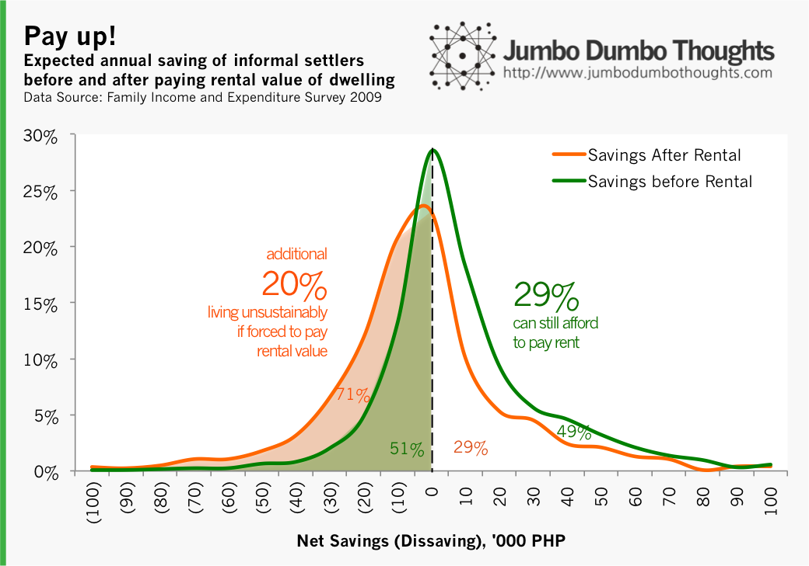

```{r fig.cap="TRESPASSERS OR VICTIMS? - There is a debate as to whether informal settlers form a threat to urban development, or whether they should be relocated. In this photo is an informal settlement along the Philippine National Railways. (Photo: <a href='http://commons.wikimedia.org/wiki/File:Philippine_National_Railways_Manila_squatter.jpg' target='_blank'>Kounosu/Wikimedia</a>, <a href='http://creativecommons.org/licenses/by-sa/3.0/deed.en' target='_blank'>CC BY-SA 3.0</a>)", out.width="100%"}

```

An informal settlement along Agham Road in North Triangle, Quezon City [has been torn down by the government](http://newsinfo.inquirer.net/570209/demolition-of-shanties-turns-agham-road-into-battle-zone), causing much drama as the residents fought back to save their dwellings. The incident has yet again sparked discussion on whether squatting is borne out of circumstance or sloth, and on which method of removing informal settlers works best.

I think, when dealing with complex socio-economic issues such as squatting, it pays to know the people who are in the situation. Fortunately, the Family Income and Expenditure Survey 2009 has data on informal settlers, and we can use it to paint a social, economic, and psychological picture of their surroundings and circumstances.

## How prevalent is squatting?

If we generalize the results of this survey, which included 38,400 households and 1,239 informal settlers, to the entire population, roughly 3.23% of households in the Philippines are living rent-free in houses and/or lots that do not belong to them, without the consent of their owners.

```{r out.width="100%"}

```

For the purposes of this post, we define informal settlers *as any household that lives rent-free on a lot with a pre-existing or self-constructed house without the owner's consent.*
  
## Are informal settlers really poor and underprivileged?

Now that that's out of the way, let's first go into some preliminary statistics: how do they measure up, relative to the entire population in terms of income and household size?

```{r out.width="100%"}

```
  
In a few words: more informal settlers are poor (most of them are in the poorer half of the population, more live in dwellings that are made of light or salvaged materials, and have more children (most households contain 5 members compared to 4 for the population). Note that we compare against the entire population since there may be inherent differences that apply to all Filipinos, and not just to informal settlers

The findings aren't really that surprising, but what I think is interesting for this set of data is how small the differences are between informal settlers and the general population. Sure, most of them are poor, but I expected nearly every single household to be; instead, you have around 35% of informal settlers in the upper half of the population in terms of income. Even more surprising is the fact that 64% already live in dwellings that are considered 'strong' - concrete and metal structures.

There is another income dimension that we can take a look at, and I've separated it into its own chart because it's quite significant: the ownership of various household appliances.

```{r out.width="100%"}

```
  
Except for truly luxury goods such as computers, vehicles, motorcycles, and airconditioning, informal settlers are almost up to par with the population with the ownership of things such as televisions, telephones, radios, VCRs, refrigerators, and washing machines. They actually beat the population in terms of stereo ownership. (The question of why is something much more difficult to answer, though. Any thoughts?)

If 67% of informal settlers can afford to have a television in their house, can they still be considered poor? </b>You be the judge. In my opinion, non-material considerations such as psychological well-being, might make them 'poorer' than material factors do.

## What if informal settlers paid for their dwellings?
  
It's an interesting question to determine, and one answerable with data. First, we take a look at the net saving or dissaving of the informally settled households without paying rent (the green distribution), and then subtract from that the imputed rental value of their house and/or lot, resulting in the net saving or dissaving after paying rent (the orange distribution).

```{r out.width="100%"}

```
  
First off, even without paying rent, 51% of informal settlers are already living 'unsustainably' - and by that I mean that their income does not cover their expenditures. They are reliant on other receipts, such as those from family members or from savings. **Forcing them to pay the imputed rental value will raise the number of households living unsustainably from 51% to 71%, and this additional 20% will probably have to move out, sans any additional income.**
  
On the flipside, 29% of informal settlers can still afford to pay rent - fitting the definition of what the middle and upper classes reject as 'living unfairly.'
  
## Reading between the numbers
  
It might be tempting to start pontificating about informal settlers - that they are urban detritus and that they need to be ripped out of the city - because clearly their near-normal wealth patterns are borne out of the sole fact that they don't pay rent, but this is where you'll need to be careful about interpreting the data.

86% of these households are employed in blue-collar work, which means that they do have an economic contribution to the city. According to a friend and commenter, Adi, they almost always pay rent, nearly P1,000 to P1,500 per month, which is actually far more than the median imputed house rental value of P750/month. **Their normal wealth patterns indicate that, apart from the fact that they live on land they don't own, they're pretty much average working citizens, and the focus should not be on ridding the city of informal settlers, but weaning them into the formal sector - setting them up to pay rent to actual landowners and not professional squatters, and keeping them out of dangerous areas.** 

Adi also shared a wonderful short film of his that provides a hands-on perspective on the plight of informal settlers. It's remarkable to me that we can see the data and the real thing coming together:

<iframe width="560" height="315" src="https://www.youtube-nocookie.com/embed/28j1RnrhmSY" frameborder="0" allow="accelerometer; autoplay; encrypted-media; gyroscope; picture-in-picture" allowfullscreen></iframe>

Hopefully, this post got you to take a look at Filipino informal settlers both in the aggregate and in the individual. Informed choices require informed reading. They're not all the same, after all.
  
Thanks for reading! If you found this post interesting, I'd appreciate a like, share, tweet, +1, or for you to share your thoughts in the comments section. Data and computation requests can be made in the comments or through my contact form.
