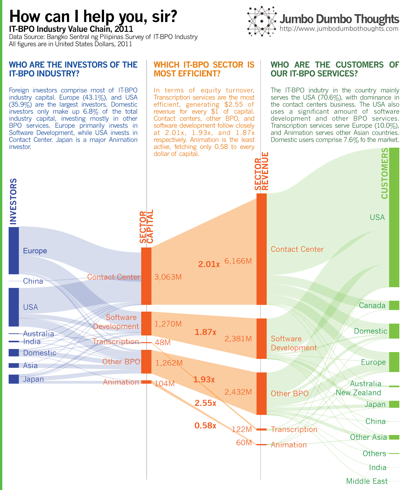
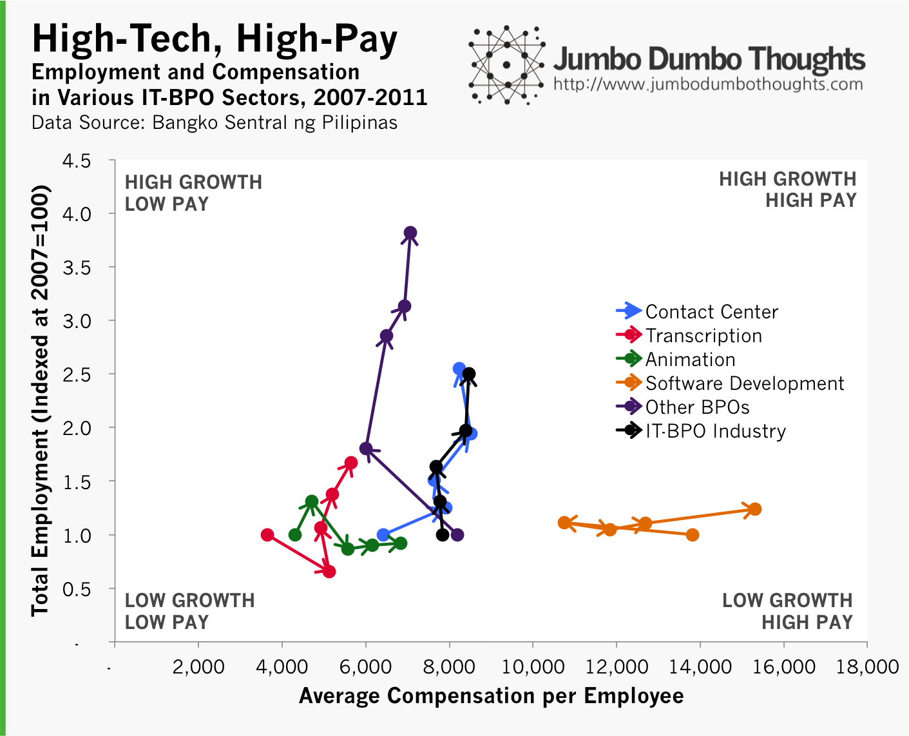

```{r fig.cap="Many skilled Filipinos detest the idea of working in a call center, but is that position justified? In this photo is the Ortigas skyline, one of the central business districts in Manila, the capital.(Photo: <a href='http://en.wikipedia.org/wiki/File:Ortigas_Tonight.jpg'>RamirBorja/Wikimedia</a>, <a href='http://creativecommons.org/licenses/by-sa/2.5/deed.en' rel='nofollow'>CC BY-SA 2.5</a>)", out.width="100%"}

```

IT-BPO (Information Technology - Business Process Outsourcing) has recently been a main economic driver for the Philippines, accounting for a significant portion of output and job growth. However, as I've come to recognize when I read a Rappler iSpeak article "[In Defense of Telephone Operators](http://www.rappler.com/move-ph/ispeak/48017-defense-telephone-operators)," the BPO industry still carries a strong stigma of being a 'dead-end job,' a job that does not require skill, or work that is poorly compensated. Do the numbers lend credence to that position? Let's find out.

## Financiers and Patrons

First, we can take a look at the details behind investment and consumption in the IT-BPO sector, the relative efficiency or returns on each type of IT-BPO, and the customers served by the industry in 2011. Such an overview can glean insight on the prospects of our BPO industry. 

```{r layout="l-body-outset"}

```

Foreign investors dominate the IT-BPO industry, with domestic investors comprising only 6.8% of capital. Given this information, it may be tempting to stoke nationalistic sentiment, but investor composition is determined less by regulation and more by market forces; the investor makeup is largely foreign because most of the available funds are overseas. Trying to boost domestic investment in BPO would definitely be a boon for stability, however.

If we analyze the relative efficiencies, in terms of equity turnover, of the various BPO sectors - contact centers/call centers, software development, transcription, animation, and others - you can see why call centers continue to dominate and moving up the skill chain is difficult. Call centers simply provide more bang for buck (or more revenue per dollar capital) than others, with the exception of transcription services.

Lastly, on the customer side, the USA commands the BPO customer base at 70.6% of the market. This is unsurprising, but given generally laggard US economic performance, it might be time for businesses to focus their selling efforts elsewhere.

If you ask me for a general diagnosis of the BPO sector given this data, I would say that, as with all developing countries, we are starting from the bottom, with high reliance on foreign capital and markets as well as providing low-value services. I believe, however, that as with all now-developed nations, *we have to start somewhere at the bottom*

As long as we continue developing the industry - moving up the value chain and shifting toward self-finance - services, not agriculture or manufacturing, could be the Philippines' path out of poverty.

## Moving up the value chain

If shifting to higher level BPO services is one of the ways in which we can boost economic growth, how are we doing? We've taken a look at the data from the industry perspective, but what if we take a look at the data from an employee's perspective? Is it true that a job at a BPO firm is just a meaningless corporate grind?

```{r out.width="100%"}

```

In this chart, we plot the total employment growth for the past 5 years (indexed at 2007=1.0) on the vertical axis, and the average compensation per employee on the horizontal axis. We do this for all sectors of the IT-BPO industry and for the whole industry as well. Arrows indicate the passage of time from year 2007 to 2011.

As you can see, low-value BPO services such as transcription, contact centers, and other BPO move 'upward': they provide a lot of jobs but don't pay as much. On the other hand, high-value BPO services such as software development, and animation, move 'sideward': they don't provide as many jobs, but pay much more. Ideally, we'd want all sectors to move into the high growth, high pay sector, but sadly, such is not the case, at least not yet. A more conservative objective would be for the low-value services to curve upward then rightward, and for the high-value services to move upward as well, a trend that would indicate that the BPO sector is upgrading its capabilities.

As a whole, however, the IT-BPO Industry is moving upward. This may mean more inclusive growth, but investment in skills is necessary to upgrade the value of our talent moving forward.

There you go: a data primer on the IT-BPO industry in the Philippines. Personally, I think no one should feel any shame in taking a call center job. We all have to start from the bottom, after all. To end this post on a positive note, here's a quote:

> "It is not the strongest of the species that survive, nor the most intelligent, but the one most responsive to change." – Charles Darwin

Thanks for reading! If you liked this post, I'd appreciate a like, share, tweet, +1, or for you to share you thoughts in the comments section. Data and computation requests can be made through the contact form.
