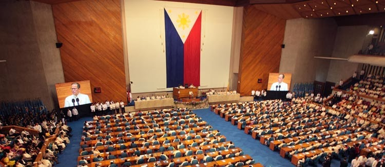
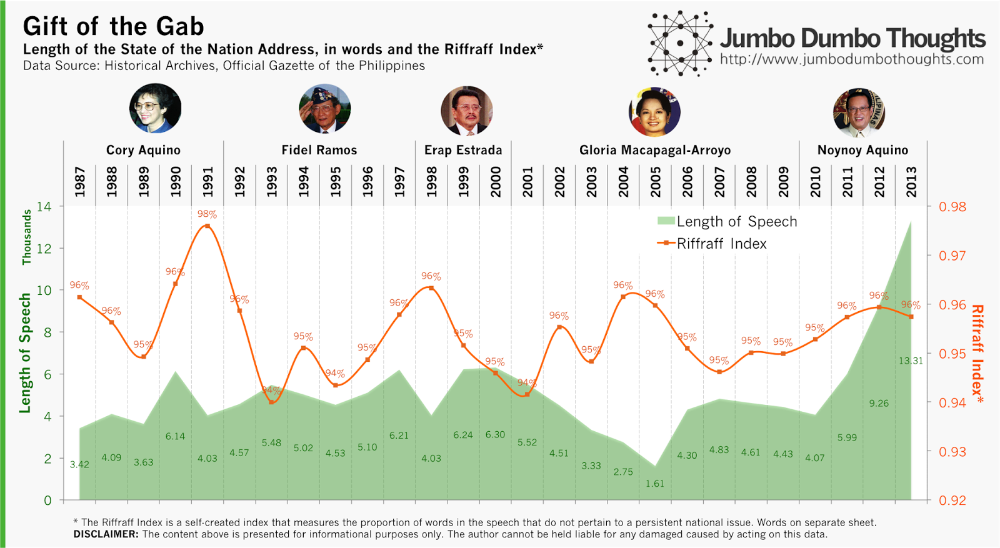
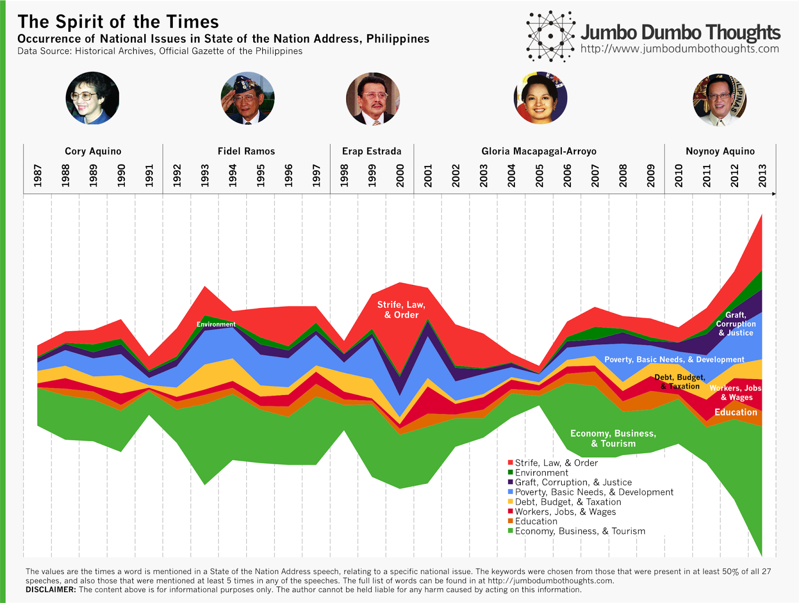
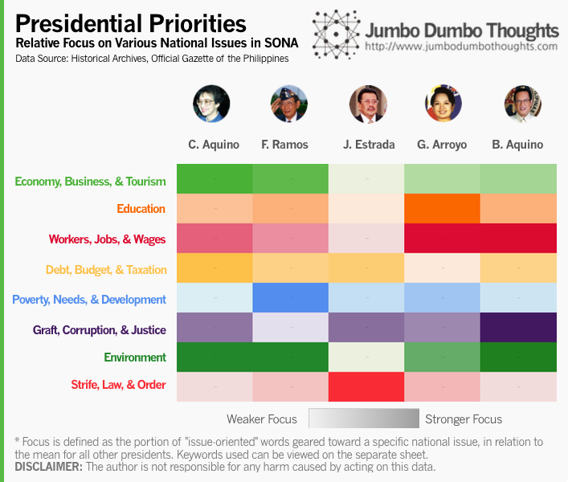

```{r fig.cap="We can distill the numbers out of speeches to determine what our commanders-in-chief have prioritized over the years of the Philippine democracy. In this photo, President Benigno Aquino III, the current president of the Philippines, delivers his second State of the Nation Address in 2011. (PUBLIC DOMAIN)", out.width="100%"}

```

## History through the President's Words

I got this great data gathering idea from an awesome article [on the Washington Post](http://flowingdata.com/2014/01/30/history-through-the-presidents-words), which analyzed the State of the Union Addresses of the various US presidents to determine hot-button issues in the United States. I decided to apply the same methodology to the Philippines and extract word counts out of the various State of the Nation Addresses, from Cory Aquino in 1987 to Noynoy Aquino in 2013.

## Length of Speech and the Riffraff Index

First, let's take a look at a very basic statistic - the length of the speech in words - as well as something I constructed called the Riffraff Index, which is the percentage of words in the SONA that do not specifically relate to any national issue. What these words are, and how they were selected are at the next section.

```{r layout="l-body-outset"}

```

The shortest speech was delivered by Gloria Macapagal-Arroyo in 2005 at only 1,600 words, while the longest was actually the most recent one by Noynoy Aquino, clocking in at a whopping 13,300 words.

But a long speech doesn't mean a meaningful one - you could fill your speech with buzzwords and riffraff to make it longer, so I constructed the Riffraff Index - the percentage of words that do not appear to relate to a specific national issue (the higher the index, the more riffraff). The highest amount of 'riffraff' was during Cory Aquino's 1991 farewell speech - a very heartfelt and emotional speech, while the lowest was during Ramos' 1993 speech - one where Fidel Ramos identified key issues and discussed them in immense detail.

You can also see that the amount of riffraff increases during election periods (1991-1992, 1997-1998, 2004) except for the most recent one.

## Zeitgeist

That's not all we could do with this data. We can also pinpoint the specific national issues each president spent the most time talking about in his/her SONA, so we identified keywords from those that were mentioned in at least 14 out of the 27 speeches, and also those that were mentioned at least 5 times in any one speech. We then categorize them into various issues, as follows:

```{r layout="l-body-outset"}

```

[The full list of keywords and their categories can be viewed here](https://dl.dropboxusercontent.com/u/1624796/Blog/Images/Keywords.pdf)

Economy, strife, law and order, and poverty are quite often discussed across the administrations, and varying degrees exist for other issues. Environment is least talked about in presidential speeches, and understandably so for a developing country with a small environmental footprint.

You can also observe that issues tend to be most talked about during the middle of a President's term, and the values shrink as they become mum during election periods - probably to stay on the safe side.

## Presidential Priorities

But this streamgraph doesn't make it easy to compare the priorities of each president relative to each other, so I constructed a heatmap that compares the favorite issues of each chief executive relative to his predecessors and/or successors:

```{r out.width="100%"}

```

Cory Aquino stayed pretty much balanced across the various issues. Fidel Ramos talked mostly about curbing poverty, protecting the environment, and improving the economy. Estrada talked about little else than strife, law, & order - his last SONA talked almost exclusively about the MILF and Mindanao. GMA focused on workers, jobs, wages, and education, which she has consistently stressed throughout her administration. Finally and not surprisingly, our current President is big on employment as well as graft, corruption and justice.

## SONA Interactive Word Counter

All this information is too rich to summarize easily, so I've decided to construct a simple tool (like Google's n-gram viewer) to let you explore the SONA data for yourself. You can enter up to 5 words in the white boxes, and the line graph on the right will show how many mentions that particular word gets in each SONA from 1987's Aquino to 2013's Aquino.

You might have to wait a few seconds to update the chart upon entering information. Sorry for the clunky Excel implementation, as I have very little coding ability. (Use a space to clear out a cell)

<iframe frameborder="0" height="350" scrolling="no" src="https://skydrive.live.com/embed?cid=0DD6BA9773242112&amp;resid=DD6BA9773242112%21123&amp;authkey=AN97-kQNt6YsXgs&amp;em=2&amp;wdAllowInteractivity=False&amp;AllowTyping=True&amp;ActiveCell='Interactive'!A1&amp;Item='Interactive'!A1%3AC19&amp;wdHideGridlines=True" width="670"></iframe>

Hope you enjoy discovering new trends with the tool! If you find an interesting pattern, please don't hesitate to share it in the comments!

hanks for reading! If you enjoyed reading, I'd appreciate it if you shared this with your friends or comment below. Data and computation inquiries can be made through the contact form or the comments.
