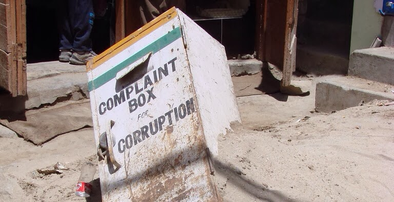
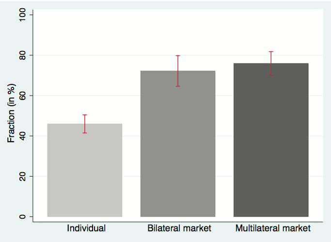
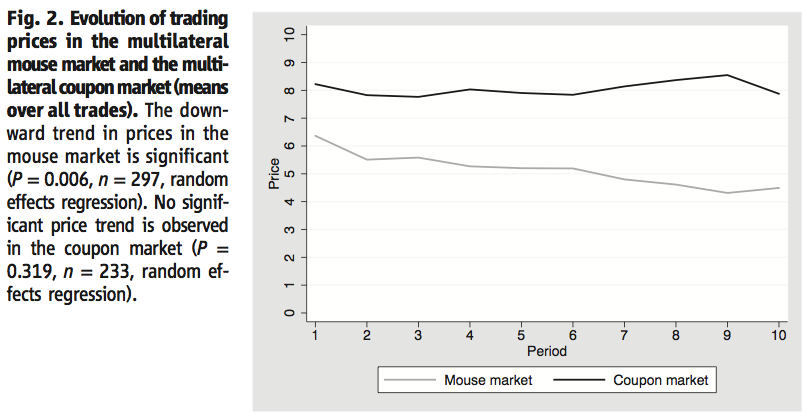

```{r fig.cap="In this photo, a complaint box for corruption lies deserted in India. (Photo: <a href='http://www.flickr.com/photos/7741046@N06/1402371308/in/photolist-38Vw8E-48d7Eb-4bSmjM-4cyJPZ-4H6Zah-5vRyZh-6aUj5v-6aYuM9-6aYxP3-6b3e55-6b3Dbd-6b3JuS-6b7XPK-9My9rw-8ahiKY-9wk71m-a86XiZ-gC9Wpe-eZcWsF-gCbDaa-gCgNGr-bWJgzC-gC47K4-9X3xZs-9X3zto-9WZFxx-deyYxS-dAS36m-arBkJm-bqL1qA-d4TWBC-d4U25q-d4agRC-d4amZd-cUn4Tq-fX4FCA-jc5A9C-jc3mnK-jc7EWw-jc3jF8-d4fjdC-d4U5bj-coLv9j-aosGfH-9r55fr-cuoSo3-fX4FW1-8PSLNs-8SnZEQ-8QvtQj-9zeMnJ'>watchsmart/Flickr</a>, <a href='http://creativecommons.org/licenses/by/2.0/' target='_blank'>CC BY 2.0</a>)", out.width="100%"}

```

## Market Malady

A common answer to why Filipinos don't entertain the idea of entering public service, despite noble intentions, is that they might get 'eaten up by the system.' Corruption is so prevalent in Philippine politics that it is considered nearly impossible to enter government and not indulge in shady practices. New research reveals that there might be a psychological element to this.

[A study reveals that people are more inclined to make morally questionable choices when faced with co-participants (Paywalled)](http://science.sciencemag.org/content/340/6133/707), meaning the simple fact that corruption takes two to tango erodes individual morality. In simple words, when you have other people to share the blame with, you are more inclined to engage in morally questionable activity.

## Morality vs Money

The researchers conducted a controlled experiment that involved deciding whether to kill an actual mouse. They were shown both the mouse and the manner in which it would be killed. The experiment had three variants: (a) an individual experiment, where they had to choose between sparing the mouse and receiving a certain sum of money, (b) a bilateral market, where they had to agree on a division of a fixed amount of money to kill the mouse, or not kill the mouse at all, and (c) a multilateral market, where multiple 'sellers' of the mouse's lives negotiated with various 'buyers' regarding the appropriate division necessary to kill the mouse.

They then recorded which fraction of the participants actually went ahead and killed the mouse, and found the following:

```{r fig.cap="The researchers found that participants were more likely to sacrifice their mouse if they had cohorts with which to negotiate the 'reward' for killing their mouse in the bilateral or multilateral markets, than if they had to make the decision on their own. (Source: Falk, A. & Szech, N. \"Morals and Markets.\" *Science 340* (707). p.707.)", out.width="100%"}

```

40% of the individual participants chose to kill the mouse. However, when participants are left to 'trade' on the value of the mouse's life in both the bilateral and multilateral settings, a significantly higher proportion, around 70%, actually chose to *kill the mouse!*

This provides preliminary evidence that markets, and transactions involving money that may not be the possession of either party, may erode morals. More people are choosing to kill the mouse for no reason, something generally considered objectionable, when faced with cohorts in the killing. The authors offer several explanations for this behavior:

  * **Sharing the blame**. When people are faced with co-participants, feelings of guilt or conscience are shared by both parties and thus diminished.
  * **Cohorts provide legitimacy.** When individuals see that they have co-participants in killing the mouse, they are more likely to lower their moral standards because they can see that they are not the only one performing the immoral activity.
  * **Money erodes morals.** Business transactions are framed by rules of competition and "survival of the fittest," which may make competitors disregard their own morality when faced with other people.
  * **Others will do it anyway.** When the individuals see others engaging in the trade of mouse lives, they are more likely to trade because they can rationalize the activity by arguing that if they don't trade/sell their mouse's life, others will be more inclined to do it anyway.
  
These four channels explain why it is so hard to keep a moral compass in a corrupt system, especially in government departments that engage in business transactions, such as purchasing or programs.

## Moving forward

```{r fig.cap="To further test their hypothesis, they compared the decline in prices as the experiment progressed in a mouse killing market vs a coupon-tearing market. The coupon's destruction is considered to be 'morally-neutral.' They found that declines in prices over time is significant for the mouse market due to the normalization or commoditization of the killing of the mouse, while the coupon market prices did not significantly change. (Source: Falk, A. & Szech, N. \"Morals and Markets.\" Science 340 (707). p.707.)", out.width="100%"}

```

If we know how the market mechanism tends to erode individual morality, what implications does it have for government? Well, these are only suggestions off the top of my head, but the following may work:

  * **Strict separation of duties.** When government officials are seen dining or otherwise meeting outside of work, it is often forgiven as part of the political process, but too much contact with persons who are supposed to provide checks and balances can lead to collusion and eventual sharing of blame. It's a little extreme, but if communications of decision-makers in government with parties of conflicting interests are monitored, we may curb the opportunity aspect of corruption. 
  * **Keep money matters separate.** In most corporations, accounting and finance functions are separate from those that make expenditure decisions such as marketing, sales, or operations. This is to ensure that the money is spent in the most efficient manner. In government, such as the pork barrel system and other specific programs, project heads are usually given considerable discretion with money matters. Keeping these things separate can prevent the morality erosion observed in the experiment.
  * **Public-Private Partnerships.** While these partnerships tend to be more efficient because it injects a degree of reward for those that build and operate large infrastructure projects, we may need to watch them closely for signs of rent-seeking.
  * **Go for the big dogs.** If the results of this article are to be extended, we can presume that a lot of low-level corruption is justified by the perception that a lot of people at the top - lawmakers and executives - are going to be corrupt anyway. It just emphasizes the importance of the 'tone at the top' for organizational culture.

There is now scientific evidence that business transactions erode morality, providing an explanation for why government officials who start out otherwise good are 'eaten up by the system,' other than the simple and rather naive thinking that "they are just bad people."

Thanks for reading! If you found this post informative, please share it with your friends on your preferred social networks. If you have any ideas or suggestions, I'd like to hear your thoughts in the comments section.
