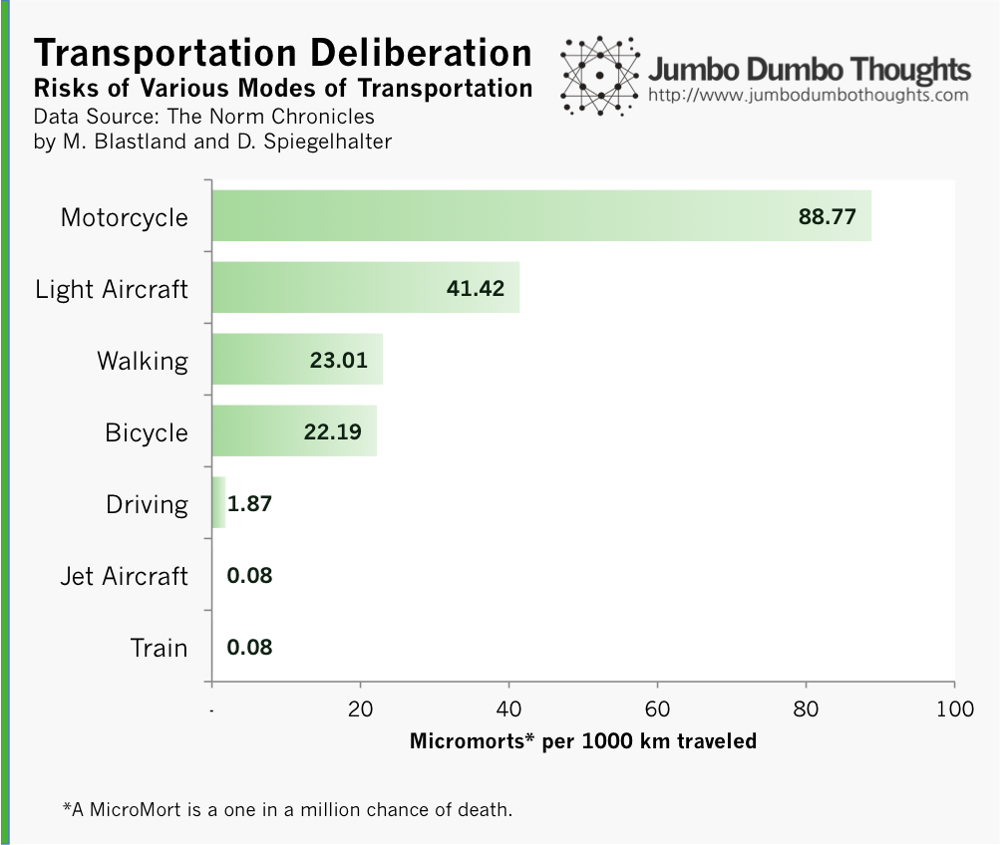
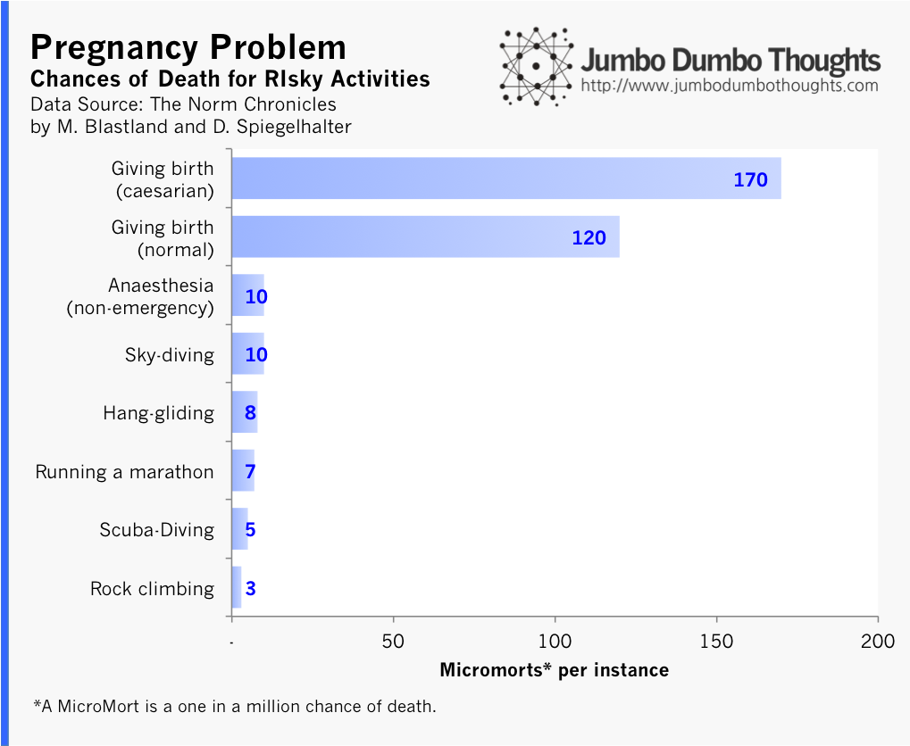

```{r fig.cap="RISKY OR BENIGN? The fear of flying is one of the most common statistically irrational fears that people have. (Photo: <a href='http://www.flickr.com/photos/49253686@N04/5976264120/in/photolist-a76V7y-8kXKXM-dkPhYt-8rFV8c-bqbT3W-9Vwbk9-aD94hz-d5AzPW-988UcA-eyGNSc-bqoaSu-8mjP2t-akPZhh-akM9VD-akMbDF-deT76D-7Y8mF6-9uYR4y-8Xs9zt-kJX3yB-dHwwmS-dUUJmL-99u7Nq-d8RVdu-cTHZdd-9Dn17Z-8AeLSy-7XMq4K-8kp9aj-aAHLXz-9uYRuq-8AbEjt-aAnCf1-9NAh26-h26MDf-9uYQmy-8yEqj1-8cA3zR-grTSnA-dSknTm-8WrVR8-agLBJn-8yBkqB-8yEuRj-eDKfTK-8yBivV-ga6D5G-h26MDq-h26GVj-95grBG-7zw9eo' target='_blank'>Kuster & Wildhaber Photography/Flickr</a>, <a href='http://creativecommons.org/licenses/by-nd/2.0/' target='_blank'>CC BY-ND 2.0</a>)", out.width="100%"}

```

## The Micromort: a standard unit for death

*The Norm Chronicles* by Michael Blastland and David Spiegelhalter, provides a way in which we can standardize the risk of death for various activities, so that we can meaningfully compare them: the Micromort. It's defined, quite simply, as a one-in-a-million chance of death. Micromorts are particularly useful because they allow us to make comparisons, they take out the effect of more chances of failure, such as in the case of driving vs flying, because they are expressed in 'in-a-million' terms.

What's the risk of dying on a light aircraft? 41 Micromorts per thousand kilometers. That means that 41 out of a million people who travel a thousand kilometers on a light aircraft will die, or a person who travels 41 billion kilometers by light aircraft will die.

Now that we have that sorted out, let's take a look at mortality statistics with our newly acquired unit, the Micromort.

## What are the most dangerous way to move around?

Have you ever heard that the chances of dying of a plane crash are much less than the risk when driving? This statement may not calm those who are already fearful fliers, but precisely quantifying the risk might further assuage these fears.

```{r out.width="100%"}

```

Riding a motorcycle, at 89 Micromorts per thousand kilometers, is most definitely the most dangerous form of transportation, and quite expectedly. The protection of a helmet cannot reasonably be expected to be enough most of the time. The risk is halved by light aircraft, but high nonetheless. Walking and bicycling are half of the risk from light aircraft. Driving is by far one of the safest forms or travel, probably because of a disproportionate effort expended on increasing driver safety.

Still, I'd like to point out, that by far the safest form of transportation is by jet aircraft and train. The reason why aircraft and train accidents are most widely reported in the media is because they are so rare, at about a thousand times less risky than an airplane, that these stories have to be told. Jet aircrafts are about 20 times less risky than cars, and 250 times less risky than walking.

## What extreme activities really are risky?

How about other activities, such as hanggliding, skydiving, rock climbing, or scuba diving? It turns out that the things we would never think of doing are much less risky than the things we expect to do in our lifetimes, such as undergoing non-emergency anaesthesia or giving birth.

```{r out.width="100%"}

```

The risk of death from sky-diving and hang-gliding are nearly the same as running a marathon or undergoing anaesthesia. Scuba-diving and rock climbing are even less dangerous. The most dangerous still is giving birth, worse if it's a caesarian operation.

These risks are easy to quantify, but hard to digest, because after all, we are humans &nbsp;- not strictly rational. The best way to describe it would be this quote from the same book where this data originated:

> ’What if I show you (the risk is) one in a million?’ he said.

> ‘No good.’

> ‘What?’

> ‘The problem’s the one.’

> ’One in a million is good.’

> ‘Not to the one. Not to the one.’
  
There you go: the probability of mortality. The next time some sort of fear sets in, let's make sure that it is justified by the statistics, first.

I'm not saying that I follow my own advice, though.

Thanks for reading! If you found this post interesting, I'd appreciate a like, share, tweet, or&nbsp;+1. You can also share your thoughts or request the data in the comments below.
