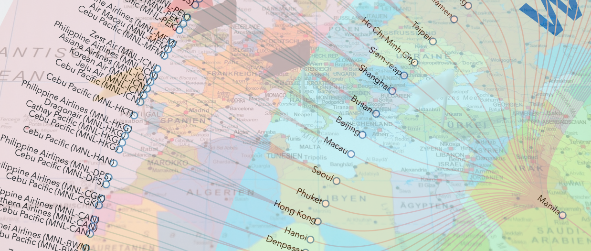
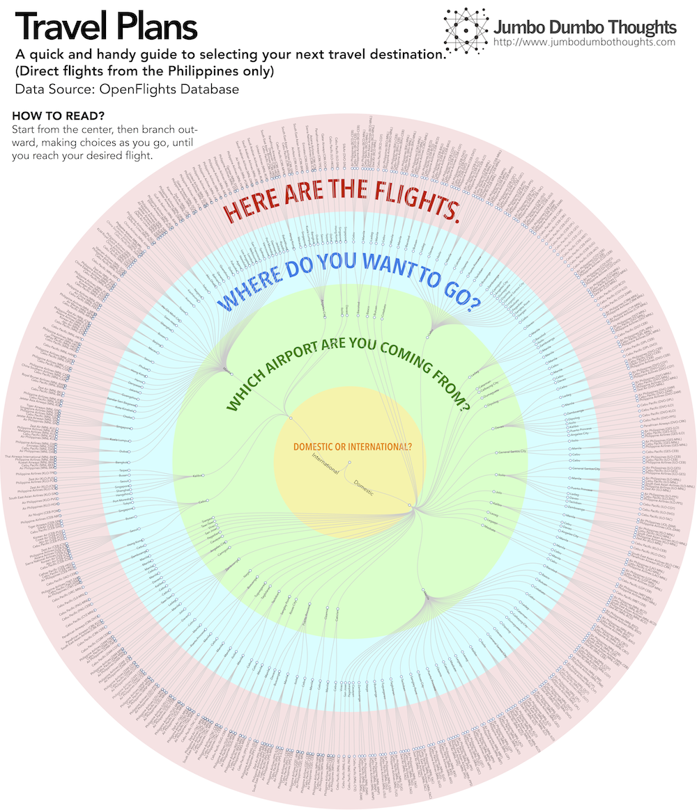

```{r layout="l-screen", fig.cap="TRAVEL OFTEN - Data from the OpenFlights database can show you all the destinations available for your travelling pleasure. (Photo: Pixabay, public domain)", out.extra="style='object-fit: cover; max-height: 200px;'"}

```

Are you having trouble making vacation plans? Well, the first step to planning any trip would be to decide on a destination, whether it be domestic or international. However, there isn't an easy way to take a look at all your alternatives: what are the destinations to which the Philippines has direct flights?

Luckily, data from the [OpenFlights database](http://openflights.org/data.html) is available, listing a wide variety of air travel routes around the world, the Philippines included. We can use it to construct a data visualization called a circular dendrogram. All the direct routes from the Philippines can be laid out in an orderly, easily explorable manner.

**How do you read this chart?** Start from the middle, and answer the choices as you move outward from the center. Once you reach the outside, you should already have an airline and route of your choice. Then you can move on to the best part of travelling - actually taking the trip.

```{r layout="l-page"}

```

You can also [download the file](https://dl.dropboxusercontent.com/u/1624796/Blog/Images/Flight.pdf) by right-clicking the image and selecting "Save Link As..." (Windows) or by using Option-Click on Mac.

As usual, we do have to take note of the limitations. The OpenFlights team is very methodical about their data, but recent routing changes may not have been reflected. Also, this includes direct flights only. You can obviously travel to anywhere using a combination of flights, but that option would usually be prohibitively expensive.

There you go: a handy guide to choosing your next vacation destination!

Thanks for reading! If you found this post interesting, I'd appreciate it if you shared it with your friends on social networks, or shared your thoughts in the comments section. Data and computation requests can be coursed through the contact form.
