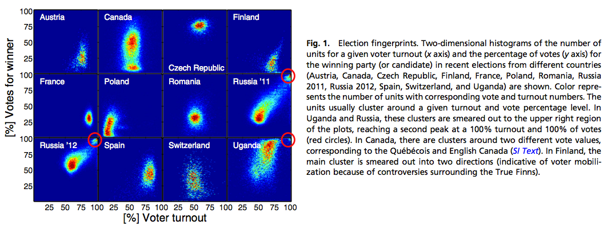
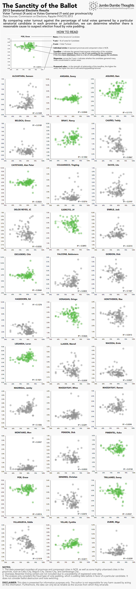
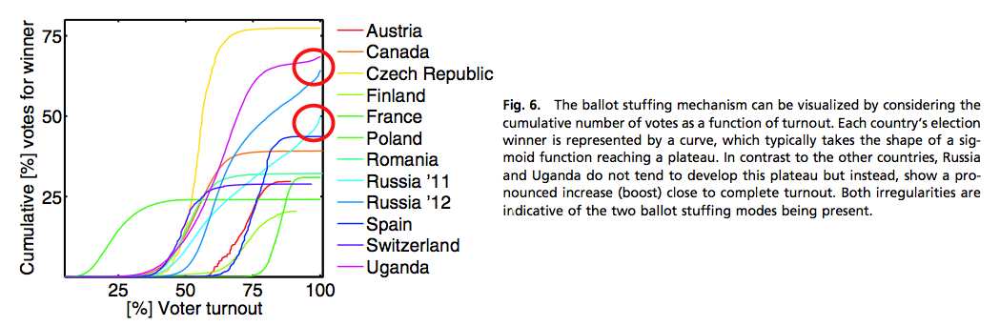
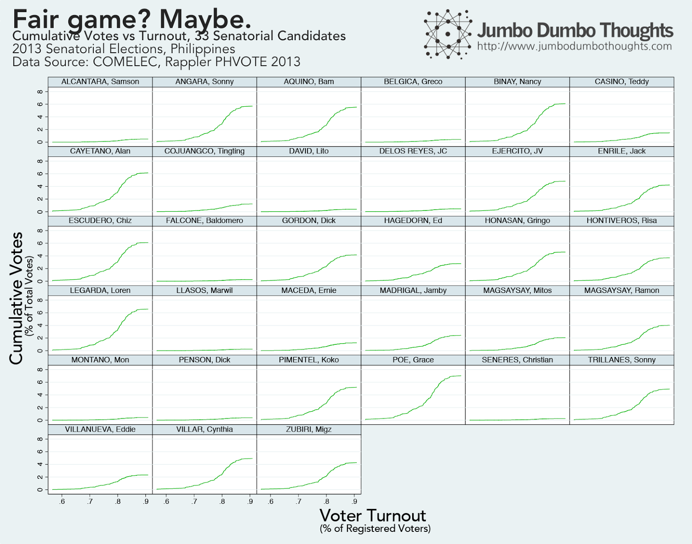

```{r fig.cap="BALLOT BOXES - Data can be used to safeguard ballot integrity, especially in a time of electronic transmission and canvassing of voting information. In this photo, ballot boxes are prepared for use in the 2007 Davao barangay elections. (Photo: <a href='https://www.flickr.com/photos/54106155@N00/1597912606' rel='nofollow' target='_blank'>Keith Bacongco/Flickr</a>, CC BY 2.0)", out.extra="style='object-fit: cover; max-height: 250px;'", layout="l-screen"}

```

The use of electronic ballot counters in recent Philippine elections has allowed the accumulation of election results data, but what can we do with it? Using a [simple analysis of voter turnout and votes cast, conceptualized by Klimek, Yegerov, Hanel, and Thurner from the University of Vienna](http://www.pnas.org/content/early/2012/09/20/1210722109.abstract)[@Klimek_Yegorov_Hanel_Thurner_2012], we can detect election fraud in the form of ballot stuffing - adding fake ballots in favor of a particular candidate. This can be either through duplicate voters, duplicate ballots, or simply reporting contrived numbers to the higher level of canvassers.

In this article, we take a look at how it works, and apply the analysis to the most recent 2013 Philippine Senatorial Elections.

## Electoral Egregiousness

Elections in the country are always alleged to contain some form of election fraud, but these allegations are never actually proven. We can, however, use election data on a disaggregated basis to detect one type of election fraud - ballot stuffing, by just using two commonly reported numbers - the voter turnout in particular areas, and also the portion of total votes cast in favor a certain candidate.

The way to think about this is how ballot stuffing affects these two numbers. Voter turnout increases because these fake ballots are considered new voters, and the portion of total votes cast in favor of the cheating candidate will also rise.

This would go undetected on the aggregate level, but breaking these numbers up allows us to detect an unusual rise in both values that would indicate ballot stuffing in certain precincts, provinces, or cities, unless the stuffing has been done nearly uniformly across all areas.

Indeed, in recent flagrant violations of the democratic exercise of elections, such as in Russia and Uganda, the relationship can be very apparent:

```{r fig.cap="Source: Klimek, Yegerov, Hanel, Thurner (2012) [@Klimek_Yegorov_Hanel_Thurner_2012]", layout="l-body-outset"}

```

These are two-dimensional histograms (or you can think of it as a 'heatmap') of the various disaggregations of elections in various countries. As you can see, in Uganda and Russia, there is a concentration of precincts that are 'smeared' towards the upper right corner, near 100% voter turnout, and 100% votes cast for the winning candidate, something which would be very unlikely save for a few '**balwartes**', or deliberate electoral fraud.

We can replicate this approach and apply it to the Philippines, particularly the most recent 2013 Senatorial Elections. I used data from the [COMELEC](http://www.comelec.gov.ph/) and [Rappler's PHVOTE 2013](http://www.rappler.com/nation/politics/elections-2013/28682-rappler-phvote-2013), and used provinces and certain key cities as they were most disaggregated unit of analysis made possible by the available data.

```{r layout="l-body-outset"}

```

As you can see, there is no pattern so consistent with flagrant ballot stuffing as in Uganda or Russia. Still, the fraud could have been perpetuated moderately, so I added OLS regression lines to indicate the path of the data, and the R-squared value to have some measurable (but imprecise) mathematical comparison.

The winning candidates that exhibited an 'upward' pattern, indicating a risk of ballot stuffing,&nbsp;and had the highest R-squared value, are Nancy Binay, Bam Aquino, and Loren Legarda.

On the other hand, the losing candidates that exhibited the 'downward' pattern, indicating a risk of being disadvantaged due to ballot stuffing, are Dick Gordon, Eddie Villanueva, and Ed Hagedorn.

Of course, all of this is more about risks than conclusions. Statistics can't prove anything; they can only tell how likely something is, so before your feathers are ruffled, keep in mind that my writing of this article is an exercise in curiosity, and not in any way politically-involved.

## Another way to slice the cake

There is another way to take a look at this data, using cumulative voting figures against voter turnout. When these figures are plotted, the function resembles a sigmoid curve or a letter S, plateauing as voter turnouts get higher. For countries purporting to have conducted fraudulent elections, there is a slight uptick for areas with high voter turnout:

```{r layout="l-body-outset"}

```

If we replicate this approach using Philippine data on the 2013 Senatorial elections,

```{r layout="l-body-outset"}

```

It seems that the past elections have been fair game, at least with regard to ballot stuffing. It may mean that the elections are totally fair, or that other means were employed.

I'd like to once again point out the caveats: these are risks, not conclusions; this only analyzes ballot stuffing, not switching or destruction, and overseas absentee voters are not considered.

Either way, as data on elections becomes more timely, improved, and safeguarded, the opportunities for election fraud will soon become slim pickings.

Thanks for reading! If you found this post interesting or enjoyable, I'd really appreciate it if you shared, tweeted,&nbsp;+1'ed it on your social networks, or shared your thoughts in the comments.
