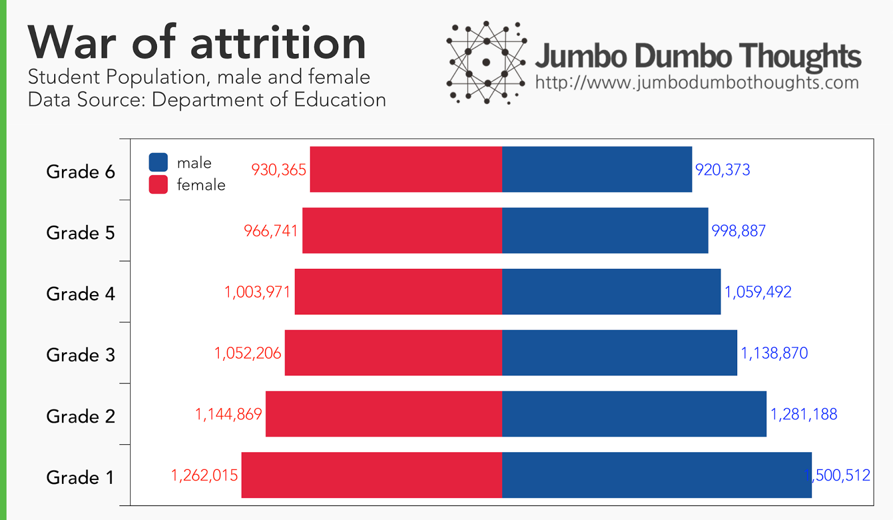
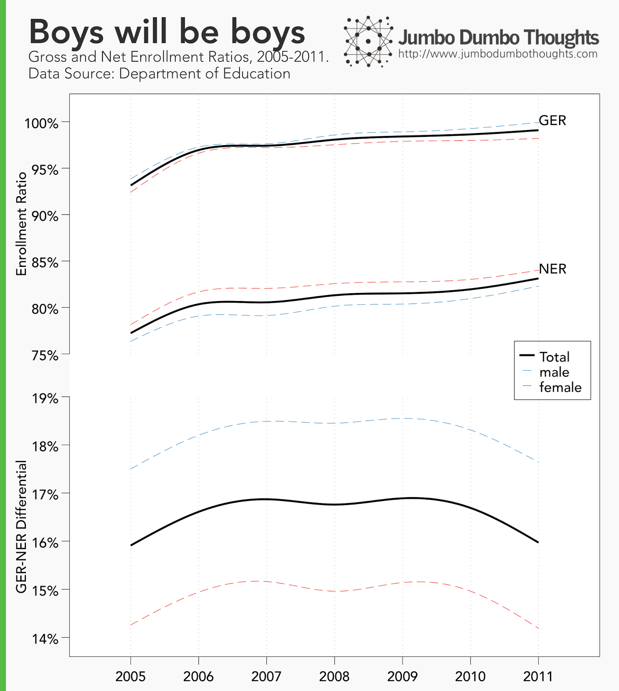
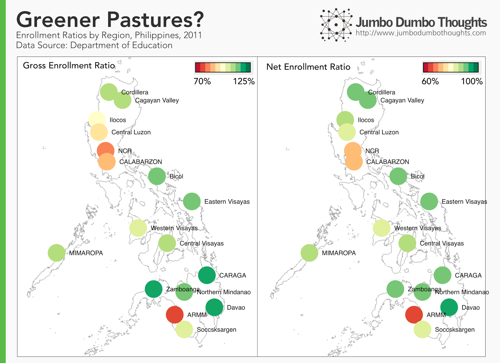
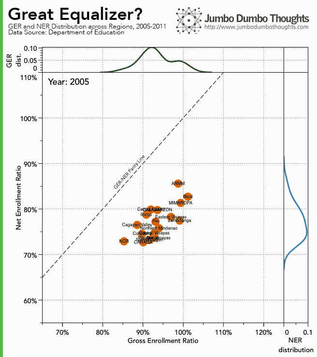
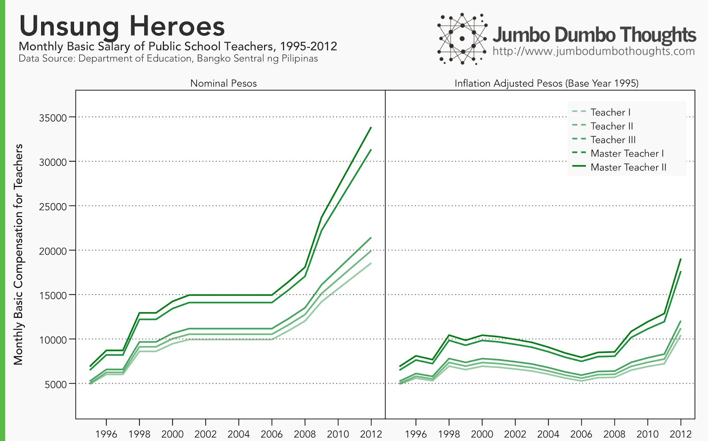

```{r fig.cap="A data-driven look at education reveals large and increasing disparities between regions and gender in terms of enrollment, and also a bleak compensation package for teachers. (Photo: <a href='https://www.flickr.com/photos/smemon/4984567320/in/photolist-8AtdcS-4R6kYr-95J17S-9p72i2-5aH3bV-akUUJa-5Xx4nM-aZhtF4-a9GaMX-8pHJNP-aguvee-9ia4xk-9Liu5Q-7EX7ri-bEBEhc-9Vi1si-9dBv8Q-gnDV6V-brGKJL-7EfwfJ-5teoHq-6eu8Ap-beBtDe-7Efwr5-8pLVjE-7hc7G7-9BZ7q9-4dvej1-9bEgDS-hpSn77-9rM5a9-7EbFa8-9LfGhe-dtuQ6g-bcbQ3i-aDz9aX-7ShWwA-5JVByJ-dwSojb-7Efwg5-4R6k5x-5teoyQ-6feXAf-7EbF4x-7PBrKg-cqJUss-65HLdF-cJHMPN-bUay88-2KRPV8' rel='nofollow' target='_blank'>Sean MacEntee/Flickr</a>,<a href='https://creativecommons.org/licenses/by/2.0/' target='_blank'> CC BY 2.0</a>)", out.width="100%"}

```

How does the Philippine education system look like through numbers? With new data from the Department of Education posted on the wonderful [data.gov.ph](http://data.gov.ph/), we can generate some interesting snapshots that allow us to assess how the country is doing at teaching future generations.

## Boys vs Girls

It seems that males are more likely to receive education, but girls are much more inclined to continue. Let's take a look at student population data for school year 2012-2013:

```{r layout="l-body-outset"}

```

At lower grade levels, males outnumber females, suggesting that males are more likely to be given the chance to receive education. However, as we move up the grade levels, the trend slowly reverses and at Grade 6, girls now outnumber boys. A number of factors may influence this: males may more likely be pulled out to work for the family, or they themselves might not value education as much as females. Either way, the large shrinkage in student population through grade levels is not that desirable.

This disparity among males and females can more easily be seen by examining two statistics: the [Gross Enrollment Ratio](http://en.wikipedia.org/wiki/Gross_enrolment_ratio) (the ratio of the number of students to the school-age population), and the [Net Enrollment Ratio](http://www.unicef.org/infobycountry/stats_popup5.html) (the ratio of the number of students in the appropriate school-age to the total school-age population). One important statistic that we can compute from these two ratios is the GER-NER Differential (the difference between gross and net enrollment ratios. This gap gets larger if there are students that are not in the appropriate grade level for their age-group (or what you could call delayed students).

```{r layout="l-body-outset"}

```

Enrollment ratios have been on the rise from 2005 to 2011, but the GER-NER differential has remained consistent, indicating a high number of displaced students, and only exhibiting a slight reversal in 2010. This differential is much higher for males than for females. Call it what you want, but girls just seem to be better than boys in school.

## Metro Manila: Jobs, not books

We can also take a look at regional differences in the gross enrollment and net enrollment ratios for 2011 (the latest available year):

```{r layout="l-body-outset"}

```

Being in a war-torn area or, surprisingly, being close to the capital, does not bode well for staying in school. It seems that the large influx of people into the capital benefits their livelihoods but not their children's education. NCR and CALABARZON exhibit one of the lowest enrollment figures in the country, next only to the strife-ridden ARMM.

## Inclusive education? Well, not really.

I've always espoused education as one of the necessary components to a well-functioning free-market or capitalist society - a great equalizer of sorts or an enabler of social and economic mobility. However, looking at the regional disparities in enrollment figures paints a disappointing picture:

```{r layout="l-body"}

```

From 2005 to 2011, regional disparities in education (demonstrated by the dispersion of the points) has expanded drastically, with Davao Zamboanga and CARAGA posting exceptional enrollment figures, and ARMM, NCR, and CALABARZON lagging behind. Others have maintained their position. Could this be a symptom of overconcentration of effort in problem areas, or simply a demographic shift?

Also, none of the regions seem to fare well in terms of keeping students on track. None of the points approach the GER-NER parity line, where both gross and net enrollment ratios are equal, suggesting a low number of delayed or displaced students.

## Teacher Salary: Mostly non-pecuniary

A lot of these figures measured the quantity of education, but many have also raised the issue of quality. While we cannot reliably and directly measure the quality of education through its output, we can get an idea by taking a look at measurable inputs, such as teacher salary.

It's another big sigh as teacher salaries have scarcely grown in real terms. They've in fact shrunk from 2000 to 2008, only making significant increases beginning 2010. Hopefully, this trend will continue and we will see more competitive individuals entering the labor supply for teachers.

```{r layout="l-body-outset"}

```

There you go: a small data primer on education. It's not a pretty picture, but hopefully a more precise data-driven perspective can pave the way to targeted and meaningful solutions.

If you found this post interesting or otherwise enjoyable, I'd appreciate it if you shared it on your social networks or gave your two cents in the comments section. 

Data and computation requests can be made through the contact form, but raw data is available at data.gov.ph.

P. S. I'm using a new data visualization software, and I'm loving it so far. Let me know what you think in the comments.
