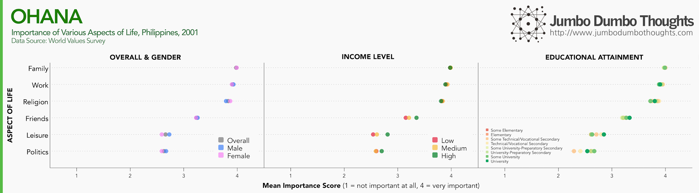
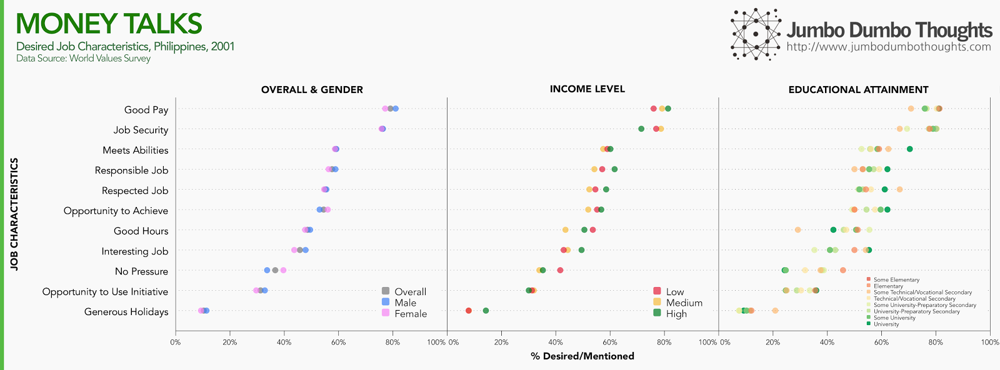
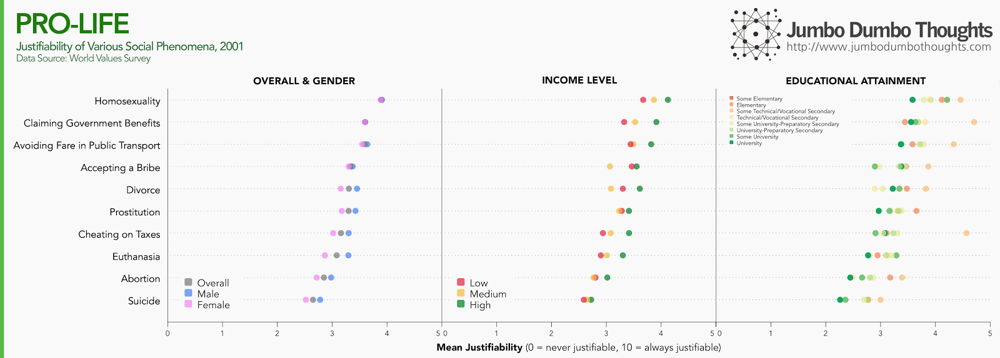
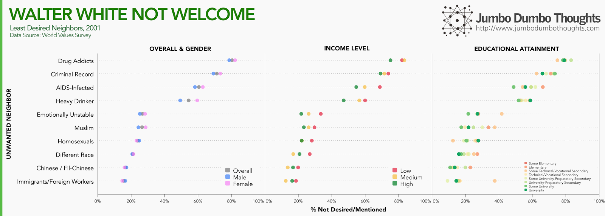
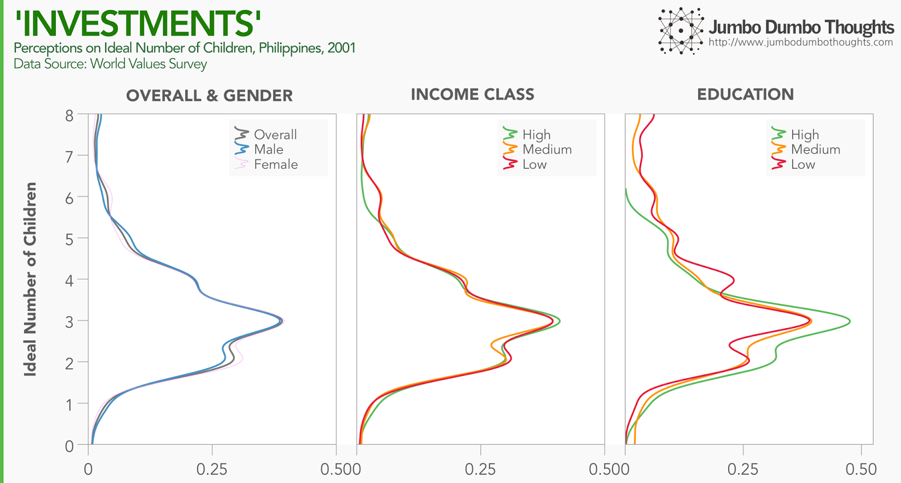
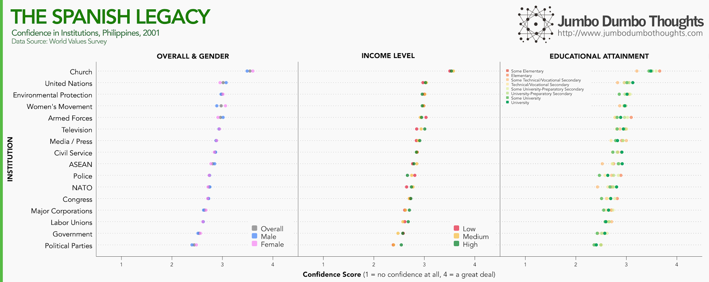

```{r fig.cap="Culture has always been tricky to measure, but by asking the right questions we can get a grasp of how Filipinos think. In this photo, hot ai'r balloons fly at the 16th International Hot Air Balloon Fiesta in Subic, Philippines. (Photo: <a href='https://www.flickr.com/photos/mayprodrigo/5449260561' rel='nofollow' target='_blank'>Lady May Pamintuan/Flickr</a>, <a href='https://creativecommons.org/licenses/by-nd/2.0/' rel='nofollow' target='_blank'>CC BY-ND 2.0</a>)", out.extra="style='object-fit: cover; max-height: 300px;'", layout="l-screen"}

```

What does it mean to be Filipino? It's a big question, but data from the [World Values Survey](http://www.worldvaluessurvey.org/wvs.jsp) can provide some answers. It does so by asking certain questions, such as whether work or family is more important, or whether divorce, abortion, or suicide are justifiable, or if they have faith in government.

I've [written against opinion polls](/2013/10/crappy-opinion-polls-wise-spending.html) in the past for their inability to capture true preferences, and the WVS is a qualitative preference-based survey at its best, but what sets it apart from other 'opinion polls' is that the researchers took pains to come up with a representative 1,200-person sample, and limited the questions to very specific responses.

The latest wave on the Philippines was in 2001,. but I've chosen questions that are less topical and thus more likely to still apply today. I've also segregated the responses by gender, income level, and educational attainment. Now, let's get into the data.

## What's important in life?

Question: For each of the following, indicate how important it is in your life. Would you say it is x?

```{r layout="l-page"}

```

True to the tight-knit nature of Filipinos, family comes out as very important for nearly all respondents. This is followed closely by work, religion, and friends. Leisure and politics seem to be only somewhat important to Filipinos.
  
Friends, leisure, and politics are more important for males, while religion is more important for females. Upper income classes seem to value friends, leisure, and politics more then lower income classes. The same is true for those who are more educated - they value friends, leisure, and politics more then those who are less educated. This is probably because lower classes and the less educated are more focused on subsistence - that is work, family, and to some extent religion, than 'worldly' affairs.
  
## What's important in a job?
  
Question: Here are some more aspects of a job that people say are important. Please look at them and tell me which ones you personally think are important in a job? 
  
```{r layout="l-page"}

```

Money still talks in the Philippines, with good pay mentioned by ~80% of respondents. Job Security follows closely behind. A majority of respondents mention a job that meets their abilities, is responsible, respected, and gives you an opportunity to achieve. Only a minority mentioned, good hours, an interesting job, no pressure, the opportunity to use initiative, and generous holidays.
  
Prestige-related aspects, such as high-paying, responsible, respected, and interesting jobs that provide opportunity to use initiative, appeal much more to males, higher income classes, and the more educated. Security-related aspects, such as job security, good hours, and no pressure, appeal more to females, lower income classes, and the less educated.
  
## Are certain things, like homosexuality or suicide, justifiable?
  
Question: Please tell me for each of the following statements whether you think it can always be justified, never be justified, or something in between.

```{r layout="l-page"}

```

The Philippines is unique in that despite being one of the most highly Catholic countries in the world, we are most accepting of homosexuality than any other country. However, note that 10 is the highest score, and I cut the axis to show more of the differences, so for a majority of Filipinos, all of these are not very justifiable. The least accepted relate to pro-life issues, such as euthanasia, abortion, and suicide, while marriage-related and financial-related aspects are somewhere in between.
  
Across the board, males are more accepting than females. This is also true for upper classes. Curiously, the more educated you are, the less accepting you are of certain issues. That definitely means something in the context of how educated shapes minds. Now I'll stop before I make a value judgement.
  
## Who would you not want as neighbors?
  
Question: On this list are various groups of people. Could you please sort out any that you would not like to have as neighbors? 

```{r layout="l-page"}

```
  
This is a nice veiled question, because you can get an idea of the prejudices of respondents without directly asking them regarding prejudices. Drug addicts, those with a criminal record, heavy drinkers, and those with AIDS are mentioned by a majority. Emotionally unstable people are mentioned by ~30%. However, what is surprising is that those that do not (or should not) imply anything negative, such as being muslim, homosexual, of a different race, or a different nationality are still mentioned by  around 20% to 25% of respondents.
  
Females are much less tolerant than males when it comes to what I'd call 'violent people', while males are less tolerant of immigrants, homosexuals, and foreigners. Across the board, lower income classes are much less tolerant than higher income classes. More educated individuals are also much more tolerant than less educated individuals.
  
## What is the ideal number of children?
  
Question: What do you think is the ideal size of the family - how many children, if any?

```{r layout="l-page"}

```

This is a very interesting question in the context of overpopulation and large families. Overall, most people prefer around 2 to 5 children, with of course some outliers.
  
But perhaps the most surprising result is the lack of any differences in income or gender. It's been a common thesis that poorer families have more children because they are seen as 'investments' for the family business or livelihood, but it seems that lower income classes have almost identical preferences to those of higher income classes. We do know, however, than actual results indicate larger family sizes for poorer families, so this conflict between what they want and how many children they actually have lends credence to the argument that the 'investment' motive is less important, and that there are... other motivations. There is a slight negative bias for more educated individuals.
  
## What is your confidence in certain institutions?
  
Question: I am going to name a number of organizations. For each one, could you tell me how much confidence you have in them: is it a great deal of confidence, quite a lot of confidence, not very much confidence or none at all? 

```{r layout="l-page"}

```

One of the hallmarks of a civilized society is a high degree of confidence in institutions. Well, at least we have electricity. The Church remains the most respected institutions in the country by a large margin, to be followed by the United Nations. The bottom of the barrel consists of government, congress, labor unions, major corporations, and political parties.
  
Females place more confidence in institutions than males. Surprisingly, higher income classes place more trust in government and big business than lower income classes which rely on the Church. Educational attainment also puts you in a more confident stance towards government and big business.
  
Whew! That was a long post. Hopefully, though, we covered quite a bit of ground on what it means to be Filipino. Thanks for reading!
  
If you liked this post or found it interesting, I'd appreciate it if you shared it with your friends on social networks, or gave us your two cents in the comments section. Data and computation requests can be coursed through the contact form.
