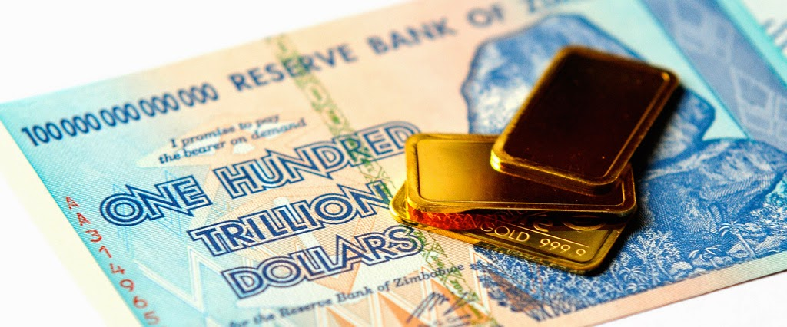
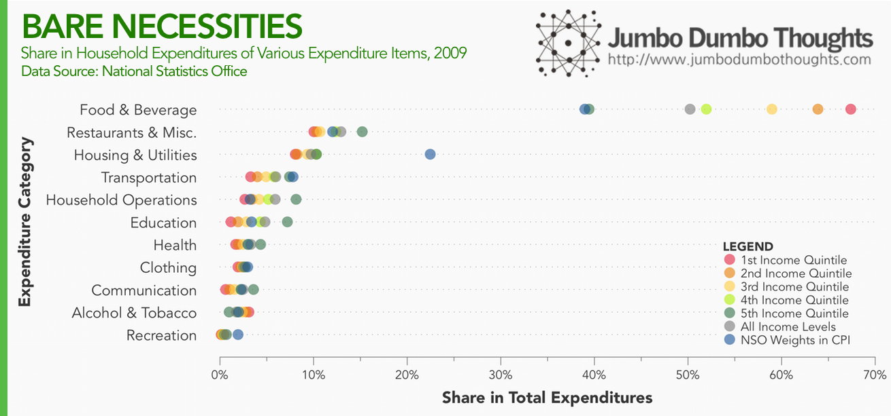
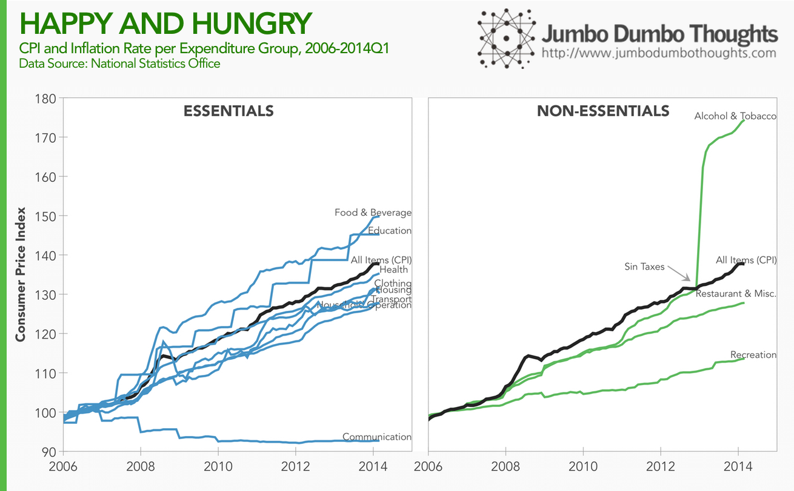
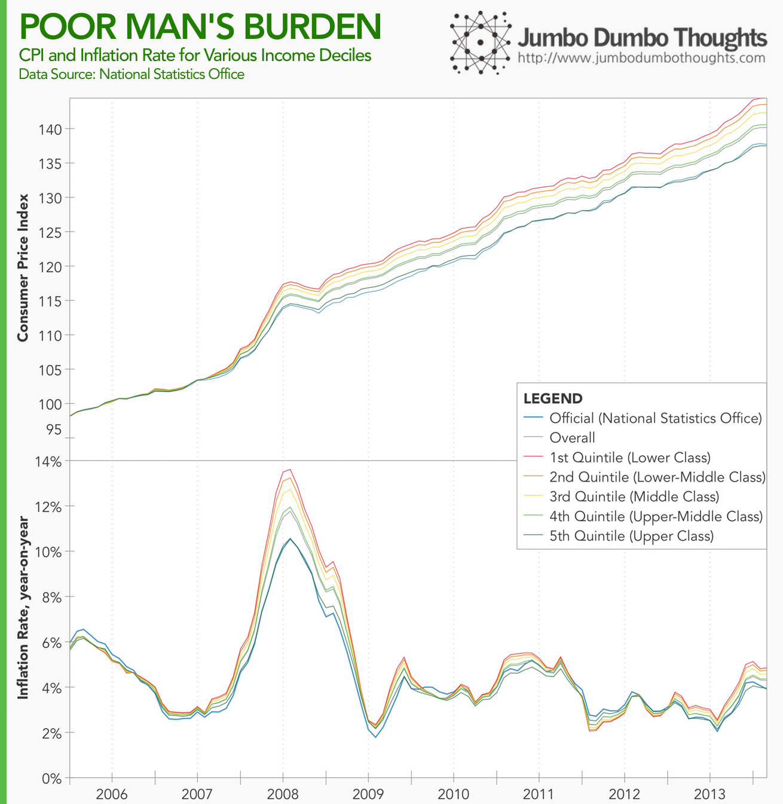
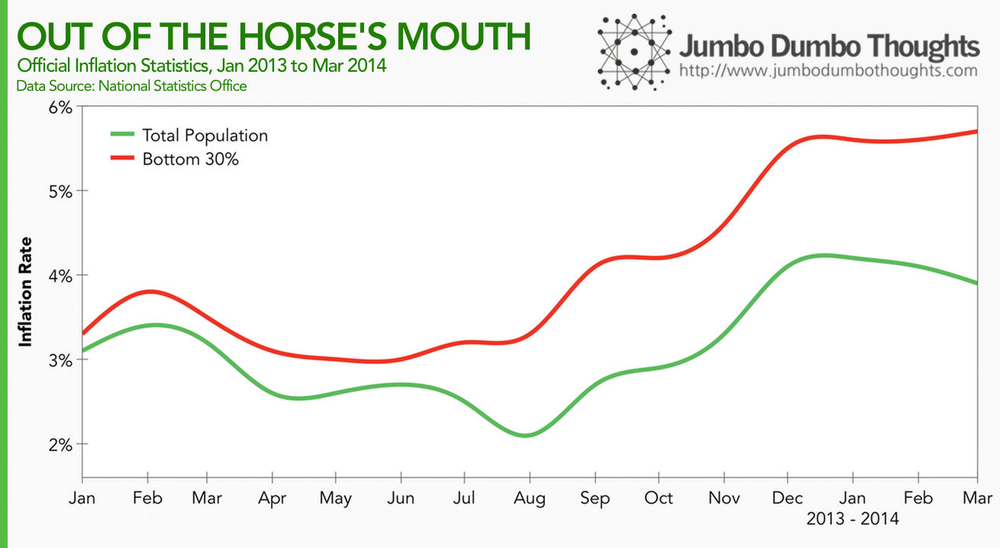

```{r fig.cap="We tend to think of inflation as a singular force that affects everyone the same way. It turns out however that the poorest households may have m'ore to lose as the peso shrinks. In this photo is a 100 trillion Zimbabwe dollar bill, commonplace during its period of hyperinflation. (Photo: <a href='https://www.flickr.com/photos/vegaseddie/4353407858/in/photolist-7CGmub-iPFXsH-5Yv1Eh-9Mxvej-9Mxveb-9Mxvem-aPsDhF-dvSfcy-9BDra4-5729SD-cSjkVQ-baF7z4-8Wgtd-b2XLqp-dPGh8m-dmyfCP-tCL7D-8eoT9r-dvSd4Y-dvSim5-dvSfs7-dvSgFh-dvLDhg-dvSc25-dvSg2G-dvLGwV-dvLDyk-dvLHpK-aPsMUV-6pmJu4-jjzRr-jgKXf-ei8bj9-sXJwe-7wYrsn-576m2j-aPsUMZ-dVkNy4-aPsNP8-73H7pG-dvLHyP-dvLDNp-dvLFYk-dvLD3X' rel='nofollow'>Paul/Flickr </a>, <a href='https://creativecommons.org/licenses/by/2.0/' rel='nofollow' target='_blank'>CC BY 2.0</a>)", out.width="100%"}

```

*This content is also available on [Medium](https://medium.com/@tjpalanca/on-inflation-and-poverty-7591ec372ff8)*

Everyone knows about inflation - a pervasive, unstoppable force that moves prices (and hopefully wages) upward in the economy, but do we really understand it? Further analysis reveals that official overall inflation statistics understate the effect of rising prices on the poor.

## Understanding Inflation

Inflation is measured through changes in what is called the [Consumer Price Index](https://en.wikipedia.org/wiki/Consumer_price_index) or **CPI**. This is an aggregate measure of prices based on a certain 'basket' of goods composed of those typically consumed by households. It seems like a fair enough way to measure general price increases, but it has the effect of making you think that inflation affects everyone equally - it does not.

The basket of goods is an approximation of the average proportions that households consume. It turns out, however, that there are significant differences in the basket of goods for households from different income levels:

```{r layout="l-page"}

```

Lower income classes tend to spend more of their income on Food &amp; Beverage, and this proportion drops as we move up the income scale. This is because the absolute level of food consumed in the household is limited, and extra income is allocated to certain 'luxuries' and other necessities, evidenced by the fact that higher income households spend more of their income on the other, non-food categories.

Just as a validity check: the data that we generated from the FIES raw data closely approximates the official NSO weighting, except for food and housing. I suspect that imputed rental value was used by the NSO instead of actual rentals paid, but since there was no breakdown in the [CPI Technical Notes](http://www.psa.gov.ph/sites/default/files/attachments/itsd/cpi/2006-based%20CPI%20full%20report_revised%20as%20of%20sep%20%202011_8.pdf), I can't say for sure. Nevertheless, it is the variance in the effect, not the absolute effect, that we are interested in.

So what does this mean? Different income classes will experience different inflation burdens because the prices of goods and services that they consume rise at different rates:

```{r layout="l-body-outset"}

```

Since the base year 2006,  essentials such as food and beverage and education have risen much more than the overall inflation rate. This means that poorer households that spend more of their income on food and beverage will feel a stronger pinch from price increases. Non-essential goods' prices have risen slower than inflation except for Alcohol & Tobacco which were affected by the [2013 sin tax hike](/2013/12/effectiveness-sin-taxes-philippines-2013q3-update.html).

## Re-weighting the Consumer Price Index

To illustrate, let us use the data on expenditure shares and the CPI to re-weight the baskets for various income classes. In other words, we will create a different basket for each income class to measure the inflation burdens that different households face:

```{r layout="l-body-outset"}

```

As you can see, since 2006, high rates of inflation tend to affect the poorest income classes more, because food and beverage prices rose more than the prices of other goods. This means that it gets more expensive to be poor - poorer households feel the impact of price increases more than their richer counterparts.<br /><br />This phenomenon is recognized by the government, which is why we not only come up with official inflation statistics for the entire population, but also for the bottom 30% households in terms of income:

```{r layout="l-body-outset"}

```

The official inflation rate for the bottom 30% of the population has been consistently higher than that for the general population, and particularly worrisome is the divergence that's occurred since January 2014.

There is the other side of the equation that this analysis is ignoring: wage growth. If inflation is the result of inclusive economic growth and wages are rising faster than the cost of living, then there would be no issue. However, if such is not the case, then it really is getting more expensive to be poor.

Thanks for reading! If you found this post interesting, I'd appreciate if you can share it with your friends on social networks, or otherwise shared your thoughts below. Data and computation requests can be accommodated through the contact form.

*Hat tip to [FiveThirtyEight](http://fivethirtyeight.com/features/inflation-may-hit-the-poor-hardest/) for the idea. This [journal article](http://www.sciencedirect.com/science/article/pii/S0304393206002121) (paywalled) should also provide formal understanding of the Phenomenon*
