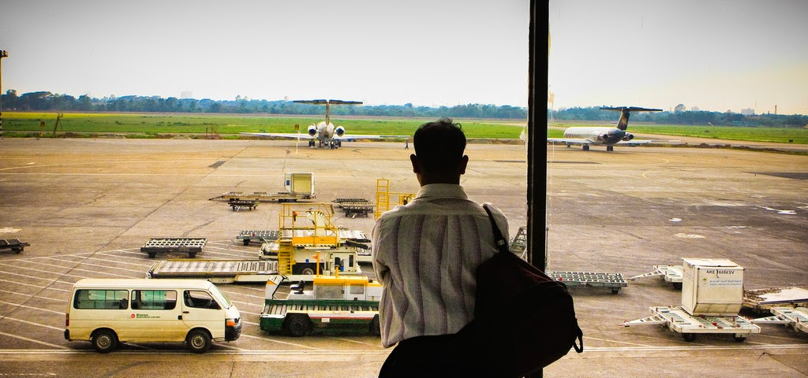
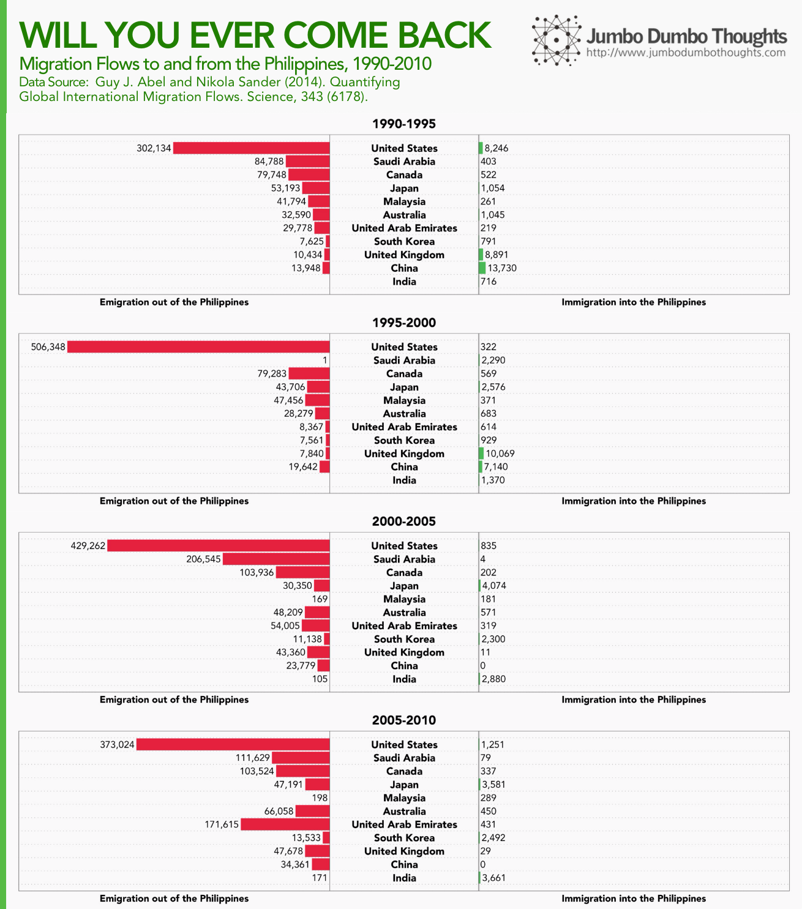
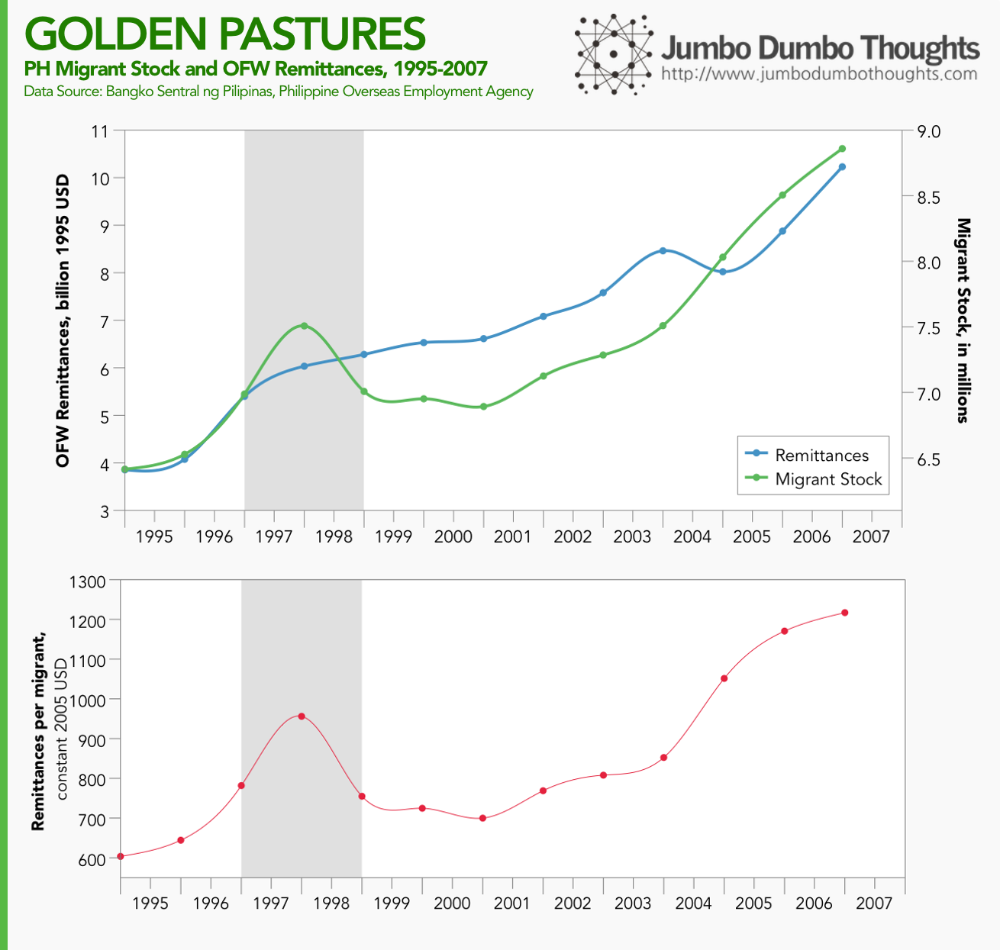

```{r fig.cap="LEAVING ON A JET PLANE. Where do these Filipino migrants go, and which nationalities migrate into the Philippines? In this photo, a migrant worker from Bangladesh, a country which faces similar economic circumstances as the Philippines, awaits his flight. (Photo: <a href='https://www.flickr.com/photos/faisal_akram/5713851042/in/photolist-9GUYR9-7pV7aR-ysY3-zRicg-bcx2Hi-bkh2wB-7N5Zve-ytDd-7RVWSW-7VrpGi-7Vf9tc-CJXYV-CJXYR-AkeFU-CHxBb-owqZm-37FjT-675Z2g-675Z1P-675Z2H-55yLcX' rel='nofollow' >Faisal Akram/Flickr</a>, <a href='https://creativecommons.org/licenses/by-sa/2.0/' rel='nofollow'>CC BY-SA 2.0</a>)", out.width="100%"}

```

Economic circumstances and an oversupply of labor in the domestic market have caused what some people have called the Filipino diaspora - a large outflow of migrant workers and overseas contract workers seeking better jobs - and pay - abroad. 

## Where do our migrants go? Who migrates into the Philippines?

To look deeper into the phenomenon, we can study data provided by researchers Abel, Bauer, and Sander who estimated global migration flows by noting changes in migrant stock of each country. They also created an interesting [circular plot visualization](http://www.global-migration.info/) that allows you to view high-level region flow data. They also have an [article published in *Science*](http://www.sciencemag.org/cgi/content/abstract/343/6178/1520?ijkey=ypit4/xi7wo4M&amp;keytype=ref&amp;siteid=sci), for those who are more keen on the details.

For this post, let's focus on country-specific data for the Philippines. The data is estimated for 5 year intervals from mid 1990 to mid 1995, and so on. I also isolated the countries presented to those with which the Philippines had major immigrant/emigrant flows, which are defined as those having 10% of inflows/outflows in any one period, or 5% of total flow in any one period.

```{r layout="l-body-outset"}

```

The first observation is of course that emigration out of the country has dwarfed immigration into the country for the past 20 years, so the diaspora is no short-term phenomenon.

The United States is still the favorite migrant destination, but the flow is shrinking, to be overtaken by Saudi Arabia and Canada, and UAE. Interestingly, there is a seeming lack of migrants to Saudi Arabia in 1995-2000, probably linked to the political instability caused by the Iraqi invasion of Kuwait and the Kingdom's opposition. Other countries like Japan, Malaysia, Australia, the UK, and China maintain a consistent flow of Filipino migrants.

As far as immigrants are concerned, the largest flow was from China in 1990-1995, probably those who wished to escape the dire economic circumstances that caused the Tiananmen Square riots in 1989. The flow of migrants has died out since then, along with the United Kingdom (which I suspect has to do with Hong Kong). As of present time, the largest foreign migrant flows come from Japan, South Korea, and India, which are expected to follow from the foreign investment that the country has received from these countries.

## Diasporic Dividends

All those red outflows from the country may look disheartening, but there are always two sides to the issue, and in this rapidly globalizing economy there might be a rational cause to the Filipino diaspora.

I came across three papers from the Philippine Institute for Development Studies - one that defines the Filipino Diaspora [Siar (2008)](http://dirp4.pids.gov.ph/ris/eid/pidseid0804-05.pdf) and another two that discuss the financial [PIDS RIO (2008)](http://dirp4.pids.gov.ph/ris/drn/pidsdrn08-5.pdf) and knowledge [Siar (2013)](http://dirp4.pids.gov.ph/ris/dps/pidsdps1318.pdf) benefits that arise from the diaspora.

I cannot quantify the knowledge benefits, and I have not discovered a paper that attempts such a thing, so we'll take a look at the financial benefits of large migrant outflows. The main financial benefit from migrant workers that inures to the country  are remittances from workers to their families back home. It has the effect of driving up consumption in the domestic economy as the families spend. 

```{r layout="l-body-outset"}

```

The amount of OFW remittances has naturally increased in pace with the stock of migrant workers. Furthermore, if we look at the 'return on investment', that is the remittances per migrant, you can see that following a brief fall during the 1997 Asian financial crisis, the remittances per migrant have steadily increased, pending another slowdown in 2007 as US markets will soon fall.

Unfortunately, data is only available up to this point, but it is clear that benefits, and motivations, to seek work abroad are still compelling for workers and the Philippine economy.

Thanks for reading! If you found this post interesting or enjoyable, I'd appreciate it if you could like, tweet, or share it with your friends, or shared your thoughts in the comments section. Data and computation requests are accommodated through the contact form.
