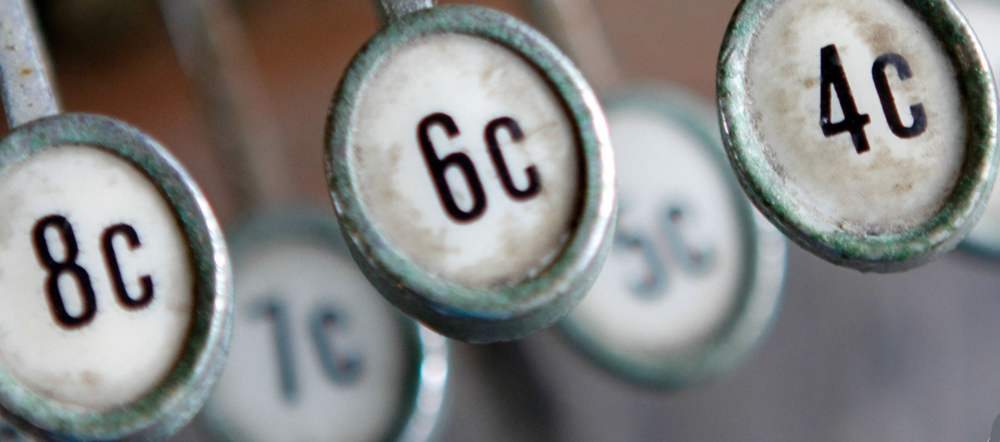
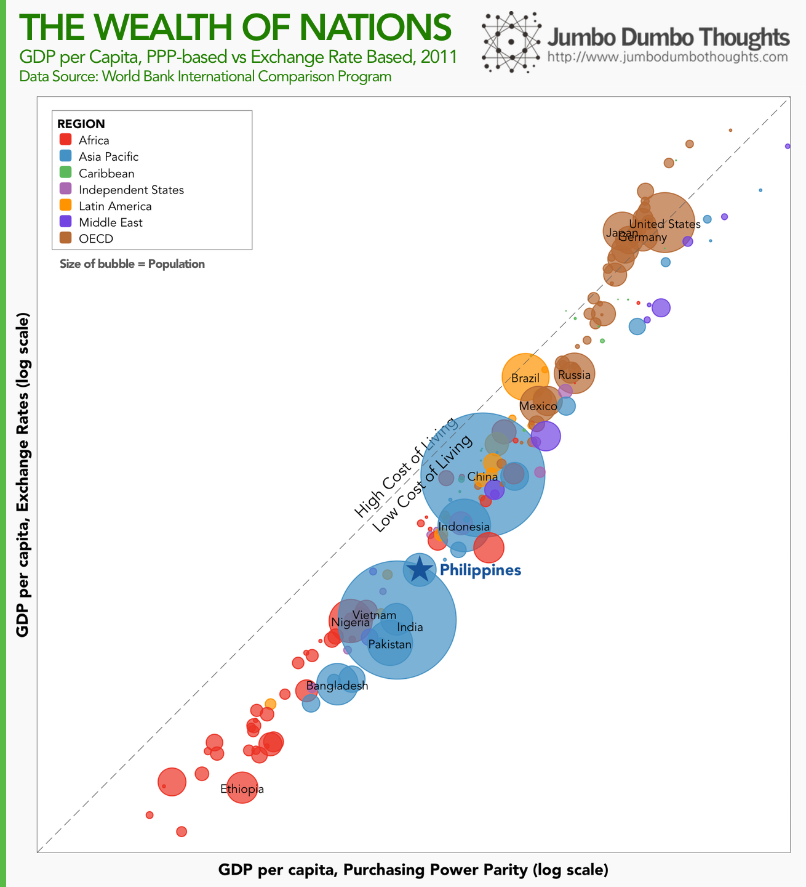
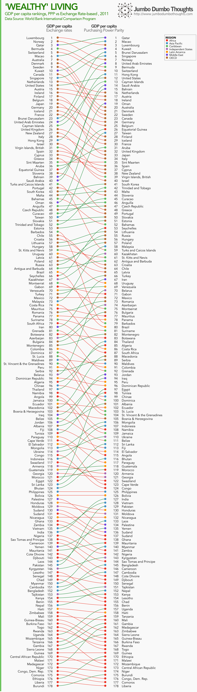

```{r fig.cap="It's easy to compare commonly-available figures such as GDP per capita to gauge a country's wealth, but differences in cost of living means such comparisons leave much to be desired. (Photo: <a href='https://www.flickr.com/photos/21560098@N06/5887121097/in/photolist-9Ye2ZT-dsqxkm-dspDrW-fwAM4X-dssBmE-dspokP-dssyF9-3sjzgy-dssr8B-dspy8j-dspooz-dsswud-dsszmu-dsskce-dssxu3-dssx2G-dspy3E-dspzk5-dsppdP-dsppkg-dspydC-dspppX-dssm9t-dssz2C-dsqvyb-dsppwK-dspyiQ-hqzC24-hqyukY-hqw9c3-fwR5n9-dssmiR-dssquT-dssqRK-fwALwM-fwAGT8-fwR1Mf-fwAK3i-fwAG2i--fwR3KU-fwR6kw-dFJDGb-d5acoA-d5acmC-d5acgU-d5acjw-k7SeFe-dsc6c1-6fAKEp' rel='nofollow' target='_blank'>Nina Matthews/Flickr</a>, <a href='https://creativecommons.org/licenses/by/2.0/' rel='nofollow' target='_blank'>CC BY 2.0</a>)"}

```

This is the first in a series of posts about 'numbersense,' or making sure that data analysis and visualization is in consonance with what the underlying data represents.

## GDP per capita: much maligned, much misunderstood

Almost everyone who's taken a basic econ class has heard about GDP per capita, or the value of production of a country divided by its total population. It's a quick, albeit rough, measure of the standard of living that's used by researchers and journalists.

However, we encounter a problem with GDP per capita when we make cross-country (and even cross-regional) comparisons, because the cost of living (the price of goods and services) varies from country to country, city to city, region to region. Even if two persons in different countries both share $1,000 in their respective countries' production, one might end up effectively 'richer' than the other if his $1,000 can buy more goods and services than the other guy.

This is because market exchange rates, subject to endless speculation and friction, are not truly reflective of the real exchange rate of goods and services between economies. When we adjust for these differences, we come up with Purchasing Power Parity (PPP) exchange rates.

A simple exercise of this transformation is called the [Big Mac Index](http://www.economist.com/content/big-mac-index), constructed by the Economist sometime in the 1980s, which attempted to measure real exchange rates by assuming a fair exchange of the McDonald's Big Mac across countries.

If we extend that analysis to a basket of goods and services consumed in the countries as opposed to just the Big Mac, we come closer to a more reliable measure of purchasing power parities. This was done by folks at the World Bank [International Comparison Program](http://icp.worldbank.org/) for 2011.

## Wealth of Nations

Let's start by comparing GDP per capita based on market exchange rates and GDP per capita based on purchasing power parities. Countries on the lower right triangle (PPP > XR) are expected to have a low cost of living, and countries in the upper left triangle (PPP < XR) are expected to have a high cost of living.

```{r out.width="100%"}

```

The Philippines remains squarely in the middle, while African nations are lagging behind. The country also exhibits a low cost of living, roughly similar to other emerging economies. Japan, US, and Germany have high costs of living, similar to other developed nations.

What does this mean for GDP per capita rankings? Let's take a look.

```{r out.width="100%"}

```

Middle Eastern countries leap to the top of the ranking due to low costs of living, upending the more developed nations. African nations still lag behind and mostly settle at the bottom of the rankings. Asia Pacific countries retain their ranking, and more specifically, the Philippines remains squarely in the middle of the rankings at 126th place.

You can see that once we account for cost of living, some economies leap ahead, while some lag behind, and some jog in place.

Nevertheless, it's clear that when making cross-country comparisons, using purchasing power parity is a must. As another example of how this is important, read this Economist piece on how [China is poised to be earlier than schedule in becoming the world's largest economy](http://www.economist.com/blogs/graphicdetail/2014/04/daily-chart-19).

Thanks for reading! If you found this post interesting, I'd appreciate it if you shared it with your friends on social networks, or shared your thoughts in the comments section. Data is available at the [International Comparison Program website](http://icp.worldbank.org/).
